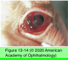
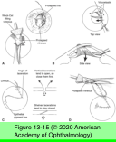
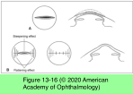
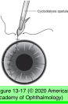
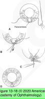
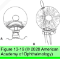

# 8.13.8. Toxic & Traumatic Injuries (VIII): Perforating Injuries

## Images

## Hierarchy

- History
  - factors known to predispose to ocular penetration
    - metal-on-metal strike
    - high-velocity projectile
    - high-energy impact on globe
    - sharp injuring object
    - lack of eye protection
- Examination
  - complete general and ophthalmic examination
  - visual acuity
  - pupillary examination
    - the most reliable predictor of final visual outcome
    - reverse Marcus Gunn response
  - signs that are suggestive or diagnostic of penetrating/perforating ocular injury
    - See Table 13-5
  - if a significant perforating injury is suspected avoid
  - ancillary tests that may be useful
    - See Table 13-6
      - forced duction testing, gonioscopy, tonometry, and scleral depression
  - all cases should be managed with safeguards appropriate for patients with bloodborne infections
- Surgical repair
  - primary enucleation
    - only when restoration of anatomy is impossible
  - anesthesia
    - general anesthesia is almost always required
      - advantages of delaying enucleation far outweigh any advantages of primary enucleation
        - delay should not exceed 12–14 days!
    - local or topical anesthesia only when
      - patient is at medical risk from general anesthesia
      - laceration is small & self-sealing
    - periocular anesthetic injection to control postoperative pain
      - after surgical repair is complete
  - repair of corneal component
    - corneal component should be repaired first
    - tissue prolapse
      - vitreous or lens fragment prolapse
        - cut flush with the cornea
          - do not exert traction on the vitreous or zonular fibers
      - uvea or retina prolapse
        - use viscoelastic material to reform anterior chamber
        - reposit using gentle sweeping technique
          - through a separate limbal incision
        - may be necessary to reposit iris tissue repeatedly
        - only frankly necrotic uvea should be excised
    - try to peel off epithelium that has migrated onto a uveal surface or into the wound
    - close points at which the laceration crosses landmarks (limbus)
      - 9-0 or 10-0 nylon suture
    - close remaining corneal component
    - suture knots should be buried in the corneal stroma, not in the wound
    - if watertight closure of the wound is not achieved
      - x-shaped or “purse-string” sutures
      - cyanoacrylate glue
      - primary lamellar keratoplasty
      - conjunctival flap should not be used!
    - specific suturing techniques
      - peripheral cornea
        - wider-spaced, longer sutures
      - central cornea
        - closer, shorter sutures
          - long enough to minimize their “cheese wiring”
        - avoid the visual axis
  - repair of scleral component
    - gentle peritomy
      - only as necessary to expose the wound
    - prolapsed vitreous is excised
    - prolapsed nonnecrotic uvea and retina are reposited
    - do not fixate an open globe with rectus muscle sutures
    - 9-0 nylon or 8-0 silk sutures
    - laceration extends under an extraocular muscle
      - muscle may be carefully removed at its insertion
    - posterior lacerations
      - open globe should not be rotated too far
      - more easily approached with loupes and a headlight
      - repair posteriorly only to the point at which it becomes technically difficult or requires undue pressure on the globe
        - very posterior lacerations benefit from physiologic tamponade by orbital tissue and are best left alone
    - dissection of tenon capsule and management of prolapsed tissue must be repeated incrementally after each suture
  - additional interventions
    - if there are any concerns, complete the closure of the laceration and postpone other interventions until a later date
    - repair of adnexal injury should follow repair of the globe itself
    - remove foreign body that is visible in the anterior segment and can be grasped
    - removal of opacified lens material
      - primarily or secondarily
    - iris repair
      - primarily or secondarily
      - to decrease formation of anterior or posterior synechiae
      - McCannel technique
        - 10-0 polypropylene suture
        - long needles
    - iridodialysis
      - McCannel technique
  - subconjunctival antibiotics
    - to cover both gram-positive and gram-negative organisms
  - intravitreal antibiotics
    - vancomycin 1 mg
      - for contaminated wounds involving the vitreous
    - ceftazidime 2.25 mg
- Preoperative management
  - studies have not documented any disadvantage in delaying the repair of an open globe for up to 36 hours
  - prompt repair can help minimize numerous complications
    - pain
    - prolapse of intraocular structures
    - suprachoroidal hemorrhage
    - microbial contamination of the wound
    - proliferation of the microbes projected into the eye
    - migration of epithelium into the wound
    - intraocular inflammation
    - lens opacity
  - temporizing measures
    - apply a protective shield
    - keep the patient on NPO status
      - avoid administering topical medications or other interventions that require prying open the eyelids
    - provide appropriate medications for sedation and pain control, as well as antiemetics
    - initiate intravenous antibiotics
    - seek anesthesia consultation
      - provide tetanus prophylaxis
  - risk of bacillus endophthalmitis
    - soil contamination
    - retained intraocular foreign bodies
    - intravenous and/or intravitreal therapy with an antibiotic effective against bacillus
      - fluoroquinolones
      - clindamycin
      - vancomycin
    - surgical repair should be undertaken with minimal delay
    - can destroy the eye within 24 hours
- Nonsurgical options
  - minimal eye penetrating injuries
    - definition
      - spontaneously seal before ophthalmic examination
      - no intraocular damage, prolapse, or adherence
    - may require only systemic and/or topical antibiotic therapy
    - close observation
  - leaking corneal wound with formed anterior chamber
    - pharmacologic suppression of aqueous production
    - patching
    - therapeutic contact lens
    - tissue adhesive
    - if these measures fail to seal the wound in 2 days --> surgical repair
- Postoperative management
  - intravenous antibiotics
    - for 48 hours
      - cephalosporin and aminoglycoside
  - oral antibiotic
    - for 3–5 days
      - moxifloxacin (400 mg po daily)
  - topical antibiotics
    - 4 times a day for 7 days or until epithelial closure
  - topical corticosteroids and cycloplegics
    - taper slowly
  - systemic prednisone
    - for fibrinous response in the anterior chamber
  - corneal sutures that do not loosen spontaneously
    - left in place for ≥3 months
      - removed incrementally over the next few months
    - indicators of adequate healing
      - fibrosis
      - vascularization
  - apply fluorescein at each postoperative visit
    - to exclude suture erosion through the epithelium
  - frequent examination of the posterior segment
    - to exclude retinal detachment
    - if no fundus view
      - afferent pupillary defect
      - b-scan ultrasonography
  - refraction and correction with contact lenses or spectacles
