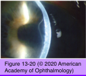
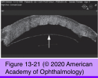

# 8.13.9. Toxic & Traumatic Injuries (IX): Surgical Trauma

## Images

## Hierarchy

- Corneal Epithelial Changes From Intraocular Surgery
  - pathogenesis of epithelial breakdown
    - inadvertent intraoperative trauma to the epithelium by surgical instruments
    - desiccation of the epithelium through inadequate intraoperative hydration
    - toxic keratopathy resulting from excessive preoperative instillation of topical ophthalmic preparations (and their preservatives)
    - accidental instillation of preoperative periocular facial scrub detergents
  - endothelial damage has a far greater effect on corneal edema than does epithelial damage
  - damage to endothelium and/or Descemet membrane can result in epithelial edema
    - corneal surface becomes irregular
      - glare
      - photophobia
      - halos around lights
      - decreased vision
        - epithelial edema is more damaging to vision than stromal edema or scarring
- Conjunctival and Corneal Changes From Extraocular Surgery
  - orbital surgery and trauma
    - conjunctival chemosis with prolapse
      - exposed conjunctiva should not be excised but rather be reposited
        - kept in place with
          - patching
          - mattress sutures
    - proptosis of the globe
      - exposure keratopathy
        - lubricants
        - eyelid patching or taping
        - moist-chamber dressings
        - temporary tarsorrhaphy
- Corneal Endothelial Changes From Intraocular Surgery
  - corneal hydration involves the following factors
    - stromal swelling pressure
    - barrier function of the epithelium and endothelium
    - the endothelial pump
    - evaporation from the corneal surface
    - IOP
  - causes of endothelial damage
    - cataract surgery and IOL implantation
    - laser burns
      - iris photocoagulation
      - endothelial burns are usually dense white with sharp margins
      - in follow-up periods of ≤1 year, endothelial cell loss following laser iridectomy has not been found to be statistically significant
- Descemet Membrane Changes During Intraocular Surgery
  - stromal edema
    - bowing and folding of Descemet membrane (striate keratopathy)
  - Detachment of Descemet membrane
    - stromal swelling and epithelial bullae localized in the area of detachment
    - Descemet membrane can be stripped off the stroma during reintroduction of the keratome through the incision
    - membrane can be reattached with air tamponade
      - recurrence may require suturing
