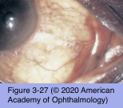

# 8.3.10. Systemic Conditions Associated With Ocular Surface Disorders (II)

## Images

## Hierarchy

- Vitamin A Deficiency
  - epidemiology
    - 20,000–100,000 new cases of blindness worldwide/year
    - malnourished infants and babies born to vitamin A–deficient mothers
      - especially infants who have another biological stressor, such as measles or diarrhea
    - superficial concurrent infections further predispose to keratomalacia and blindness
      - herpes simplex
      - measles
      - malnutrition
        - bacterial agents
  - pathogenesis
    - low dietary intake of vitamin A
      - unusual self-imposed dietary practices
      - chronic alcoholism
    - decreased absorption of vitamin A
      - lipid malabsorption
        - cystic fibrosis
        - biliary cirrhosis
        - bowel resection
          - gastric bypass surgery
  - clinical presentation
    - loss of mucus production by goblet cells
      - dryness of the conjunctiva and cornea (xerosis)
        - Bitôt spot
          - superficial foamy, gray triangular area on bulbar conjunctiva in palpebral aperture
            - keratinized epithelium
          - histopathology
            - inflammatory cells
            - debris
            - Corynebacterium xerosis bacilli
              - metabolize the debris, producing the foamy appearance
    - corneal ulcers and scars
      - diffuse corneal necrosis (keratomalacia)
    - 3 stages
      - conjunctival xerosis, without (X1A) or with (X1B) Bitôt spots
      - corneal xerosis (X2)
      - corneal ulceration, with keratomalacia involving <1/3 (X3A) or >1/3 (X3B) of the corneal surface
    - similar changes in gastrointestinal, genitourinary, and respiratory tracts
  - management
    - medical emergency
      - untreated mortality rate of 50%
    - oral or parenteral vitamin A
    - protein-calorie supplementation
      - malabsorption may prevent oral administration from being effective in patients with acute vitamin A deficiency
    - identification and proper treatment of underlying causes
    - ocular
      - corneal lubrication
      - prevention of secondary infection and corneal melting
- Xeroderma Pigmentosum
  - rare
  - recessively transmitted
  - impaired ability to repair sunlight-induced damage to DNA
  - skin findings
    - exposed skin develops focal hyperpigmentation, atrophy, actinic keratosis, and telangiectasia
      - first or second decade of life
    - cutaneous neoplasms
      - squamous cell carcinoma
      - basal cell carcinoma
      - melanoma
  - ophthalmic manifestations
    - signs and symptoms of KCS
      - photophobia
      - tearing
      - blepharospasm
    - conjunctiva
      - dryness
      - inflammation
      - telangiectasia
      - hyperpigmentation
      - pingueculae and pterygia
    - cornea
      - exposure keratitis
      - ulceration
      - neovascularization
      - scarring
      - perforation
      - keratoconus
      - band-shaped nodular corneal dystrophy
      - gelatinous dystrophy
    - eyelids
      - atrophy
        - even loss of the entire lower eyelid
      - madarosis
      - trichiasis
      - scarring
      - symblepharon
      - entropion
      - ectropion
        - 11%
    - ocular neoplasms
      - most frequently at the limbus
      - squamous cell carcinoma
        - most common
      - basal cell carcinoma
      - melanoma
