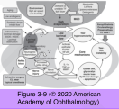
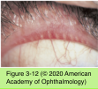
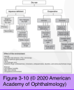
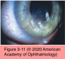

# 8.3.1. Clinical Approach to Dry Eye (I)

## Images

## Hierarchy

- Introduction
  - definition
    - multifactorial disease of the tears and ocular surface that results in symptoms of discomfort, visual disturbance, and tear-film instability with potential damage to the ocular surface
  - lacrimal functional unit (LFU)
    - components
      - lacrimal glands
      - ocular surface (cornea, conjunctiva, and meibomian glands)
      - eyelids
        - sensory and motor nerves
    - functions
      - tear-film integrity (by carrying out lubricating, antimicrobial, and nutritional roles)
      - ocular surface health (by maintaining corneal transparency and surface stem cell population)
      - the quality of the image projected onto the retina
  - epidemiology
    - prevalence increases with age
      - 10% of those age 30–60
      - 15% of adults over age 65
    - equal prevalence in all racial and ethnic groups
- F>M
- Pathogenesis
  - core mechanisms of dry eye
    - tear hyperosmolarity
      - stresses the surface epithelium
    - tear-film instability
    - inflammation
      - release of inflammatory mediators
        - disrupt junctions between superficial epithelial cells
        - T cell infiltration into epithelium
          - release cytokines
  - classification
    - aqueous tear deficiency (ATD)
      - T-cell–mediated inflammation of the lacrimal gland
    - evaporative dry eye
      - meibomian gland dysfunction (MGD)
        - altered lipid metabolism
          - transition from unsaturated to saturated fats
            - tear-film instability
              - tear evaporation
                - tear hyperosmolarity
  - other causes of tear-film instability
    - xerophthalmia
    - ocular allergy
    - contact lens wear
    - dietary consumption of a high ratio n-6 to n-3 essential fatty acids
    - diabetes mellitus
    - cigarette smoking
    - prolonged usage of video displays
    - long-term use of medications with topical preservatives
- Evaporative Dry Eye
  - symptoms
    - burning
    - foreign-body sensation
    - redness of the eyelids and conjunctiva
    - filmy vision
      - worse in the morning
  - clinical signs
    - usually confined to the posterior eyelid margins
      - irregular posterior eyelid margins
    - brush marks
      - prominent, telangiectatic blood vessels
        - coursing from the posterior to anterior eyelid margins
    - meibomian gland orifices may pout or show metaplasia
      - white plug of keratin protein extending through the glandular orifice
    - in active disease, meibomian secretions may be turbid and more viscous
    - nonobvious obstructive MGD
      - a precursor to clinically apparent disease
      - patient is symptomatic but lacks obvious clinical signs of meibomian disease
      - with mild compression the glands are found to be obstructed
      - more forceful expression produces a thin filamentous secretion due to narrowing of distal portion of ducts
    - additional clinical signs
      - papillary reaction on the inferior tarsus
      - linear staining along the inferior cornea and inferior conjunctiva
      - episcleritis
      - marginal epithelial and subepithelial infiltrates
      - corneal scarring or thinning
        - corneal neovascularization or pannus
      - acne rosacea
  - extensive atrophy of meibomian gland acini may develop after years
    - eyelid compression does not produce expression of meibomian gland secretions
    - shortening or absence of vertical lines of meibomian glands
      - may be revealed by transillumination of the everted eyelid using a muscle light
  - rapid tear breakup time (TBUT)
    - fluorescein strip moistened with sterile saline applied to tarsal conjunctiva
      - should be done before any manipulation of eyelids or instillation of other drops
    - tear film is evaluated using a broad beam of the slit lamp with a blue filter
    - time lapse between last blink and the appearance of first randomly distributed dry spot on the cornea
    - appearance of dry spots in <10 seconds is considered abnormal
- foam in tear meniscus
- Aqueous Tear Deficiency
  - clinical presentation
    - symptoms
      - tend to be worse
        - with prolonged use of the eyes
          - toward the end of the day
          - reduced blink rate associated with computer usage
        - exposure to environmental extremes
          - lower levels of humidity associated with indoor heating
      - burning
      - dry sensation
      - photophobia
      - blurred vision
    - signs
      - bulbar conjunctival hyperemia
      - decreased tear meniscus
        - normally 1.0 mm in height and convex
        - ≤0.3 mm is considered abnormal
      - epithelial keratopathy
        - irregular corneal surface
        - best demonstrated following instillation of lissamine green, rose bengal, or fluorescein
        - exposure staining
          - rose bengal and lissamine green more sensitive than fluorescein staining in revealing early or mild cases
          - nasal and temporal limbus and/or inferior paracentral cornea
      - debris in the tear film
      - incomplete blinking
      - severe ATD
        - filamentary keratopathy
          - strands of epithelial cells attached to the surface of the cornea over a core of mucus
          - painful
        - marginal or paracentral thinning and even perforation
      - advanced disease
        - corneal calcification (band keratopathy)
        - keratinization of the cornea and conjunctiva
          - particularly in association with certain topical medications (especially glaucoma medications)
  - “stare test”
    - after a few blinks, a patient is asked to look at a visual acuity chart
    - the time until the image blurs should be more than 8 seconds
  - classification based on disease severity
    - See Table 3-4
- mucous plaques
