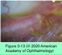

# 8.3.2. Clinical Approach to Dry Eye (II): Treatment

## Images

## Hierarchy

- Introduction
  - history of associated systemic conditions
  - history of medication use
  - carefully examine for structural/exogenous disorders that can cause similar symptoms
    - conjunctivochalasis
    - floppy eyelid syndrome
    - superior limbic keratoconjunctivitis
- Medical management of aqueous tear deficiency (ATD)
  - Recommended treatment for aqueous teat deficiency
    - See Table 3-5
  - stop smoking
  - discontinue topical or systemic medications that may contribute to the condition
    - topical β-blockers
      - increase incidence of dry eye
        - due to reduced corneal sensitivity
    - systemic medications
      - diuretics
      - antihistamines
      - anticholinergics
      - psychotropics
    - See Table 3-6
  - topical tear substitutes
    - preservative-free tear substitutes are recommended to avoid toxicity in patients who use these agents frequently
    - demulcents
      - polymers added to artificial tear solutions to improve their lubricant properties
        - mucomimetic
      - can briefly substitute for glycoproteins lost late in the disease process
      - cannot restore lost glycoproteins or conjunctival goblet cells, reduce corneal cell desquamation, or decrease osmolarity
      - preservative-free demulcent solutions
        - improve corneal barrier function
  - topical cyclosporine A 0.05%
    - treats the inflammatory component of ATD
    - used earlier in disease course
    - often initiated in combination with a short course of topical steroids
    - ≈ 50% of patients with moderate to severe ATD seem to benefit from topical cyclosporine
      - it may take several months for the anti- inflammatory benefits of cyclosporine to take effect
    - minimal side effects
  - dilute solutions of hyaluronic acid
  - diluted autologous serum
    - composition is somewhat similar to normal tears
      - particularly in regard to growth factors
        - beneficial trophic function
    - requires blood draws of 3 or 4 red-top tubes
      - spun to separate the serum
        - placed on dry ice
          - sent to a compounding pharmacy
    - helpful for
      - persistent epithelial defects
      - neurotrophic keratopathy
  - treatment of filamentary keratopathy
    - tear supplementation
    - acetylcysteine 10%
      - dispensed in an eyedrop container
      - mucolytic
    - topical low-dose steroids
    - cyclosporine
    - tacrolimus
    - therapeutic contact lenses
  - treatment of severe ATD
    - goggles
    - shields
    - moisture bubbles
    - therapeutic soft contact lenses
      - may increase the risk of infection
      - patients should be observed more carefully
    - scleral contact lenses
      - extremely helpful in patients with advanced dry eye symptoms
  - pharmacologic stimulation of tear secretion
    - cholinergic agonists
      - cevimeline
        - pilocarpine
      - stimulate muscarinic receptors present in salivary and lacrimal glands
      - effective in treating both xerostomia and dry eye in patients with Sjögren syndrome
      - approved only for treatment of xerostomia
      - significant adverse effects
  - dietary supplementation with omega-3 fatty acids
    - block the proinflammatory eicosanoids and cytokines
      - increase average tear production/tear volume
    - foods rich in omega-3 fatty acids
      - fish (eg, salmon, tuna, cod, flounder)
      - shrimp
      - crab
      - flaxseed oil
      - dark leafy greens
      - walnuts
- Medical management of evaporative dry eye
  - based on stage of MGD
    - See Tables 3-7 and 3-8
  - eyelid hygiene is the mainstay of treatment
    - warm compresses to the eyelids
      - ≥ 4 minutes once or twice a day
      - liquefies thickened meibomian gland secretions
      - application of heat should be followed by moderate to firm massage of eyelids to express retained meibomian secretions
      - followed by cleansing of the closed eyelid margin with a clean washcloth, a cotton ball, or a commercially available pad
        - diluted solution of a nonirritant shampoo
        - dilute sodium chloride solution
          - 1 teaspoon of salt to 1 pint of boiled water
  - topical antibiotics
    - short-term use
    - reduce the bacterial load on the eyelid margin
    - topical ophthalmic azithromycin
      - lipophilic antibiotic
        - reduces the production of bacterial lipases
      - high viscosity of the drop prolongs the contact time and aids its penetration into the glands
  - topical corticosteroids
    - short-term use
    - moderate to severe inflammation
      - corneal infiltrates
      - corneal vascularization
    - should be warned about the potential complications associated with long-term use
  - changes in diet and omega-3 supplementation
    - in one study
      - 1000-mg omega-3 nutritional supplements 3 times a day for 1 year
        - improved symptoms, tear-film stability, and meibomian secretions
    - in another study
      - supplementation with fish oil showed no significant effect on meibum lipid composition or aqueous tear evaporation rate
      - average tear production and tear volume increased
  - systemic tetracyclines
    - drugs
      - tetracycline
        - must be taken on an empty stomach
        - requires more frequent dosing
      - doxycycline
        - 100 mg every 12 hours for 3–4 weeks
          - tapering to 40–100 mg per day, based on clinical response
      - minocycline
        - 50 mg every 12 hours for 3–4 weeks
    - lower doses may be equally effective
    - therapy must often be continued long-term
      - often takes 3–4 weeks to achieve a clinical response
        - it may take several months for the anti- inflammatory benefits of cyclosporine to take effect
    - erythromycin
      - alternative therapy in patients with known hypersensitivity to tetracycline or in children
    - adverse effects
      - photosensitization
      - gastrointestinal upset
      - azotemia
        - rare
      - oral or vaginal candidiasis in susceptible patients
      - may reduce the efficacy of oral contraceptives
    - contraindications
      - pregnancy
      - breast-feeding
      - known hypersensitivity
      - children <8 years
        - cause permanent discoloration in teeth and bones
    - used with caution
      - women of childbearing age
      - family history of breast cancer
      - history of liver disease
      - patients taking certain anticoagulants (eg, warfarin)
  - new therapies
    - commercially available system
      - gentle pulsatile pressure and thermal energy to increase blood flow to the eyelid and open obstructed meibomian gland ductules
    - special instruments to probe and open the meibomian glands mechanically
- Surgical management of aqueous tear deficiency
  - reserved for patients with severe disease for whom medical treatment is either inadequate or impractical
  - reversible punctal occlusion
    - for moderate to severe ATD
    - collagen implants
      - usually dissolve within days and do not provide complete canalicular occlusion
    - silicone punctal plugs
      - may remain in place for months to years
      - disadvantages
        - plug displacement
          - once a plug has been displaced, subsequent plugs are more likely to be displaced
        - inadvertent insertion into nasolacrimal system
          - requires surgical removal
        - conjunctival abrasion if a plug protrudes from the punctum
        - granuloma formation at the punctal opening
          - requires removal of the plug
    - plugs for intracanalicular placement
      - associated with infections
  - irreversible punctal occlusion
    - techniques
      - disposable cautery
      - hyfrecator
      - radiofrequency probe
    - recommended primarily for patients who have
      - minimal basal tear secretion
        - older patients, in whom the risk of iatrogenically induced epiphora is minimal
      - punctate keratopathy
      - no significant ocular surface inflammation or infection
  - other surgical procedures
    - correction of eyelid malpositions such as entropion and ectropion
    - reduction of the palpebral aperture
      - lateral and/or medial tarsorrhaphy
        - for severe KCS when more conservative measures have failed
        - lateral tarsorrhaphy may limit the temporal visual field
        - cosmetic defect
