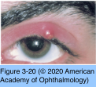
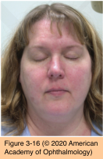
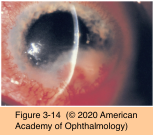
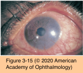

# 8.3.3. Eyelid Diseases Associated With Ocular Surface Disorders (I)

## Images

## Hierarchy

- internal hordeola
  - on the posterior eyelid
    - meibomian glands
- Hordeola and Chalazia
  - clinical presentation
    - hordeola
      - painful, tender, red nodular masses near the eyelid margin
      - external hordeola
        - styes
        - on the anterior eyelid
          - glands of Zeis or lash follicles
      - localized purulent abscess
        - S aureus
      - generally self-limited
        - improve spontaneously over the course of 1–2 weeks
    - chalazia
      - internal hordeola occasionally evolve into chalazia
        - from meibomian glands (or glands of Zeis)
      - blurred vision secondary to astigmatism induced by its pressure on globe
        - chronic lipogranulomatous nodules
      - disappears in weeks to months
        - drain either externally through the eyelid skin or internally through the tarsus
        - extruded lipid is phagocytosed and the granuloma dissipates
        - a small amount of scar tissue may remain
      - basal cell, squamous cell, and sebaceous cell carcinoma can masquerade as chalazia (or chronic blepharitis)
        - histologic examination of persistent, recurrent, or atypical chalazia is therefore important
  - management
    - cultures
      - not indicated for isolated, uncomplicated hordeolum or chalazion
    - warm compresses
      - with light massage over the lesion
    - topical antibiotics
      - generally not effective and, therefore, are not indicated
      - unless accompanying infectious blepharoconjunctivitis is present
    - systemic antibiotics
      - indications
        - secondary eyelid cellulitis
          - rare
        - oral doxycycline
          - prominent and chronic accompanying meibomitis
    - intralesional injection of corticosteroid
      - for chalazia resistant to warm compresses and eyelid hygiene
      - works best with
        - small chalazia
        - chalazia on the eyelid margin
        - multiple chalazia
      - 0.1–0.2 mL of triamcinolone 40 mg/mL
        - may lead to depigmentation of the overlying eyelid skin in patients with dark skin
    - incision and drainage
      - for large chalazia
      - internal chalazia require vertical incisions through the tarsal conjunctiva along the meibomian gland
        - avoid horizontal scarring of tarsal plates
      - perilesional anesthesia
    - recurrent chalazia should be biopsied to rule out meibomian gland carcinoma
- eyelid margin telangiectasia
- Rosacea
  - epidemiology
    - aged 30–60 years
      - can be encountered in younger patients and is often underdiagnosed
  - pathogenesis
    - no proven cause
      - slight F preponderance
    - ± overexpression of cathelicidin antimicrobial peptides
      - neutrophil recruitment
        - angiogenesis
        - cytokine release
    - alcohol can contribute to a worsening of this disorder
  - clinical presentation
    - cutaneous sebaceous gland dysfunction
      - face
      - neck
      - shoulders
    - facial lesions
      - telangiectasias
      - recurrent papules and pustules
      - midfacial erythema
        - malar rash
          - unpredictable flushing episodes
            - alcohol
            - coffee
      - rhinophyma
        - thickening of the skin and connective tissue of the nose
        - occur relatively late
      - external examination under bright room light
    - ocular findings
      - recalcitrant chronic blepharitis
      - meibomian gland distortion, disruption, and dysfunction
        - excessive sebum secretion
      - recurrent chalazia
      - chronic conjunctivitis
      - marginal corneal infiltrates
      - sterile ulceration
      - episcleritis
      - iridocyclitis
      - corneal neovascularization and scarring
        - secondary to repeated bouts of ocular surface inflammation
  - management
    - ocular and systemic diseases are managed simultaneously
    - systemic tetracyclines as the mainstay of therapy
      - anti-inflammatory properties
        - suppression of leukocyte migration
        - reduced production of nitric oxide and reactive oxygen species
        - inhibition of matrix metalloproteinases (MMPs)
        - inhibition of phospholipase A2
        - reduce irritative free fatty acids and diglycerides by suppressing bacterial lipases
      - oral therapy
        - doxycycline
        - minocycline
    - facial erythema
      - topical metronidazole 1% cream
        - topical metronidazole 0.75% gel
      - azelaic acid gel 15%
        - the only gel approved by FDA for treatment of papulopustular rosacea
    - ulcerative keratitis
      - infectious etiology
      - sterile inflammatory etiology
        - topical corticosteroids
          - used judiciously
    - advanced cases with scarring and neovascularization
      - conservative therapy is generally recommended
    - PK
      - high-risk procedure in rosacea patients
    - light-pulse treatment
      - to reduce eyelid erythema
- Types of blepharitis
  - staphylococcal
  - meibomian gland dysfunction
  - seborrheic
  - See Table 2-9
- Seborrheic Blepharitis
  - clinical presentation
    - alone or in combination with staphylococcal blepharitis or MGD
    - symptoms
      - burning
      - foreign-body sensation
        - increased meibomian gland secretions
          - appear turbid when expressed
    - signs
      - crusting
        - on the eyelids, eyelashes, eyebrows, and scalp
        - oily or greasy consistency
      - chronic eyelid redness
        - inflammation occurs primarily at anterior eyelid margin
          - MGD affects mainly the posterior lid margin
      - associated keratitis (or conjunctivitis)
        - ≈15%
          - punctate epithelial erosions
        - over the inferior one-third of the cornea
      - evaporative dry eye
        - 1/3
  - treatment
    - eyelid hygiene
    - concurrent treatment of the scalp disease with selenium sulfide shampoos
