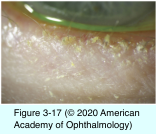
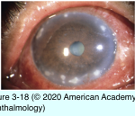
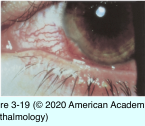

# 8.3.4. Eyelid Diseases Associated With Ocular Surface Disorders (II): Staphylococcal Blepharitis

## Images

## Hierarchy

- pathogenesis
  - primarily infectious
    - MGD and seborrheic blepharitis are primarily inflammatory
    - usually Staphylococcus aureus
- inflammation associated with seborrheic blepharitis occurs primarily at anterior eyelid margin
- inflammation associated with MGD occurs primarily at posterior eyelid margin
- management
  - eyelid hygiene
    - focus on base of lashes
    - reduces bacterial colonization and accumulation of sebaceous secretions
    - commercially available eyelid scrub kits
    - warm water with diluted baby shampoo
  - topical antibiotic
    - apply to eyelid margin to reduce both bacterial load and inflammation
    - agents
      - bacitracin
      - erythromycin
      - azithromycin
  - concomitant ATD and/or lipid-induced tear-film instability should be treated
  - antibiotic solution
    - cases with prominent infectious conjunctivitis
    - well-tolerated, narrow-spectrum antimicrobial agent effective against the majority of staphylococci should be selected
  - anti-inflammatory therapy
    - limited and judicious use of mild doses of topical corticosteroids in selected cases
      - routine or long-term use should be discouraged
    - more rapid symptomatic relief
    - little therapeutic benefit for toxic-related punctate epithelial keratopathy
    - marginal infiltrates and phlyctenulosis respond promptly to topical corticosteroid therapy
      - have a strong immunologic component
      - phlyctenulosis
        - corticosteroids are usually necessary early in the course of treatment
      - marginal infiltrates
        - eyelid hygiene and antibiotic therapy alone may be sufficient
        - corticosteroids may be introduced earlier if the diagnosis is certain
        - if epithelial defects are noted over the infiltrates, diagnostic cultures should be considered before corticosteroid treatment
- clinical presentation
  - more common in younger individuals
  - symptoms
    - crusting
      - particularly upon awakening
    - burning
    - itching
    - foreign-body sensation
      - in contrast to ATD
    - peak in the morning and improve as the day progresses
  - signs
    - hard, brittle fibrinous scales/hard, matted crusts
      - surrounding individual cilia on anterior eyelid margin
    - injection and telangiectasis of anterior and posterior eyelid margins
    - small ulcers of anterior eyelid margin
      - seen when hard crusts are removed
    - white lashes (poliosis)
    - lash loss (madarosis)
    - trichiasis
  - Staphylococcal blepharoconjunctivitis
    - S aureus
    - chronic (>4-week duration)
    - unilateral or bilateral
    - papillary reaction of tarsal conjunctiva
      - particularly inferior tarsal conjunctiva near the eyelid margin
    - injection of bulbar and tarsal conjunctivae
      - mild
    - scant mucopurulent discharge
    - ± concomitant ATD and/or lipid-induced tear- film instability
    - S aureus
      - matted golden crusts and ulcers on anterior eyelid margin
      - inferior punctate keratopathy
      - marginal corneal infiltrates
      - conjunctival or corneal phlyctenules
        - rare
  - Moraxella angular blepharoconjunctivitis
    - Moraxella lacunata
    - chronic angular blepharoconjunctivitis
    - crusting and ulceration of skin in lateral canthal angle
    - papillary or follicular reaction on tarsal conjunctiva
    - ± adjacent keratitis
    - frequently associated with concomitant S aureus blepharoconjunctivitis
  - phlyctenulosis
    - unilateral
    - ≥1 small, rounded, elevated, gray or yellow, hyperemic, focal inflammatory nodules
      - at or near the limbus
      - cornea
      - bulbar conjunctiva
    - adjacent zone of engorged hyperemic vessels
    - natural course
      - become necrotic and ulcerate centrally
        - spontaneously involute over a period of 2–3 weeks
      - conjunctival phlyctenules do not lead to scarring
      - corneal/limbal phlyctenules lead to residual wedge-shaped fibrovascular corneal scars along the limbus
        - when such scars are bilateral and inferior, they may suggest previous phlyctenulosis
      - corneal involvement is recurrent
        - ± corneal thinning
          - centripetal migration of successive inflammatory lesions may eventually develop, affecting vision if untreated
        - perforation
          - rare
- differential diagnosis
  - chronic unilateral conjunctivitis refractory to therapy
    - masquerade syndrome (conjunctival malignancy)
    - factitious illness
- laboratory evaluation
  - eyelid and conjunctival cultures
    - heavy, confluent growth of S aureus
    - light to moderate growth and/or isolation of staphylococcal species other than S aureus does not exclude the diagnosis
  - indications
    - initial diagnosis is in doubt
    - treatment response is poor
    - infection is worsening
  - susceptibility testing
    - in cases that have been refractory to empiric antibiotic therapy
