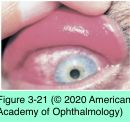

# 8.3.5. Structural and Exogenous Disorders Associated With Ocular Surface Disorders (I)

## Images

## Hierarchy

- inferior 1/3 of the cornea
- Exposure Keratopathy
  - pathogenesis
    - neurogenic diseases
      - seventh nerve palsy
    - degenerative neurologic conditions
      - Parkinson disease
    - cicatricial or restrictive eyelid diseases
      - ectropion
    - drug abuse
    - blepharoplasty
    - skin disorders
      - Stevens-Johnson syndrome
      - xeroderma pigmentosum
    - proptosis
  - symptoms
    - foreign-body sensation
    - photophobia
    - tearing
  - clinical presentation
    - punctate epithelial keratopathy
      - entire corneal surface in severe cases
    - large, coalescent epithelial defects
      - ulceration
      - melting
      - perforation
  - management
    - similar to that for severe dry eye
    - early stages
      - nonpreserved artificial tears during the day
      - ointment at bedtime
    - nocturnal exposure
      - taping the eyelid shut at bedtime
    - paralytic ectropion of the lower eyelid
      - horizontal tightening procedure
    - correction of any associated eyelid abnormalities, such as ectropion and/or trichiasis
    - bandage contact lenses
      - high incidence of desiccation and infection!
    - temporary or self-limited exposure keratopathy
      - temporary tarsorrhaphy
        - tissue adhesive
          - hazardous in patients with exposure keratopathy
        - sutures
    - long-standing exposure keratopathy
      - permanent lateral and/or medial tarsorrhaphy
      - insertion of gold or platinum weights into the upper eyelid
        - effective, more cosmetic approach
        - remain stable when exposed to magnetic resonance imaging
        - complications
          - infection
          - shifting
          - extrusion
          - induced astigmatism
          - unacceptable ptosis
          - noninfectious inflammatory response
- Superior Limbic Keratoconjunctivitis
  - pathogenesis
    - mechanical trauma from upper eyelid to superior bulbar and tarsal conjunctiva
    - association with autoimmune thyroid disease
  - clinical presentation
    - women 20–70 years of age
    - chronic, recurrent
      - usually resolves spontaneously
        - recur over a period of 1–10 years
    - often bilateral
      - 1 eye may be more severely affected
    - can be associated with ATD or blepharospasm
    - ocular findings
      - fine papillary reaction on superior tarsal conjunctiva
      - injection and thickening of superior bulbar conjunctiva
      - hypertrophy of superior limbus
      - fine punctate fluorescein and rose bengal staining of superior bulbar conjunctiva above limbus and superior cornea just below limbus
      - superior corneal filamentary keratopathy
  - diagnostic work-up
    - histopathology of superior bulbar conjunctiva
      - hyperproliferation
      - acanthosis
      - loss of goblet cells
      - keratinization
        - nuclear pyknosis with “snake nuclei”
    - scrapings or impression cytology of the superior bulbar conjunctiva
      - increased epithelial cytoplasm–nucleus ratio
      - loss of goblet cells
    - thyroid function tests
      - free thyroxine (T4)
        - keratinization
      - thyroid-stimulating hormone (TSH)
      - thyroid antibody
  - management
    - topical anti-inflammatory agents
    - large-diameter bandage contact lenses
    - superior punctal occlusion
    - thermocauterization of the superior bulbar conjunctiva
    - resection of the bulbar conjunctiva superior to the limbus
    - topical cyclosporine
    - autologous serum eyedrops
    - amniotic membrane transplant
    - conjunctival fixation sutures
- Floppy Eyelid Syndrome
  - obese individuals
    - obstructive sleep apnea
  - pathogenesis
    - flimsy, lax upper tarsus
      - everts with minimal upward force applied to the upper eyelid
      - spontaneous eversion of upper eyelid when it comes into contact with pillow or other bed linens during sleep
        - trauma to upper tarsal conjunctiva
          - chronic ocular irritation and inflammation
  - clinical findings
    - small to large papillae on upper palpebral conjunctiva
    - mucus discharge
    - corneal involvement
      - mild punctate epitheliopathy to superficial vascularization
    - ± unilateral
      - keratoconus
        - has been reported
      - if the patient always sleeps in the same position
  - differential diagnosis
    - vernal conjunctivitis
    - giant papillary conjunctivitis
    - atopic keratoconjunctivitis
    - bacterial conjunctivitis
    - toxic keratopathy
  - treatment
    - covering the affected eyes with a metal shield
    - taping the eyelids closed at night
    - surgical eyelid-tightening procedures
