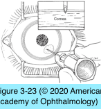

# 8.3.6. Structural and Exogenous Disorders Associated With Ocular Surface Disorders (II): Recurrent Corneal Erosion

## Images

## Hierarchy

- pathogenesis
  - preexisting conditions
    - previous sudden, sharp, abrading injury
      - superficial lacerating injuries rarely result in recurrent erosions
    - preexisting epithelial basement membrane dystrophy
    - other conditions with abnormalities of epithelial basement membrane
      - diabetes mellitus
      - dystrophies of stroma and Bowman layer
  - upregulation of gelatinase activity (MMP-2 and MMP-9) in corneal epithelium
  - some patients with recurrent corneal erosions have MGD
    - increased levels of MMPs occur in tear film of patients with MGD
- high oxygen transmissibility (Dk)
- management
  - acute phase
    - frequent lubrication
      - antibiotic ointments
    - cycloplegia
  - after acute phase
    - nonpreserved lubricants or hypertonic saline solution (5% sodium chloride) during the day and ointment at bedtime
      - X 6-12 months
    - some patients find hypertonic medications unacceptably irritating
    - low-dose oral doxycycline
    - topical corticosteroids
      - localized inhibition of MMPs
  - therapeutic bandage contact lens
    - proper patient education and judicious monitoring are crucial
    - flat base curve
    - topical broad-spectrum antibiotic 3–4 times daily
  - recalcitrant disease
    - anterior stromal micropuncture
      - bent 25-gauge needle
        - for posttraumatic recurrent erosions
      - numerous superficial puncture wounds in involved area
        - create subepithelial scars
      - rarely is a significant scar visible for more than a few months after this procedure
        - should be used with caution in the visual axis
      - may need to be repeated
    - diathermy
    - polishing with a diamond burr
  - dystrophic/degenerative erosions
    - epithelial debridement
      - topical anesthetic
      - surgical sponge, spatula, or surgical blade
        - do not damage underlying Bowman layer
      - light application of ophthalmic diamond burr to Bowman layer in affected area (outside visual axis)
        - ± reduces recurrences in resistant cases
      - significant discomfort x 3–4 days
        - perform at the time of a painful recurrent episode
      - topical antibiotic ointment, cycloplegia, and, in some cases, bandage contact lenses are used
      - oral analgesics are often necessary in the first 24 hours
    - excimer laser phototherapeutic keratectomy
      - create a large, shallow zone of ablation
        - particularly for dystrophic erosions
      - can minimize refractive effects
      - can be used to correct an associated myopic refractive error
- clinical presentation
  - acute episode
    - sudden onset of eye pain
      - no obvious precipitating event
        - days to years after initial abrading injury
      - at night or upon first awakening
    - redness
    - photophobia
    - tearing
    - symptoms subside spontaneously in most cases, only to recur periodically
  - minor episodes
    - last 30 minutes to several hours
    - cornea has an intact epithelial surface at the time of examination
  - severe episodes
    - last several days
    - greater pain, eyelid edema, decreased vision, and extreme photophobia
      - discomfort is out of proportion to degree of observable pathology
    - epithelium in involved area appears heaped up and edematous
      - significant pooling of fluorescein over the affected area is often visible
  - corneal epithelium is loosely attached to the underlying basement membrane and Bowman layer
  - examine contralateral eye following maximal pupillary dilation
    - dystrophic erosion
      - basement membrane changes in unaffected eye
    - posttraumatic erosion
      - no basement membrane changes in unaffected eye
