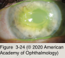

# 8.3.7. Structural and Exogenous Disorders Associated With Ocular Surface Disorders (III)

## Images

## Hierarchy

- Dellen
  - pathogenesis
    - ocular surface elevations
      - interfere with wetting effect of the tear film
        - desiccation of the epithelium and subepithelial tissues
  - normal blinking does not wet the involved area properly
  - clinical presentation
    - at or near limbus adjacent to surface elevations
      - pterygia
      - large filtration blebs
      - dermoids
    - saucerlike depressions in the corneal surface
    - epithelium exhibits punctate irregularities overlying a thinned area of dehydrated corneal stroma
  - treatment
    - ocular lubrication
    - pressure patching
  - scleral dellen
    - orbital and conjunctival tissues help in maintaining scleral hydration
    - removal of perilimbal conjunctiva and interference with the wetting effect of the tear film
      - cause the underlying sclera to become markedly thinned and translucent
- Neurotrophic Keratopathy and Persistent Corneal Epithelial Defects
  - etiology
    - damage to the trigeminal nerve
    - herpetic keratitis
      - most common cause
      - can produce persistent corneal epithelial defects in absence of replicating virus or active inflammation
    - topical medications
      - toxic ulcerative keratopathy
        - agents
          - topical anesthetics
          - topical nonsteroidal anti-inflammatory drugs (NSAIDs)
          - trifluridine
          - β-blockers
          - carbonic anhydrase inhibitors
          - drops containing the preservative benzalkonium chloride (BAK)
        - clinical presentation
          - usually presents as a diffuse punctate keratopathy
            - often misinterpreted as a worsening of the underlying disease
              - may lead to even larger doses of offending medication
          - pericentral pseudodendritiform lesions and pseudogeographic defects
    - diabetes mellitus
      - diabetic neuropathy
      - epithelial debridement during vitreoretinal procedures
    - See Table 3-10
  - persistent corneal epithelial defects
    - central or paracentral areas of chronic nonhealing epithelium
    - elevated, round or oval, grayish edges associated with underlying stromal inflammation
    - inferior or inferonasal
      - protective effect of Bell phenomenon on the superior cornea
    - can progress to
      - vascularization and corneal opacification or scarring
      - necrosis and thinning of the stroma
        - perforation
  - management
    - careful history
    - frequent lubrication with nonpreserved ointments
      - potentially aggravating topical medications must be discontinued
    - autologous serum drops (20%)
      - contain growth factors and fibronectin
    - temporary or permanent punctal occlusion
      - in cases involving significant dry eye
    - patching
    - low-water-content, highly oxygen-permeable therapeutic contact lenses
    - scleral-bearing contact lenses with a fluid-filled reservoir
    - lateral and/or medial tarsorrhaphy
      - decrease tear-film evaporation and tear-film osmolarity
    - medications with specific activity against MMPs
      - systemic tetracyclines
      - may help prevent stromal melting
    - corneal collagen crosslinking
      - early in the course of a melt
    - amniotic membrane grafting
      - to encourage healing of persistent epithelial ulcerations
    - partial or total conjunctival flaps
      - prevent corneal melting
      - should be used as a last resort
- sharply delineated borders
- Factitious Ocular Surface Disorders
  - self-induced injuries with symptoms or physical findings that the patient intentionally produces in order to assume the sick role
  - factitious conjunctivitis
    - shows evidence of mechanical injury to the inferior and nasal quadrants of cornea and conjunctiva
    - patients often have medical training or work in a medical setting
    - patients have an attitude of serene indifference
  - mucus-fishing syndrome
    - inciting event is typically KCS
      - conjunctival tissues usually show no evidence of inflammation on pathologic examination
      - increased mucus production
    - vigorous eye rubbing and compulsive removal of mucus strands from the fornix (mucus fishing)
      - epithelial injury heightens ocular surface irritation
        - stimulates additional mucus production
    - well-circumscribed pattern of rose bengal or lissamine green staining of nasal and inferior bulbar conjunctiva
  - topical anesthetic abuse
    - local anesthetics
      - inhibition of epithelial migration and division
      - loss of microvilli
      - reduction of desmosomes and other intercellular contacts
      - swelling of mitochondria and lysosomes
    - clinical features
      - punctate keratopathy
      - eye injection
      - epithelial defects
        - can take on a neurotrophic appearance
      - dense stromal infiltrates
        - large ring opacity
      - stromal vascularization
      - diffuse stromal edema
      - secondary infection
        - keratic precipitates and hypopyon
    - differential diagnosis
      - infectious keratitis must be ruled out
        - bacterial, fungal, herpetic, and amebic keratitis
        - features suggestive of anesthetic abuse
          - negative cultures
        - often, diagnosis is made only when the patient is discovered concealing the anesthetic drops
          - failure to respond to appropriate therapy
    - management
      - corneal healing usually occurs if all exposure to anesthetics is removed
        - permanent corneal scarring or perforation may occur
      - psychiatric counseling
- Trichiasis and Distichiasis
  - Trichiasis
    - acquired
    - eyelashes emerging from their normal anterior origin curve inward toward the cornea
    - etiology
      - idiopathic
      - chronic inflammatory conditions of eyelids and conjunctiva
        - subtle cicatricial entropion of eyelid margin
          - most common
        - trachoma
        - mucous membrane pemphigoid
        - Stevens-Johnson syndrome
        - chronic blepharitis
        - chemical burns
  - Distichiasis
    - congenital
    - autosomal dominant
    - extra row of eyelashes emerges from the ducts of meibomian glands
      - can be fine and well tolerated
      - can be coarser and a threat to corneal integrity
  - treatment
    - mechanical epilation
      - temporary
        - eyelashes normally grow back within 2–3 weeks
    - electrolysis
      - works well only for removing a few eyelashes
      - may be preferable in younger patients for cosmetic reasons
    - cryotherapy
      - complications
        - eyelid margin thinning
        - loss of adjacent normal eyelashes
        - persistent lanugo (hairs)
      - cryotherapy at –20°C should be limited to less than 30 seconds
    - tarsotomy with eyelid margin rotation
      - preferred surgical technique
