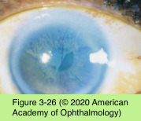

# 8.3.8. Limbal Stem Cell Deficiency

## Images

## Hierarchy

- PATHOGENESIS
  - stem cells
    - types
      - corneal stem cells
        - basal cell layer of the limbus
          - ≈ 25%–33% of limbus must be intact to ensure normal ocular resurfacing
      - conjunctival stem cells
        - uniformly distributed throughout bulbar surface or located in fornices
    - unlimited capacity for self-renewal
    - slow cycling (low mitotic activity)
    - once stem cell differentiation begins, it is irreversible
      - transit amplification
        - transit-amplifying cells
          - limited capacity for self-renewal
            - able to undergo a finite number of cell divisions
          - at limbus as well as basal layer of the corneal epithelium
  - absence of limbal stem cells
    - reduced effectiveness of epithelial wound healing
    - compromised ocular surface integrity
      - irregular ocular surface
      - recurrent epithelial breakdown
    - migration of conjunctival cells onto ocular surface
      - often accompanied by superficial neovascularization
- CLINICAL PRESENTATION
  - irregular corneal surface
    - decreased vision
    - wavelike irregularity of the ocular surface emanating from the limbus
      - more easily observed following the instillation of topical fluorescein
  - corneal neovascularization
  - recurrent ulceration
  - increased epithelial permeability
    - diffuse permeation of topical fluorescein into the anterior stroma
- MANAGEMENT
  - discontinue any possible inciting cause
  - mild & focal/sectoral cases
    - topical steroids
    - epithelial debridedment
  - extensive or severe cases
    - scleral contact lens
    - limbal transplantation
      - limbus focally affected in 1 eye
        - autograft from ipsilateral eye
      - unilateral, moderate or severe chemical injuries
        - autograft from opposite eye
      - bilateral limbal deficiency
        - limbal allograft from a HLA– matched living related donor
          - systemic immune suppression is required
- etiology
  - See Table 3-11
  - primary causes
    - PAX6 gene mutations (aniridia)
    - ectrodactyly–ectodermal dysplasia–clefting syndrome
    - sclerocornea
    - keratitis-ichthyosis-deafness (KID) syndrome
    - congenital erythrokeratodermia
  - secondary causes
    - chemical burns
    - thermal burns
    - radiation
    - contact lens wear
    - ocular surgery
    - mucous membrane conjunctivitis
      - mucous membrane pemphigoid
      - trachoma
      - Stevens-Johnson syndrome
    - pterygia
    - use of topical medications
      - pilocarpine
        - also cause neurotrophic keratitis
      - β-blockers
      - antibiotics
      - antimetabolites
    - dysplastic or neoplastic lesions of the limbus
