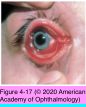
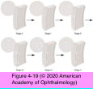
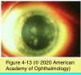
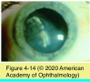
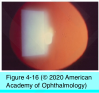

# 8.4.3. Infectious Diseases of the External Eye (III): DNA Viruses (II)

## Images

## Hierarchy

- HPV 6 & 11 cause wart/papilloma
- Adenoviruses
  - pathogenesis
    - structure
      - double-stranded DNA
      - nonenveloped
        - resistant to environmental insult
          - can persist for weeks outside the human host
          - apply dilute bleach to tonometer tips x ≥ 10 minutes to prevent transmission of adenoviruses
    - 6 distinct subgroups (A–F)
      - 49 serotypes
    - transmission
      - ocular or respiratory secretions
      - contaminated swimming pools
      - fomites
        - contaminated instruments or eyedrops in physicians’ offices
  - classic syndromes
    - simple follicular conjunctivitis (multiple serotypes)
      - not associated with systemic disease
      - self-limited
    - pharyngoconjunctival fever (serotypes 3 or 7)
      - follicular conjunctivitis
      - fever, headache, pharyngitis
        - mimic influenza
      - preauricular adenopathy
    - epidemic keratoconjunctivitis (EKC) (serotypes 8, 19, or 37, subgroup D)
      - symptoms
        - preceded by an upper respiratory tract infection
        - bilateral
          - tearing, light sensitivity, and foreign-body sensation
      - severe follicular conjunctivitis
      - chemosis
      - petechial hemorrhages
      - preauricular adenopathy
      - pseudomembranes or true membranes
      - central geographic corneal erosions
        - may persist for several days
      - multifocal subepithelial (stromal) corneal infiltrates
        - adenovirus replication in the corneal epithelium
          - immunopathologic response of keratocytes in the superficial stroma
        - 7–14 days after onset of eye symptoms
        - photophobia and reduced vision
          - may persist for months-years
  - lab evaluation
    - viral cultures
    - rapid immunodetection assay
      - to detect adenovirus antigens
    - paired serologic titers 2–3 weeks apart
  - treatment
    - supportive
      - cool compresses
      - artificial tears
    - topical antibiotics
      - if clinical signs suggest bacterial infection
    - membranes
      - manual removal
      - judicious use of topical corticosteroids
    - topical corticosteroids
      - effects
        - reduce photophobia & improve vision impaired by adenoviral subepithelial infiltrates
        - may prolong viral shedding from adenovirus- infected patients
        - can lead to worsening of HSV infections
        - does not affect the natural course of the disease
        - may be difficult to wean patients from them
      - indications
        - conjunctival membranes
        - ineffective therapy for adenoviral subepithelial infiltrates
          - reduced vision due to bilateral subepithelial infiltrates
    - nonsteroidal anti-inflammatory agents
      - may be helpful in preventing recurrence following tapering of corticosteroids
    - topical cyclosporine 1%
      - in patients failing other therapy
    - viral shedding may persist for 10–14 days after the onset of clinical signs and symptoms
      - personal hygiene measures
      - patients should be considered infectious if they are still hyperemic and tearing
      - patients on topical corticosteroids may appear quiet but still shed the virus
- Varicella-Zoster Virus
  - pathogenesis
    - primary infection
      - varicella/chickenpox
        - mode of transmission
          - respiratory secretions
            - shed virus before onset of the characteristic rash
          - direct contact with VZV skin lesions
    - latency
      - neural ganglia
      - 20% reactivation
    - recurrent disease
      - zoster/shingles
        - single dermatome
          - thorax
            - T3 - L3
          - CN V (trigeminal)
            - Herpes zoster ophthalmicus
              - ophthalmic branch>maxillary and mandibular branches
            - 15% involve CN V
  - Chickenpox/Varicella
    - ocular findings
      - eyelid vesicles
      - follicular conjunctivitis
        - +- vesicular lesion on the bulbar conjunctiva
      - Punctate/dendritic epithelial keratitis
        - uncommon
    - lab evaluation
      - Serologic testing
        - to identify varicella-naive adults who might benefit from prophylactic vaccination
      - cytology
      - culture
      - PCR
      - antigen detection
      - scrapings from a vesicle base
    - management
      - vaccination
        - age>12 months without history of chickenpox or with a negative serology
      - oral acyclovir
        - reduces severity of signs and symptoms
      - topical corticosteroids
        - keratitis or uveitis
  - Herpes zoster ophthalmicus
    - demographics
      - sixth to ninth decades of life
      - predisposing conditions
        - majority are healthy
        - immunosuppressive therapy
        - systemic malignancy
        - debilitating disease
        - HIV infection
        - major surgery, trauma, or radiation
      - ocular involvement
        - 70% of patients with zoster of first (trigeminal) division of CN V
          - immunosuppression
            - may involve more than 1 branch of the trigeminal nerve/may be multiply recurrent
          - ≤25% risk of systemic dissemination
        - may occur with zoster of the second (maxillary) division of CN V
    - clinical findings
      - dermatitis
        - rash --> vesicles --> pustules --> scarring
        - pain
          - usually decreases as lesions resolve
          - can continue for months to years
        - eyelid dermatitis
          - secondary bacterial infection
          - eyelid scarring
          - marginal notching
          - loss of cilia
          - trichiasis
          - cicatricial entropion or ectropion
          - occlusion of the lacrimal puncta
      - cornea
        - punctate and dendritic epithelial keratitis
          - pseudodendrites
            - superficial/lack central ulceration
            - stain minimally with fluorescein and rose bengal
            - blunt rather than bulbous ends
            - branching (medusa-like)
        - dendritiform mucous plaques
          - may occur weeks-months after skin lesions
        - zoster stromal keratitis
          - nummular corneal infiltrates
            - characteristic
          - interstitial keratitis/disciform keratitis in HZO are clinically indistinguishable from HSV infection
          - complications
            - corneal opacity
            - corneal vascularization
            - lipid keratopathy
            - neurotrophic keratopathy
              - ≤50%
              - may be severe
      - Episcleritis or scleritis
        - nodular, zonal, or diffuse
      - anterior uveitis
        - sectoral iris atrophy
        - increased IOP
        - clinically indistinguishable from HSV infection
      - posterior segment findings
        - Focal choroiditis
        - occlusive retinal vasculitis
      - orbital/CNS involvement
        - from occlusive arteritis
          - ipsilateral acute retinal necrosis (ARN) temporally associated with HZO
            - retinal detachment
            - uncommon
        - ptosis
        - orbital edema
        - proptosis
        - papillitis or retrobulbar optic neuritis
        - cranial nerve palsies
          - ≤1/3
          - CN III (oculomotor) most commonly affected
      - systemic dissemination
        - ≤25% in immunocompromised patients
    - treatment
      - Oral antiviral therapy
        - advantages
          - reduce viral shedding
          - reduce the chance of systemic dissemination
          - decrease the incidence and severity of the most common ocular complications
          - reduce the duration if not the incidence of postherpetic neuralgia
            - if begun <72 hours of the onset of symptoms
        - oral famciclovir 500 mg 3 times per day
        - oral valacyclovir 1 g 3 times per day
        - oral acyclovir 800 mg 5 times per day for 7–10 days
          - best if started within 72 hours of the onset of skin lesions
      - Topical antiviral
        - not effective
          - except
            - corneal epithelial mucoid plaques
            - chronic epithelial disease
      - Amitriptyline
        - decreases duration of postherpetic neuralgia
          - if given early
      - varicella-zoster vaccine
        - 50% reduction in incidence of zoster
        - 66% reduction in postherpetic neuralgia
        - indications
          - immunocompetent individuals older than 60 years
        - potential to reactivate/exacerbate HZO-related inflammation in patients with previous HZO
          - administer during an extensive quiet period
      - Intravenous acyclovir therapy (10 mg/kg every 8 hours)
      - Oral corticosteroids
        - HZO >age 60
          - to reduce early zoster pain
            - patients at risk for disseminated zoster due to immunosuppression
          - controversial
      - cutaneous lesions
        - moist warm compresses
        - topical antibiotic ointment
      - keratouveitis
        - Topical corticosteroids and cycloplegics
      - neurotrophic keratopathy
        - nonpreserved tears, gels, and ointments
        - punctal occlusion and tarsorrhaphy
      - postherpetic neuralgia (PHN)
        - capsaicin cream
        - low doses of amitriptyline, desipramine, clomipramine, or carbamazepine
          - to control severe symptoms
        - gabapentin (Neurontin)
        - pregabalin (Lyrica)
- Cytomegalovirus Keratitis
  - pathogenesis
    - herpesvirus
    - infects > 90% by age 80
    - transmission
      - sharing of saliva
      - ingestion of breast milk
    - if acquired
      - children
        - sexual contact
        - subclinical infection
      - adults
        - nonspecific febrile illness lasting 1–3 weeks
          - viremia transmits the virus to the bone marrow
            - becomes latent in CD 34+ myeloid progenitor cells
  - ocular findings
    - necrotizing retinitis
      - sectoral
      - +- thin stellate keratic precipitates
        - almost exclusively in AIDS and other immunocompromised states
      - +- epithelial and stromal CMV keratitis
        - rare
    - endotheliitis
      - keratic precipitates
      - endothelial cell loss
      - diffuse or local corneal edema
    - anterior uveitis
      - acute or chronic iritis
      - variably responsive to topical corticosteroids
  - differential diagnosis
    - HSV-related endotheliitis
    - trabeculitis
    - Posner-Schlossman syndrome
  - lab evaluation
    - PCR testing of aqueous humor
      - contemporaneous serum may be tested to confirm that the viremia is local rather than systemic
    - histologic examination of biopsy specimens
  - treatment
    - CMV-associated anterior segment disease
      - antiviral therapy
        - ganciclovir
          - oral valganciclovir 900 mg twice daily
            - poorly tolerated
            - recurrence of disease is common
          - ganciclovir implants
          - topical ganciclovir
        - not responsive to famciclovir or acyclovir
          - resistance of a presumed HSV infection to these agents should raise the suspicion of CMV
      - keratoplasty
        - recurrence can occur
      - corticosteroids
        - may prolong or worsen CMV-associated anterior segment disease
- rises in IOP
