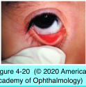
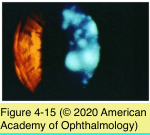
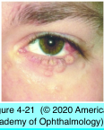

# 8.4.3. Infectious Diseases of the External Eye (IV): DNA Viruses (III)

## Images

## Hierarchy

- Human Papillomaviruses (HPV)
  - structure
    - double-stranded DNA
    - nonenveloped
      - resistant to environmental insults
    - icosahedral capsid
  - HPV 6 and 11
    - maintained in a latent state within basal epithelial cells
    - skin wart (verrucae)
    - conjunctival papilloma
  - HPV 16 and 18
    - squamous cell carcinoma
- Epstein-Barr Virus (EBV)
  - pathogenesis
    - herpesvirus
    - infects majority of humans by early adulthood
    - Spreads by sharing of saliva
    - if acquired
      - first decade of life
        - subclinical infection
      - later in life
        - infectious mononucleosis
    - remains latent in
      - B lymphocytes
      - pharyngeal mucosal epithelial cells
  - clinical findings
    - most common cause of acute dacryoadenitis
    - acute follicular conjunctivitis
    - Parinaud oculoglandular syndrome
    - bulbar conjunctival nodules
    - EBV stromal keratitis
      - types
        - Type 1: multifocal subepithelial infiltrates
          - resemble adenoviral keratitis
        - Type 2: multifocal, blotchy, pleomorphic infiltrates in anterior to mid-stroma
          - with active inflammation
          - inactive form
        - Type 3: multifocal deep/full-thickness peripheral infiltrates
          - resemble interstitial keratitis due to syphilis
      - unilateral or bilateral
      - differential diagnosis
        - HSV, VZV, Lyme disease, adenovirus, or syphilis
  - ancillary testing
    - virus isolation
      - difficult
    - antibody detection
      - antibodies to viral capsid antigens (VCA)
        - IgM
        - anti-VCA IgG may persist for life
          - serologic evidence of past infection
      - antibodies to EBV nuclear antigens
        - appear weeks to months later
  - treatment
    - effect on corneal manifestations unknown
      - acyclovir not effective for infectious mononucleosis
    - corticosteroids may be effective for reduced vision due to EBV stromal keratitis
      - not without prophylactic antiviral if HSV infection is a possibility
- Poxviruses
  - structure
    - DNA virus
    - double-stranded
    - enveloped
  - Molluscum Contagiosum
    - spreads by direct contact
    - clinical findings
      - smooth nodules
        - umbilicated central core
        - eyelid margin
          - release viral particles into the tear film
        - conjunctiva
      - punctate epithelial erosions
        - chronic follicular conjunctivitis
      - corneal pannus
        - rare
      - spontaneous resolution
      - extensive lesions occur in AIDS
      - compared with keratoacanthoma
        - smaller
        - less inflammation
    - lab evaluation
      - cannot be cultured using standard techniques
      - histologic examination of expressed or excised nodule
        - eosinophilic, intracytoplasmic inclusions (Henderson-Patterson bodies)
          - within epidermal cells
    - Treatment
      - complete excision
      - cryotherapy
      - incision of the central portion of the lesion
