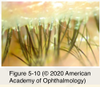
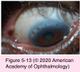

# 8.5.2. Microbial and Parasitic Infections of the Eyelid Margin and Conjunctiva (II)

## Images

## Hierarchy

- Fungal and Parasitic Infections of the Eyelid Margin
  - Demodex
    - a genus of mites
    - clinical findings
      - waxy “sleeves” around eyelashes
      - +- inflammatory response (blepharitis)
        - cylinders extending from sebaceous glands of the eyelid margin
    - treatment
  - Malassezia furfur
    - blepharitis
      - dilute tea tree oil applied to the base of the eyelashes
        - oral ivermectin
  - focal granuloma or dermatitis
    - blastomycosis
    - sporotrichosis
    - rhinosporidiosis
    - cryptococcosis
    - leishmaniasis
    - ophthalmomyiasis
  - Lice infestation (phthiriasis palpebrum)
    - adolescents and young adults
    - localized extension of head or body lice
      - rare
    - treatment
      - Mechanical removal of the lice and nits (eggs)
      - pubic hairs are usually treated with a pediculicide
      - ointment
        - twice daily for at least 10 days
          - reexamination x 10–14 days
            - incubation period (of the nits) is 7–10 days
      - wash items of close contact
        - dry at the highest temperature setting (≥50°C)
- pubic louse
- Chlamydial conjunctivitis
  - Trachoma
    - Pathogenesis
      - C trachomatis
        - obligate intracellular bacterium
    - Lab evaluation
      - cannot be easily cultured
      - Giemsa stain
      - PCR
        - direct fluorescent antibody staining
      - cell culture
    - Epidemiology
      - 150 million individuals worldwide
        - Middle East and in developing regions
        - USA
          - American Indians
          - mountainous areas of the South
      - poor hygiene/sanitation
      - leading cause of preventable blindness
      - Modes of transmission
        - eye to eye
        - flies
    - Clinical presentation
      - Symptoms
        - foreign-body sensation
          - household fomites
        - redness
        - tearing
        - mucopurulent discharge
      - severe follicular reaction
        - diffuse papillary hypertrophy/inflammatory cell infiltration (acute trachoma)
        - +- limbus
          - superior tarsal conjunctiva
        - become necrotic --> significant scarring
          - linear or stellate scarring of the superior tarsus
            - Arlt line
          - limbal depressions
            - Herbert pits
      - corneal findings
        - epithelial keratitis
        - focal/multifocal peripheral and central stromal infiltrates
        - superficial fibrovascular pannus
          - superior third of the cornea
      - diagnosis requires ≥ 2 of the following
        - 2 limbal follicles and their sequelae (Herbert pits)
        - 3 typical tarsal conjunctival scarring
          - 1 conjunctival follicles on the upper tarsal conjunctiva
        - 4 vascular pannus most marked on the superior limbus
      - complications
        - aqueous tear deficiency
        - tear drainage obstruction
        - trichiasis
        - entropion
    - Treatment
      - tetracycline 1% ophthalmic ointment twice daily x 2 months
      - oral azithromycin 1000 mg x 1
        - more effective and easier
      - erythromycin ointment twice daily x 2 months
      - rare tetracycline-resistant cases
        - oral erythromycin
      - tear substitutes
      - eyelid surgery for entropion or trichiasis
  - Adult chlamydial conjunctivitis
    - Epidemiology
      - sexually transmitted systemic disease
        - sexually active adolescents and young adults
        - in conjunction with chlamydial urethritis or cervicitis
      - Modes of transmission
        - contact with infected genital secretions
        - shared eye cosmetics
        - inadequately chlorinated swimming pools
    - Clinical presentation
      - 1–2 weeks after ocular inoculation
      - not as acute as adenoviral keratoconjunctivitis
        - mild symptoms for weeks-months
      - follicular conjunctival response
        - bulbar conjunctiva
          - lower palpebral conjunctiva and fornix
          - specific sign in patients not using topical medications
            - unlike trachoma
        - inferior
          - semilunar fold
      - scant mucopurulent discharge
        - preauricular adenopathy
      - no conjunctival membranes
        - adenoviral conjunctivitis causes membranes and pseudomembranes
      - corneal involvement
        - fine or coarse epithelial infiltrates
          - +- subepithelial infiltrates
          - superior cornea
            - may also occur centrally and resemble adenoviral keratitis
        - micropannus
          - less than 3 mm from the superior cornea
          - superior
            - follicular response is inferior micropannus is superior
    - Management
      - resolves spontaneously in 6–18 months
      - oral antibiotic
        - azithromycin 1000 mg single dose
        - doxycycline 100 mg twice daily for 7 days
        - tetracycline 250 mg 4 times daily for 7 days
        - erythromycin 500 mg 4 times daily for 7 days
          - in neonate and children
      - evaluate patients and their sexual contacts for coinfection with other sexually transmitted diseases before starting antibiotic treatment
      - sexual partners should be concomitantly treated
- Parinaud Oculoglandular Syndrome
  - Etiology
    - Cat-scratch disease
      - B henselae
      - most common cause
      - transient infection in kittens and their fleas
        - carrier state
          - cat bite or lick
          - cat’s fleas
          - no human-to-human transmission
    - other Bartonella species
    - Afipia felis
    - tularemia
    - tuberculosis
    - sporotrichosis
    - syphilis
    - coccidioidomycosis
  - Clinical presentation
    - unilateral granulomatous conjunctivitis
      - ≥1 raised or flat gelatinous, hyperemic, granulomatous lesions
        - superior or inferior tarsal conjunctiva
        - bulbar conjunctiva
        - fornix
      - 3–10 days after inoculation
    - optic neuritis and neuroretinitis
      - ipsilateral preauricular/submandibular (cervical) lymph nodes become firm & tender
        - enlarged suppurative nodes
          - 10-40%
    - systemic symptoms
      - mild
        - fever
        - malaise
        - headache
        - 10-30%
          - anorexia
      - severe
        - encephalopathy/encephalitis
        - thrombocytopenic purpura
        - osteolysis
        - hepatitis
        - splenitis
  - Lab evaluation
    - Serologic testing
      - indirect fluorescent antibody testing
      - enzyme immunoassay
        - more sensitive
    - skin test antigen
      - neither commercially available
      - nor standardized
    - culture
    - PCR
  - Treatment
    - antibacterial treatment
      - azithromycin
      - erythromycin
      - doxycycline
      - rifampin
        - adjuvant
