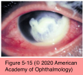
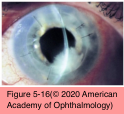

# 8.5.3. Microbial and Parasitic Infections of the Cornea and Sclera (I): Bacterial Keratitis

## Images

## Hierarchy

- Predisposing factors
  - contact lens wear
    - most frequent risk factor in US
      - 19%–42%
    - P aeruginosa becomes more pathogenic in lens-related biofilms
      - enhanced binding to molecular receptors exposed on injured epithelial cells
    - risk increases x15 in patients who wear their contact lenses overnight
      - risk increases with the number of consecutive days lenses are worn without removal
      - extended-wear soft lenses
        - 0.21%
    - annual incidence of cosmetic contact lens– related ulcerative keratitis (in Australia)
      - daily-wear soft lenses
        - 0.02%
  - trauma
  - contaminated ocular medications
  - impaired defense mechanisms
  - altered structure of the corneal surface
- Pathogenesis
  - epithelial adherence
  - corneal stromal invasion
    - bacteria-specific proteases
  - reactive host inflammation
    - cytokines and chemokines
    - inflammatory cells
      - tears
      - limbal vessels
    - secretion of matrix metalloproteinases
  - stromal necrosis (keratolysis)
- Causative agents
  - See Table 5-4
- Management
  - therapy must be initiated before definitive diagnosis is obtained
  - Initial therapy for bacterial keratitis
    - see Table 5-5
      - gram positive cocci
        - cefazolin
        - vancomycin
        - third- and fourth-generation fluoroquinolones
      - gram negative rods
        - tobramycin
        - ceftazidime
        - second, third,- and fourth-generation fluoroquinolones
  - monotherapy (topical fluoroquinolones)
    - dosing
      - every 30–60 minutes
        - tapered in frequency according to the clinical response
      - severe cases
        - loading dose
          - every 5 minutes for 30 minutes
    - second-generation fluoroquinolones
      - ciprofloxacin
      - ofloxacin
      - lack useful gram-positive activity
      - excellent Pseudomonas coverage
    - third- and fourth-generation fluoroquinolones
      - moxifloxacin
      - gatifloxacin
      - levofloxacin
      - besifloxacin
      - improved gram-positive and atypical mycobacterial coverage
      - limited activity against MRSA
  - combination therapy
    - agent active against gram-positive bacteria
    - agent active against gram-negative bacteria
      - if monotherapy fails
    - indications
      - if at initial presentation the ulcer is
        - large
          - similar to indications for culture
        - vision threatening
        - atypical
    - “fortified” antibiotics
      - may have a greater toxic effect on the ocular surface
      - indications
        - in combination with vancomycin for gram- positive coverage when MRSA is suspected
        - with large or vision-threatening ulcers
        - prior antibiotic failure
  - initial broad-spectrum therapy should continue until
    - substantial control of the infection is seen
      - effectively treated, most infectious keratitis is culture-negative after 48–72 hours
      - prophylactic broad-spectrum antibiotic (not a fortified antibiotic) may be given at a therapeutic dose until the corneal epithelium is healed
    - an organism is recovered
      - start appropriate monotherapy
        - antibiotic sensitivities
          - antibiotic levels achieved by topical administration are much higher than those achieved by systemic administeration
          - often, a bacterial keratitis will respond in vivo even when in vitro data suggest resistance
          - any changes in medical therapy should therefore be based on clinical response
  - systemic antibiotics (+ intensive topical antibiotics)
    - suspected scleral and/or intraocular extension of infection
  - clinical parameters for monitoring clinical response to antibiotic therapy
    - blunting of the perimeter of the stromal infiltrate
    - decreased density of the stromal infiltrate
    - reduction of stromal edema and endothelial inflammatory plaque
    - reduction in anterior chamber inflammation
    - reepithelialization
    - cessation of corneal thinning
  - corticosteroid therapy
    - controversial
    - does not appear to increase the general risk of poor outcomes or complications
    - criteria for corticosteroid therapy
      - corticosteroids should not be used in the absence of appropriate antibiotic therapy
      - the patient must be able to return for frequent follow-up examinations and demonstrate adherence to appropriate antibiotic therapy
    - prednisolone acetate/phosphate 1% every 6 hours
      - no other associated virulent or difficult-to- eradicate organism is found or suspected
      - monitor patient 24 and 48 hours after initiation of therapy
        - the frequency of administration may be adjusted
  - penetrating keratoplasty (PK)
    - indications
      - keratitis is unresponsive to antimicrobial therapy
      - descemetocele formation or perforation occurs
      - disease progresses despite therapy
    - circumscribe all areas of infection
    - peripheral iridectomies are indicated
    - interrupted sutures
    - appropriate antibiotics
    - cycloplegics
    - intense topical corticosteroids postoperatively
- Clinical presentation
  - rapid onset of pain
  - conjunctival injection
  - photophobia
  - decreased vision
  - single infiltrate
    - sharp epithelial demarcation
    - dense, suppurative stromal inflammation
      - indistinct edges
      - surrounding stromal edema
    - irreversible corneal scarring
    - clinical appearance of the infection is an unreliable guide in determining the causative pathogen
  - P aeruginosa
    - stromal necrosis with a shaggy surface
    - adherent mucopurulent exudate
    - endothelial inflammatory plaque
    - marked anterior chamber reaction
      - hypopyon
  - slow-growing, fastidious organisms (mycobacteria, anaerobes)
    - intact epithelium
    - nonsuppurative infiltrate
    - infectious crystalline keratopathy
      - densely packed, white, branching aggregates of organisms
      - absence of a host inflammatory response
        - corticosteroid use
      - risk factors
        - contact lens wear
        - previous corneal surgery
          - penetrating keratoplasty
      - causative agents
        - bacterial
          - α-hemolytic Streptococcus species (Streptococcus viridans)
        - fungal
- fluoroquinolones
- Lab evaluation
  - yield for corneal cultures and smears is significantly higher before the initiation of antibiotic treatment
  - discontinuing the antibiotics 12–24 hours prior to culturing may enhance recovery of viable organisms
  - culture
    - indications
      - infiltrates that extend
        - to the middle of the cornea
        - into deep stroma
        - across a large area (>2 mm)
      - history or clinical features suggest fungal, amebic, mycobacterial, or drug-resistant organisms
    - sources
      - cornea
        - cases unresponsive to initial empiric therapy
          - +- discontinuation of antibiotics for 12–24 hours
      - contact lenses
      - contact lens cases
      - solutions
      - inflamed eyelids
  - smear
    - a positive smear does not obviate the need for broad-spectrum coverage
