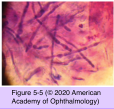

# 8.5.3. Microbial and Parasitic Infections of the Cornea and Sclera (II)

## Images

## Hierarchy

- Renu with MoistureLoc solution
  - Fusarium keratitis
- renal failure
  - fungal invasion of blood vessels
    - ischemic necrosis (blackened char)
- Acanthamoeba Keratitis
  - microsporidia is also (intracellular) protozoa
  - Epidemiology
    - protozoa
      - ubiquitous
        - freshwater
      - motile trophozoites
        - soil
      - dormant cysts
    - resistant to
      - freezing
      - desiccation
      - levels of chlorine routinely used in municipal water supplies, swimming pools, and hot tubs
  - Pathogenesis
    - corneal epithelial adherence
      - mannose-binding protein
    - stromal invasion
      - various collagenases
        - mannose-induced protein (MIP-133)
  - sources of infection
    - contact lens use
      - ≈90%
      - homemade saline contact lens solutions
      - Complete MoisturePlus multipurpose cleaning solution
    - contaminated water
      - contaminated tap water due to river flooding
  - Clinical presentation
    - bilateral
      - 7%–11%
        - contaminated rooftop cisterns
    - Symptoms
      - photophobia
        - severe ocular pain
    - protracted, progressive course
      - no therapeutic response to a variety of topical antimicrobial agents
    - localized to the corneal epithelium in early cases
      - diffuse punctate epitheliopathy
      - dendritic epithelial lesion
        - misdiagnosed as herpetic keratitis
    - stromal infection
      - central cornea
      - gray-white superficial, nonsuppurative infiltrate
      - partial or complete ring infiltrate in the central cornea
      - radial perineuritis/keratoneuritis
        - inflamed corneal nerves
        - nearly pathognomonic
    - limbitis
    - focal, nodular, or diffuse scleritis
    - dacryoadenitis
    - intraocular extension may occur
    - encephalitis has not been reported
  - Lab evaluation
    - smears
      - Giemsa
        - also for Chlamydia
      - periodic acid–Schiff (PAS)
      - calcofluor white
      - acridine orange
      - Gridley
    - culture
      - nonnutrient agar with E coli or Enterobacter aerogenes overlay
      - buffered charcoal–yeast extract agar
      - characteristic trails
    - in vivo confocal microscopy
      - the cyst forms
  - Prognosis
    - early diagnosis is the most important prognostic indicator
      - excellent prognosis
        - early diagnosis is the most important prognostic indicator
        - epithelial or anterior stromal
          - epithelial debridement
          - extended (3–4 months) course of antiamebic therapy
      - worse prognosis
        - deep stromal
        - ring infiltrate
        - extracorneal manifestations
        - ≥1 year course of antiamebic therapy
          - other adjunctive therapy
          - +- therapeutic keratoplasty
            - unlike the contiguous, dendritic pattern in HSV keratitis)
  - Differential diagnosis
    - clinical features that suggest a diagnosis of Acanthamoeba keratitis rather than herpes simplex virus keratitis
      - disproportionately severe pain
        - noncontiguous or multifocal granular epitheliopathy/subepithelial opacities
        - unlike disproportionately mild pain secondary to trigeminal nerve involvement in HSV
      - presence of epidemiologic risk factors such as contact lens use or exposure to possibly contaminated freshwater
      - failure to respond to initial antiviral therapy
  - Treatment
    - topical administration
      - biguanides: polyhexamethylene biguanide (polyhexanide), chlorhexidine
        - efficacy against both cysts and trophozoites
        - mainstay of pharmacologic treatment
      - diamidines: propamidine, hexamidine
      - aminoglycosides: neomycin, paromomycin
        - effective against trophozoites
      - imidazoles/triazoles: voriconazole, miconazole, clotrimazole, ketoconazole, itraconazole
    - Single-agent systemic voriconazole
      - recalcitrant cases
    - corticosteroids
      - do not improve or worsen clinical outcomes
    - +- topical and systemic immunosuppressants
      - after the patient has been treated for a period of at least 2 weeks
    - keratoplasty
      - vision rehabilitation
        - perform any optical keratoplasty only after a full course of amebicidal therapy and ≥3–6 months of treatment- and disease-free follow- up
          - late recurrences can occur when medical therapy is stopped before completion
            - lower rate of recurrent infection with effective anti-Acanthamoeba therapy
    - collagen crosslinking
      - cases that are progressing despite maximal medical therapy
- Fungal Keratitis
  - Epidemiology
    - less common than bacterial keratitis
      - <5%–10% of corneal infections
    - etiology
      - septate Filamentous Fungi
        - Fusarium
          - more common in warmer, more humid parts of the US
            - fulminant keratitis
        - Aspergillus
        - Alternaria
        - Curvularia
        - Paecilomyces
        - Scedosporium
        - Phialophora
      - nonseptate Filamentous Fungi
        - Zygomycetes
          - species
            - Mucor
            - Rhizopus
            - Absidia
          - uncommon cause of external ocular infections
          - can cause life-threatening infections of the paranasal sinuses, brain, and orbit in immunocompromised patients
            - diabetes mellitus
        - Pneumocystis jiroveci (previously Pneumocystis carinii)
          - important cause of choroiditis in HIV-infected individuals
    - Risk factors
      - trauma to the cornea with plant or vegetable material
        - leading risk factor
      - contact lens wear
      - topical corticosteroids
        - reduce cornea’s resistance to infection
      - systemic corticosteroid/immunosuppressant use
      - immunocompromised hosts
        - Candida species
      - chronic corneal erosion/ulceration from other causes
      - corneal surgery
        - PK
        - radial keratotomy
      - chronic keratitis
        - herpes simplex virus
        - herpes zoster
        - vernal/allergic conjunctivitis
      - Renu with MoistureLoc solution
        - Fusarium keratitis
  - Clinical presentation
    - fewer inflammatory signs and symptoms
      - little or no conjunctival injection
    - pain can be out of proportion to the relatively uninflamed cornea
    - filamentous fungal keratitis
      - early disease
        - superficial lesions
          - gray-white
          - elevate the surface of the cornea
          - dry, rough, or gritty texture
          - irregular feathery/filamentous margins
          - +- multifocal or satellite infiltrates
        - +- deep stromal infiltrate
          - intact corneal epithelium
          - endothelial plaque
            - if
              - deep or large infiltrate
              - anterior chamber penetratiobn
          - hypopyon
      - advanced disease
        - intense suppuration
          - may resemble bacterial keratitis
        - extension of fungal infection into the anterior chamber
          - rapidly progressive anterior chamber inflammation
            - hypopyon
            - inflammatory membranes
          - may invade the iris or posterior chamber
        - angle-closure glaucoma
    - yeast keratitis
      - superficial white, raised colonies
      - +- deep invasion with suppuration
        - may resemble bacterial keratitis
  - Lab evaluation
    - smear
      - Gomori methenamine silver (GMS)
      - not Gram stain
        - except Candida
      - repeated scrapings
    - culture
      - blood, Sabouraud’s, and brain–heart infusion media
    - confocal microscopy
      - branching filaments
      - individual septa
    - biopsy
      - if negative smear when fungal infection is suspected
  - Treatment
    - filamentous fungal keratitis
      - natamycin 5% suspension
        - for most filamentous fungi particularly Fusarium
      - topical amphotericin B (0.15%–0.30%)
        - for Aspergillus
      - topical voriconazole 1%
        - inferior to natamycin
    - yeast keratitis
      - topical amphotericin B (0.15%–0.30%)
    - systemic administration
      - more severe keratitis
      - keratitis with intracameral extension
      - agents
        - ketoconazole
        - fluconazole
        - itraconazole
        - oral voriconazole
          - replacing older azoles
            - excellent intraocular penetration
            - broader spectrum of coverage
        - oral posaconazole
    - deep fungal keratitis
      - intrastromal administration of amphotericin B or voriconazole
      - corneal epithelial debridement
        - enhances penetration of natamycin or amphotericin B
    - superficial fungal keratitis
      - mechanical debridement
        - frequent topical application (every 5 min) x 1 hour
    - intraocular extension
      - intracameral injection of amphotericin B or voriconazole
    - progressive disease despite maximal topical and/or oral antifungal therapy
      - therapeutic PK
- Candida species
- usually superficial
