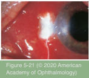
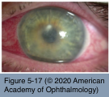

# 8.5.5. Microbial and Parasitic Infections of the Cornea and Sclera (III)

## Images

## Hierarchy

- Contact Lens–Related Infectious Keratitis
  - epidemiology
    - risk of corneal infection is increased nearly 10x in contact lens wearers
    - developed countries
      - contact lens wear represents the most common risk factor for corneal infection
      - one-third of emergency department visits for corneal infection
  - Pathogenesis
    - introduction of a contaminated foreign body to the corneal surface
    - interruption of the normal tear flow
    - corneal epithelial microtrauma
    - alteration of ocular surface immunity
    - corneal hypoxia
  - Management
    - patching of any corneal epithelial defect or corneal infiltrate in a contact lens wearer is absolutely contraindicated
      - provide antibiotic coverage for the most common bacterial pathogen in contact lens– related keratitis, P aeruginosa
    - pathogens
      - Acanthamoeba
        - P aeruginosa
        - less common
        - seen predominantly in contact lens wearers
      - Fungi
      - acanthamoeba and fungal pathogens should be suspected if the clinical presentation or clinical course is atypical
- microsporidiosis
  - epidemiology
    - intracellular protozoa
    - immunocompetent individuals
      - southeast Asia
      - corneal stromal keratitis
    - immunosuppressed individuals
      - AIDS
        - nosema genus
        - disseminated microsporidiosis involving the sinuses, respiratory tract, or gastrointestinal tract
      - keratoconjunctivitis
        - conjunctivitis
        - epithelial keratopathy
          - superficial nonstaining opacities described as “mucoid”
          - dense areas of fine punctate fluorescein staining
          - corneal stroma remains clear
          - minimal or no iritis
        - encephalitozoon and septata genera
  - clinical presentation
    - symptoms
      - ocular irritation
      - photophobia
      - decreased vision
    - bilateral conjunctival injection
    - little or no associated inflammation
    - stromal keratitis
      - nosema genus
  - lab evaluation
    - electron microscopy
      - Brown and Hopps stain
        - small gram-positive microsporidial spores
          - epithelial cells of the conjunctiva
    - tissue culture
      - immunofluorescence antibody techniques
  - management
    - restoration of immune function
    - topical fumagillin
      - keratoconjunctivitis
      - low toxicity
      - long-term use
        - recurrence is common
    - severe cases of vittaforma corneae
      - granulomatous inflammation leading to necrotic thinning/perforation
        - PK
- microbial scleritis
  - very rare
  - predisposing conditions
    - extension of peripheral microbial keratitis
    - trauma
    - contaminated foreign bodies (including scleral buckles
    - previous pterygium surgery
      - beta irradiation
      - mitomycin
    - scleral surgical wound
  - organisms
    - bacteria
      - syphilis
      - tuberculosis
      - leprosy
      - acanthamoeba
      - nocardia
    - fungi
      - atypical mycobacteria
    - varicella-zoster virus
  - lab evaluation
    - smears
    - cultures
    - scleral or episcleral biopsy
  - treatment
    - topical antimicrobial therapy
    - subconjunctival injections
    - intravenous antibiotics
    - long-term oral therapy
- Corneal Stromal Inflammation (non- suppurative) Associated With Systemic Infections
  - reactive arthritis
  - congenital or acquired syphilis
  - Lyme disease
  - tuberculosis
  - leprosy (Hansen disease)
  - onchocerciasis
- atypical Mycobacteria
  - Organisms
    - Mycobacterium fortuitum
    - Mycobacterium chelonei
      - found in soil and water
  - Lab evaluation
    - acid-fast stain
    - culture on Lowenstein-Jensen media
  - Clinical presentation
    - postrefractive (post-LASIK) keratitis
      - delayed-onset
      - recalcitrant, nonsuppurative infiltrates
  - Treatment
    - oral and topical clarithromycin
    - gatifloxacin
    - Amikacin
      - moxifloxacin
      - replaced by these newer treatment options
- loiasis (loa loa)
  - pathogenesis
    - bite of an infected vector (female deer fly)
      - microfilaria (Loa loa)
        - burrow subcutaneously to reach the eye
          - move under the skin at about 1 cm/min
          - seen or felt wriggling under the periocular skin or bulbar conjunctiva
    - west and central Africa
  - clinical presentation
    - conjunctivitis
    - dermatologic manifestations
  - management
    - extraction of the filarial worm
    - antiparasitic treatment for disseminated infestation
      - diethylcarbamazine
        - 3 weeks
      - ivermectin
        - significant adverse effects in patients with prominent intravascular loiasis
    - corticosteroids and/or antihistamines
