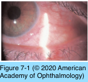
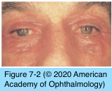

# 8.7.1. Immune-mediated diseases of the eyelid

## Images

## Hierarchy

- atopic dermatitis
  - pathogenesis
    - genetically susceptible individuals
      - type IV hypersensitivity reaction
        - impaired cell-mediated immunity
    - increased IgE hypersensitivity
    - increased histamine release from mast cells and basophils
  - clinical presentation
    - chronic condition
    - begins in infancy or childhood
    - pruritus
    - lesions on the eyelid and other sites
      - appearance of skin lesions
        - infants
          - erythematous rash
        - children
          - eczematous dermatitis with secondary lichenification from scratching
        - adults
          - scaly patches with thickened and wrinkled dry skin
      - location of skin lesions
        - face and extensor surfaces in infants and young children
        - joint flexures in adolescents and adults
    - personal or family history of other atopic disorders
      - asthma
      - allergic rhinitis
      - nasal polyps
      - aspirin hypersensitivity
    - periorbital darkening
    - exaggerated eyelid folds
    - ectropion
      - meibomianitis
    - chronic papillary conjunctivitis
  - management
    - identify & avoid environmental allergens
      - allergist
    - moisturizing lotions and petrolatum gels
    - topical corticosteroid cream or ointment
      - long-term use strongly discouraged to avoid skin thinning
    - topical tacrolimus ointment
    - oral antihistamines and mast-cell stabilizers
      - may exacerbate dry eye with their anticholinergic activity
- contact dermatoblepharitis
  - type I IgE–mediated (immediate) hypersensitivity reaction
    - etiology
      - topical ophthalmic medications
        - anesthetics
        - antibiotics
          - bacitracin
          - cephalosporins
          - sulfacetamide
      - cosmetics
      - environmental substances
    - clinical presentation
      - itching
        - within minutes
      - eyelid erythema and swelling
      - conjunctival hyperemia and chemosis
      - systemic anaphylaxis
    - management
      - allergen avoidance or discontinuation
        - often resolve spontaneously
      - cold compresses
      - artificial lubricants
      - topical antihistamines
      - mast-cell stabilizers
      - nonsteroidal anti-inflammatory drugs
      - topical vasoconstrictors
        - should not be used long term
  - type IV T-cell–mediated (delayed- hypersensitivity) reaction
    - etiology
      - cycloplegics such as atropine and homatropine
      - aminoglycosides such as neomycin, gentamicin, and tobramycin
      - antiviral agents such as idoxuridine and trifluridine
      - preservatives such as thimerosal and ethylenediaminetetraacetic acid (edta)
    - clinical presentation
      - 24–72 hours
      - acute eczematous reaction
      - erythema
      - leathery thickening
      - scaling of the eyelid
      - papillary conjunctivitis
      - mucoid or mucopurulent discharge
      - punctate epithelial erosions
        - inferior cornea
      - sequelae
        - hyperpigmentation
        - dermal scarring
        - lower-eyelid ectropion
    - management
      - allergen avoidance or discontinuation
      - mild topical corticosteroids
      - tacrolimus (protopic) ointment
        - applied to the eyelids and periocular skin
