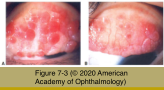
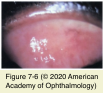
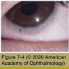
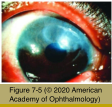
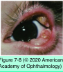

# 8.7.2. Immune-mediated diseases (II): Conjunctiva (I)

## Images

## Hierarchy

- male children
- primarily a type IV reaction
  - mast-cell therapy may not be effective!
- hotter climates
- atopic keratoconjunctivitis
  - epidemiology
    - 1/3 of patients with atopic dermatitis
  - pathogenesis
    - type I immediate hypersensitivity responses
    - depressed systemic cell-mediated immunity
      - susceptible to
        - herpes simplex virus keratitis
        - colonization of the eyelids with staphylococcus aureus
  - clinical presentation
    - similar to VKC with the following differences
      - have disease year-round (minimal seasonal exacerbation)
      - patients are older
      - papillae are small or medium-sized (than giant)
      - papillae occur in the upper and lower palpebral conjunctiva
      - milky conjunctival edema + variable subepithelial fibrosis
      - extensive corneal vascularization and opacification (limbal stem cell dysfunction)
      - eosinophils in conjunctival cytology specimens are less numerous and are less often degranulated
      - conjunctival scarring; occasional symblepharon formation
      - characteristic posterior subcapsular and/or anterior subcapsular lens opacities
      - corneal findings
        - punctate erosions
        - persistent epithelial defects
        - increased incidence of ectatic corneal diseases such as keratoconus and pellucid marginal degeneration
        - increased incidence of staphylococcal and herpes simplex infections
  - management
    - allergen avoidance
    - cold compress
    - monitor for complications of infectious diseases
    - pharmacotherapeutic agents similar to those used in the treatment of VKC
    - systemic immune suppression
      - severe cases
        - chronic ocular surface inflammation unresponsive to topical treatment
        - discomfort
        - progressive cicatrization
        - peripheral ulcerative keratopathy
      - oral cyclosporine
      - in coordination with an internist or rheumatologist
    - topical tacrolimus
      - dermatitis
- vernal keratoconjunctivitis (VKC)
  - epidemiology
    - seasonally recurring
    - year-round in tropical climates
    - personal or family history of atopy
  - pathogenesis
    - conjunctival inflammatory infiltrate
      - types I and IV hypersensitivity reactions
      - eosinophils, lymphocytes, plasma cells, and monocytes
  - clinical presentation
    - bilateral
    - symptoms
      - itching
      - blepharospasm
      - photophobia
      - blurred vision
      - copious mucoid discharge
    - 2 forms
      - palpebral VKC
        - diffuse papillary hypertrophy
          - more prominently on the upper region
        - bulbar conjunctival hyperemia and chemosis
          - giant papillae resembling cobblestones
            - upper tarsus
      - limbal VKC
        - african or asian descent
        - alone or in association with palpebral vkc
        - thick gelatinous limbus
        - vascular injection
          - scattered opalescent mounds
        - Horner-Trantas dots
          - whitish macroaggregates of degenerated eosinophils and epithelial cells
    - corneal changes
      - punctate epithelial erosions
        - superior and central cornea
      - pannus
        - occasionally 360°
          - superior cornea
      - noninfectious epithelial ulcers
        - superior or central cornea
        - underlying stromal opacification
      - keratoconus
      - stem cell deficiency
  - management
    - mild cases
      - topical antihistamines
      - climatotherapy
        - home air-conditioning
        - relocation to a cooler environment
    - mild to moderate disease
      - topical mast-cell stabilizers
        - start at least 2 weeks before symptoms usually begin
    - severe cases
      - topical corticosteroids
        - for exacerbations with moderate to severe discomfort and/or decreased vision
        - intermittent (pulse) therapy
          - every 2 hours for 5–7 days and then rapidly tapered
          - soluble corticosteroids
            - difluprednate ophthalmic emulsion (durezol)
            - dexamethasone phosphate
      - supratarsal injection of corticosteroid
        - evert the upper eyelid
        - dexamethasone phosphate (4 mg/ml)
        - triamcinolone acetonide (40 mg/ml)
        - 0.5–1.0 ml
      - topical immunomodulatory agents
        - cyclosporine
          - 2–4 times daily
          - punctate epithelial keratopathy
          - ocular surface irritation
          - minimal systemic absorption
        - tacrolimus
          - twice daily
    - very severe cases
      - systemic anti-inflammatory therapy
- oval or shieldlike
- hay fever conjunctivitis and perennial allergic conjunctivitis
  - pathogenesis
    - IgE-mediated immediate hypersensitivity reactions
    - airborne allergen
      - conjunctival mast cells
        - degranulation
          - release histamine/inflammatory mediators
            - vasodilation
            - edema
            - recruitment of other inflammatory cells
              - eosinophils
  - clinical presentation
    - symptoms develop rapidly (within minutes) after exposure
      - itching
      - eyelid swelling
      - conjunctival hyperemia
      - chemosis
      - mucoid discharge
    - short-lived and episodic
    - suffer from other atopic conditions
      - allergic rhinitis
      - asthma
  - diagnosis
    - clinical diagnosis
    - conjunctival scrapings
      - eosinophils
    - challenge testing
  - management
    - avoid allergen exposure
    - thorough cleaning (or changing) of
      - unclean or old carpets
      - linens
      - bedding
      - animal dander, house dust mites
    - glasses or goggles
    - supportive
      - cold compresses
      - artificial tears
        - dilute and flush away allergens
    - topical
      - topical antihistamines
      - topical mast-cell stabilizers
        - for treating seasonal allergic conjunctivitis
          - require continued use over 7 or more days
          - ineffective in the acute phase of hay fever conjunctivitis
      - topical nsaids
        - reports of corneal perforations
          - refills should be limited
          - follow-up appointments
      - topical corticosteroids
        - use with caution, except in very severe cases
      - topical vasoconstrictors
      - topical cyclosporine
        - provide symptom relief in some patients
          - use >5–7 days may predispose to compensatory chronic vascular dilation
      - topical tacrolimus
        - associated dermatitis
    - systemic
      - systemic antihistamines
        - may be associated with increased dry eye
    - hyposensitization injections (immunotherapy)
- ligneous conjunctivitis
  - rare
  - pathogenesis
    - composed of
      - fibrin
      - epithelial cells
      - mixed inflammatory cells
      - fibrin-bound tissue plasminogen activator (tPA)
      - matrix metalloproteinase-9
    - deficiency in type I plasminogen
      - severe hypoplasminogenemia (>12% of patients)
        - hypofibrinolysis
      - plasminogen gene (PLG) mutation
        - band 6q26
  - clinical presentation
    - all ages
    - bilateral
    - symptoms
      - ocular irritation
      - foreign-body sensation
    - firm (“woody”) yellowish, platelike pseudomembranes/masses
      - overlie one or more of the palpebral surfaces
  - management
    - cultures
      - to exclude a bacterial pseudomembranous/ membranous conjunctivitis
    - purified plasminogen
      - surgical excision +- adjunctive cryotherapy
        - recurrences are frequent
    - fresh frozen plasma
    - heparin
    - corticosteroids
    - azathioprine
    - amniotic membrane
    - +- spontaneous resolution
      - after several months - few years
