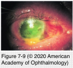
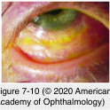

# 8.7.2. Immune-mediated diseases (III): Conjunctiva (II): Stevens-Johnson syndrome and toxic epidermal necrolysis

## Images

## Hierarchy

- classic “target” lesion
  - red center surrounded by a pale ring and then a red ring
- clinical presentation
  - systemic findings
    - sudden onset
    - fever
    - arthralgia
    - malaise
    - upper or lower respiratory symptoms
  - skin eruption follows within a few days
    - maculopapular or bullous lesions
    - mucous membranes of the eyes, mouth, and genitalia
      - bullous lesions with membrane/ pseudomembrane formation
    - new lesions may appear over 4–6 weeks
      - 2-week cycles
  - ocular finding
    - mucopurulent conjunctivitis
    - episcleritis
    - conjunctival and corneal epithelial sloughing/ necrosis
      - severe inflammation and scarring
    - long-term ocular complications
      - conjunctival shrinkage
      - keratinization of the eyelid margins
        - an important risk factor for poor long-term outcomes
      - trichiasis
      - entropion
      - tear deficiency
      - higher risk of infection
      - mucous membrane pemphigoid
        - rare
- pathogenesis
  - hypersensitivity reaction
    - drugs
      - TEN
        - 80%
      - SJS
        - 50%–80%
      - 100 drugs of various classes
        - sulfonamides
        - anticonvulsants
        - NSAIDs
        - herpes simplex virus
          - allopurinol
    - infectious diseases
      - streptococcus
      - adenovirus
  - presentation of major histocompatibility complex class I–restricted antigens
    - infiltration of the skin with cytotoxic T lymphocytes and natural killer cells
      - release granzymes (perforin–granzyme pathway)
        - granzyme enters target cell through the perforin channels
          - keratinocyte apoptosis
        - granulysin is the most highly expressed cytotoxic molecule
        - both the blister fluid and the cells are cytotoxic
- type IV rxn?
- genetics
  - HLA-B12
  - HLA-B*1502
    - in all Han chinese patients who had a reaction to carbamazepine
  - interaction between
    - HLA-A*0206
    - toll-like receptor 3 gene
    - required for onset of sjs/ten with ocular complications
- pathology of SJS
  - SJS
    - subepithelial bullae
    - scarring
  - TEN
    - epidermal necrolysis
      - keratinocyte apoptosis
    - minimal inflammatory infiltrate in the dermal stroma
- epidemiology
  - 5 cases per million per year
  - AIDS patients are at a higher risk
  - children and young adults
  - F>M
- classification
  - erythema multiforme minor
    - only the skin
  - SJS (erythema multiforme major)
    - skin and mucous membranes are involved
    - 20%
    - TEN
      - most severe form
- management
  - acute SJS
    - treated in burn units at major tertiary care centers
    - immediate discontinuation of the offending agent
    - managing dehydration and superinfection
    - +- systemic prednisone (1 mg/kg per day for 3 days)
      - serious complications
        - gastrointestinal hemorrhage
        - electrolyte imbalance
        - sudden death
        - increase the likelihood of infection
    - +- intravenous immunoglobulin
    - acute ocular therapy
      - preservative-free artificial tears/ointments
      - surveillance for ocular infections
        - +- prophylactic topical antibiotics
      - transplantation of amniotic membrane over the entire ocular surface & eyelid margins
        - for severe epithelial defects of the cornea and/ or conjunctiva
        - a second amniotic membrane grafting may be necessary for severe cases
      - repeated conjunctival lysis of symblepharon
        - may result in further inflammation and scarring
  - chronic ocular therapy
    - therapeutic contact lenses
      - temporary
    - scleral contact lenses
      - critical role in the long-term rehabilitation
    - ocular surface reconstructipn
      - limbal stem cell transplantation
      - penetrating keratoplasty
        - extremely poor prognosis
        - reserved for progressive thinning or perforation
      - keratoprosthesis
        - osteo-odonto-keratoprosthesis
        - boston type i keratoprosthesis
    - eyelid reconstruction
      - mucous membrane grafting (reconstructing eyelid margins and symblepharon)
        - may result in further inflammation and scarring
    - systemic immunosuppression
      - needs to be performed prior to any ocular surface reconstruction
      - to suppress the severe inflammatory response
- topical corticosteroids
  - controversial
