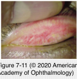
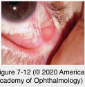

# 8.7.4. Immune-mediated diseases (IV): Conjunctiva (III): Mucous Membrane Pemphigoid (MMP)

## Images

## Hierarchy

- SJS is primarily type III
  - atopic keratoconjunctivitis is primarily type IV
- induces expression of
- pathogenesis
  - cytotoxic (type II) hypersensitivity
    - autoantibodies directed against a cell surface antigen in the basement membrane zone (bmz)
      - bullous pemphigoid antigen II
      - antibody activates complement
        - membrane breakdown
  - proinflammatory cytokines
    - IL-1
    - tumor necrosis factor α
      - migration inhibition factor
    - macrophage colony-stimulating factor
      - HLA typing is not useful!
  - cellular immunity
    - HLA-DR4
- differential diagnosis of cicatrizing conjunctivitis
  - infectious
    - trachoma
    - adenovirus
    - corynebacterium diphtheriae
    - streptococcal conjunctivitis
  - allergic
    - atopic keratoconjunctivitis
    - Stevens-Johnson syndrome
  - autoimmune
    - mucous membrane pemphigoid
    - sarcoidosis
    - lupus
    - scleroderma
    - lichen planus
    - graft-vs-host disease
  - miscellaneous
    - rosacea
    - trauma
    - chemical burn
    - radiation
    - neoplasia
    - medicamentosa
  - linear IgA dermatosis
    - can result in an ocular syndrome that is clinically identical to MMP
  - diagnosis of unilateral MMP should be made with caution
- pseudopemphigoid
  - long-term use of certain topical ophthalmic medications
    - pilocarpine
    - echothiophate iodide
    - demecarium bromide
    - epinephrine
    - timolol
    - idoxuridine
  - progression ceases once the offending agent is recognized and removed
- epidemiology
  - F>M
  - usually >60 years
    - rarely younger than 30
- laboratory evaluation
  - conjunctival biopsy
    - direct immunofluorescent staining
    - immunoperoxidase staining
    - immunohistochemical staining
      - complement 3
      - IgG
      - IgM
      - IgA
      - in the BMZ of the conjunctiva
    - false-negative results are not uncommon
      - from an actively affected area
      - if involvement is diffuse, from the inferior fornix
  - oral mucosal biopsies
  - circulating anti–basement membrane antibody
    - may be negative in end-stage disease
- clinical presentation
  - mucous membranes
    - conjunctiva
    - mouth and oropharynx
      - difficulty swallowing
      - oral mucosal lesions may be a clue that can lead to early diagnosis
    - genitalia
    - anus
  - skin
    - 15%
  - recurrent attacks of mild and nonspecific conjunctival inflammation
    - bilateral
    - conjunctival hyperemia
      - chronic red eye
    - edema
    - ulceration
    - tear dysfunction
    - occasional mucopurulent discharge
    - transient bullae of the conjunctiva
  - stage I
    - subepithelial fibrosis
      - fine gray-white linear opacities
      - best seen with an intense but thin slit beam
      - deep conjunctiva
  - stage II
    - shortening of the fornices
      - inferior forniceal depth < 8 mm
        - should prompt further evaluation
  - stage III
    - symblepharon formation
      - subtle inferior symblephara
        - lower eyelid is pulled down while the patient looks up
  - stage IV
    - restricted ocular motility with extensive adhesions between the eyelid and the globe
  - chronic cicatrizing conjunctivitis
    - loss of goblet cells
    - obstruction of the lacrimal gland ductules
    - keratinization/epidermalization of the conjunctiva
    - entropion
    - trichiasis
    - corneal changes
      - abrasion
      - vascularization
      - ulceration
      - scarring
    - aqueous and mucous tear deficiency
  - remissions and exacerbations are common
    - surgical intervention can incite further scarring
- management
  - multidisciplinary approach
  - high-risk
    - criteria
      - ocular, genital, nasopharyngeal, esophageal, and laryngeal mucosae
      - rapidly progressing disease
    - mild disease
      - dapsone
        - initial drug of choice in mild cases
          - may cause hemolytic anemia
        - avoid in patients with
          - glucose-6-phosphate dehydrogenase (g6pd) deficiency
            - test for g6pd deficiency
          - sulfa allergy
    - severe disease
      - cyclophosphamide
        - mainstay of therapy in severe disease
        - 1.5–2.0 mg/kg per day in divided doses
        - target white blood cell count of 2000–3000 cells/μl
      - azathioprine
    - patients not responding to conventional therapies
      - intravenous immunoglobulin
      - biologic agents
        - rituximab
        - infliximab
        - etanercept
  - low-risk
    - much lower incidence of scarring
    - progression is often slow
    - topical vitamin A
  - surgical correction of eyelid deformities
  - eyelash ablation for trichiasis
  - hard palate and buccal mucosal grafting
    - fornix reconstruction in severe cases
    - higher rate of spontaneous extrusion of silicone punctal plugs
      - intraocular surgery is best delayed until disease activity has been under control for an extended period
  - dry eye
    - punctal occlusion
    - permanent punctal occlusion with cautery
  - standard PK
    - very guarded prognosis
  - boston keratoprosthesis
- criteria
  - disease occurring only in the oral mucosa or oral mucosa and skin
