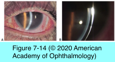

# 8.7.4. Immune-mediated diseases (V): Conjunctiva (IV)

## Images

## Hierarchy

- Ocular Graft-Vs-Host Disease
  - pathogenesis
    - common complication of allogeneic bone- marrow transplantation
      - conjunctival inflammation with or without subepithelial fibrosis
      - severe keratoconjunctivitis sicca (kcs)
        - lacrimal gland infiltration by GHVD-effecting T lymphocytes
    - types
      - acute
      - chronic
        - 3 months after bone-marrow transplantation
  - clinical findings
    - conjunctival inflammation
      - most ocular complications occur as a manifestation of chronic GVHD
    - cicatricial conjunctivitis
    - KCS
      - 40%–60% of chronic GVHD
    - scleritis
    - limbal stem cell deficiency
      - secondary corneal scarring
      - rare
    - posterior subcapsular cataracts
  - management
    - aggressive lubrication
    - punctal occlusion
      - punctal fibrosis is common
        - can lead to plug extrusion
    - severe filamentary keratitis
      - mucolytic agents (10% acetylcysteine)
      - bandage soft contact lenses
    - topical cyclosporine
    - gas-permeable scleral contact lenses
    - soft therapeutic contact lenses
    - keratoprosthesis
    - active nonocular (often skin) GVHD
      - systemic immunosuppression
        - cyclosporine
        - tacrolimus
- other immune-mediated diseases of the skin and mucous membranes
  - linear iga bullous dermatosis
  - dermatitis herpetiformis
  - epidermolysis bullosa
  - lichen planus
  - paraneoplastic pemphigus
  - pemphigus vulgaris
  - pemphigus foliaceus
