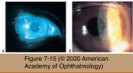

# 8.7.6. Immune-mediated diseases (VI): Cornea (I)

## Images

## Hierarchy

- Thygeson Superficial Punctate Keratitis
  - pathogenesis
    - unknown
    - +- immune-mediated
    - no inflammatory cells
  - clinical presentation
    - children to older adults
    - bilateral
      - may develop initially in 1 eye
      - may be markedly asymmetric
    - recurrent episodes
    - symptoms
      - tearing
      - foreign-body sensation
      - photophobia
      - reduced vision
      - symptoms may far exceed the apparent signs
    - slightly elevated corneal epithelial lesions
      - each opacity is a cluster of multiple smaller gray, granular pinpoint opacities
      - multiple (2-40)
      - greatest density in the central cornea
      - "negative staining"
        - stain faintly with fluorescein and rose bengal
      - minimal conjunctival reaction
      - waxing and waning appearance of individual epithelial opacities
        - change in location and number
          - in contrast to adenoviral keratoconjunctivitis
      - +- mild subepithelial opacity
        - in patients who have received topical antiviral therapy
  - management
    - mild cases
      - artificial tears
    - persistently symptomatic cases
      - low-dose topical corticosteroids
        - fluorometholone 0.1%
        - very responsive to corticosteroids
        - recur in the same or different locations after the topical corticosteroids are stopped
        - the use of corticosteroids should be minimized
      - topical cyclosporine 0.05%
      - bandage soft contact lenses
        - tacrolimus ophthalmic suspension 0.1%
          - preferred over corticosteroids
- Interstitial Keratitis Associated With Infectious Diseases
  - pathogenesis
    - type IV hypersensitivity
      - to infectious microorganisms
        - congenital syphilis
          - only rarely in acquired (as opposed to congenital) syphilis
            - unilateral in 60%
            - uveitis and retinitis are much more common manifestations of acquired syphilis than keratitis
          - manifestations of congenital syphilis that occur early in life (within the first 2 years) are infectious
          - IK is an immune-mediated manifestation of congenital syphilis
            - develops late in the first decade of life (or even later)
        - herpes simplex virus
        - varicella-zoster virus keratitis
        - mycobacterium tuberculosis
        - mycobacterium leprae
        - borrelia burgdorferi (lyme disease)
        - measles virus
        - epstein-barr virus (infectious mononucleosis)
        - chlamydia trachomatis (lymphogranuloma venereum)
        - leishmania spp
        - onchocerca volvulus (onchocerciasis)
      - to other antigens
    - nonsuppurative inflammation of the corneal stroma
      - cellular infiltration
      - vascularization
  - Syphilitic interstitial keratitis
    - clinical presentation
      - congenital syphilis>>acquired syphilis
        - no primary involvement of the corneal epithelium or endothelium
      - bilateral (80%)
        - develops late in the first decade of life (or even later)
        - both eyes may not be affected simultaneously or to the same degree
      - nonocular signs of congenital syphilis
        - dental deformities: notched (hutchinson) incisors and mulberry molars
        - bone and cartilage abnormalities: saddle nose, palatal perforation, saber shins, and frontal bossing
        - cranial nerve VIII (vestibulocochlear) deafness
        - rhagades (circumoral radiating scars)
        - cognitive impairment
      - symptoms
        - pain
        - tearing
        - photophobia
        - perilimbal injection
      - sectoral superior stromal inflammation and keratic precipitates (early)
        - spreads centrally
          - corneal opacification and edema
        - deep stromal neovascularization
          - cornea appears pink
            - salmon patch
      - inflammation may last for several weeks if left untreated
        - sequelae
          - corneal scarring & opacification
          - corneal thinning
          - ghost vessels
    - laboratory evaluation
      - serology
        - rapid plasma reagin (RPR) test
        - FTA-ABS
        - cycloplegic agents
          - microhemagglutination assay for Treponema pallidum [MHA-TP]
    - management
      - topical corticosteroids
      - systemic syphilis (or neuroretinal manifestations)
        - penicillin or an appropriate alternative antibiotic
      - necessity of lumbar puncture in syphilitic IK is uncertain
- Marginal Corneal Infiltrates Associated With Blepharoconjunctivitis
  - Pathogenesis
    - limbus
      - antigen-presenting cells
        - express MHC class II antigens
          - mobilize and induce T-cells
      - vessels
        - circulating immune cells, immune complexes, and complement factors
      - immune-related corneal changes occur adjacent to the limbus
    - Predisposing Factors
      - blepharoconjunctivitis
      - contact lens wear
      - trauma
  - Clinical Presentation
    - gray-white infiltrates
      - endophthalmitis
    - well circumscribed
    - where the eyelid margins intersect with the corneal surface
      - 10-, 2-, 4-, and 8-o’clock positions
    - clear zone of cornea between infiltrate and limbus
      - 1 mm inside the limbus
    - superficial blood vessels may cross the clear interval
    - overlying epithelium
      - intact
      - punctate epithelial erosions
      - ulcerated
    - following resolution
      - stromal opacification
      - peripheral corneal thinning
      - pannus
- Cogan Syndrome
  - pathogenesis
    - autoimmune disorder
    - young adults
      - upper respiratory tract infection 1–2 weeks before
  - clinical findings
    - stromal keratitis
      - early
        - bilateral faint white subepithelial infiltrates
          - peripheral cornea
      - late
        - multifocal nodular infiltrates in the posterior cornea
    - vertigo
    - hearing loss
    - systemic vasculitis
      - polyarteritis nodosa
        - similar to congenital syphilis
    - ocular and vestibular changes can proceed rapidly
  - laboratory evaluation
    - diagnosis of exclusion
      - exclude syphilis
        - VDRL
          - or
            - RPR test
              - may become nonreactive in congenital syphilis
        - FTA-ABS
          - or
            - MHA-TP
  - management
    - topical corticosteroids
      - acute keratitis
    - cytotoxic agents
      - oral corticosteroids
        - vestibuloauditory symptoms
          - deafness is more likely if the condition is not treated early
      - for severe and unresponsive cases
- Reactive Arthritis (Reiter syndrome)
  - pathogenesis
    - predisposing conditions
      - dysentery
        - gram-negative bacteria
          - Salmonella, Shigella, and Yersinia
    - HLA-B27–positive
      - 75%
        - nongonococcal urethritis
          - C trachomatis
  - clinical presentation
    - classic triad
      - ocular inflammation
        - bilateral papillary conjunctivitis
          - mucopurulent discharge
            - should be considered in any case of chronic, nonfollicular, mucopurulent conjunctivitis with negative cultures
          - 30%–60%
          - self-limited
            - days to weeks
        - episcleritis
        - mild nongranulomatous iritis
          - 3%–12%
        - keratitis
          - diffuse punctate epithelial erosions
          - superficial or deep focal infiltrates
          - superficial or deep vascularization
      - urethral inflammation
      - joint inflammation
        - oligoarticular
        - highly asymmetric
    - less common manifestations
      - keratoderma blennorrhagicum
      - aphthous stomatitis
      - fever
        - balanitis
      - lymphadenopathy
      - pneumonitis
      - pericarditis
      - myocarditis
    - manifestations can appear simultaneously or separately, in any sequence
    - self-limited attacks
      - 2 to several months
      - may recur periodically over the course of several years
  - management
    - palliative
    - topical corticosteroids
      - corneal infiltrates and vascularization
    - systemic antibiotic
      - related infections
    - systemic immune suppression
      - intraocular (uveitic) component
- Corneal Transplant Rejection
  - tolerance of a corneal graft is an active process based on several features
    - absence of blood and lymphatic channels in the graft and its bed
    - absence of MHC class II+ APCs in the graft
    - reduced expression of MHC-encoded alloantigens on graft cells replaced with minor peptides (nonclassical MHC-Ib molecules) to avoid lysis by natural killer cells
    - expression of T-cell–deleting CD95 ligand (Fas ligand, or FasL) on endothelium, which can induce apoptosis in killer T cells
    - immunosuppressive microenvironment of the aqueous humor
      - transforming growth factor β2, α-melanocyte- stimulating hormone, vasoactive intestinal peptide, and calcitonin gene–related peptide
  - allograft rejection is associated with cellular immune mechanisms
    - anterior chamber–associated immune deviation (ACAID) involving the development of suppressor T cells
      - ACAID is a downregulation of delayed-type cellular immunity
    - T-lymphocyte–mediated response
      - delayed (type IV) hypersensitivity
  - for the endothelial cells to be rejected, they must express MHC class II antigens
    - endothelial cells’ endogenous minor H antigens
      - recognized by the CD4+ T cells
