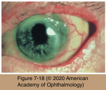
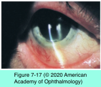
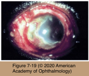

# 8.7.7. Immune-mediated diseases (VII): Cornea (II)

## Images

## Hierarchy

- Mooren Ulcer
  - Pathogenesis
    - unknown
      - +- autoimmune
        - autoreactivity to a cornea-specific antigen
          - humoral and cell-mediated immune mechanisms
            - abnormal T-suppressor cell function
            - increased level of IgA
            - increased concentration of plasma cells and lymphocytes in the conjunctiva adjacent to the ulcerated areas
            - increased CD4+/CD8+ and B7-2+/APC ratios as well as increased vascular cell adhesion molecule 1, very late antigen 4, and intercellular adhesion molecule 1 in the vascular endothelium of conjunctival vessels
            - tissue-fixed immunoglobulins and complement in the conjunctival epithelium and peripheral cornea
            - resident cells in Mooren ulcer specimens express MHC class II antigens
      - idiopathic
        - cases of PUK due to known local (rosacea) or systemic (rheumatoid arthritis) diseases should not be called Mooren ulcer
        - precipitating factors
          - trauma
          - surgery
          - exposure to parasitic infection
            - incidence of Mooren ulcer is particularly high in areas where parasitic infections are endemic
  - Clinical Presentation
    - symptoms
      - pain
        - can be intense
      - photophobia
      - tearing
    - ulceration of corneal stroma and epithelium
      - chronic progressive
      - periphery of the cornea
        - spreads circumferentially
        - then centripetally
        - slower ulceration proceeds toward sclera
      - leading undermined edge of de-epithelialized tissue
      - eye is inflamed
      - extensive vascularization and fibrosis
    - perforation
      - minor trauma
      - secondary infection
    - two clinical types
      - unilateral
        - older patient
        - slowly progressive
          - M=F
      - bilateral
        - Africa
        - M>F
        - rapidly progressive
          - coexisting parasitemia
        - poorly responsive to medical or surgical intervention
        - corneal ulceration/perforation
  - Differential diagnosis
    - idiopathic PUK
      - in PUK sclera is often involved
        - Mooren ulcer is purely corneal
  - Management
    - topical corticosteroids
    - contact lenses
    - acetylcysteine and L-cysteine
    - topical interferon-α2a (IFN-α2a)
    - topical cyclosporine 2%
      - similar to PUK
    - infliximab
    - limbal conjunctival excision
    - lamellar keratoplasty
    - systemic immunosuppressive agents
      - oral corticosteroids
      - cyclophosphamide
      - methotrexate
      - cyclosporine
    - hepatitis C–associated cases of Mooren ulcer–type PUK
      - interferon therapy
- Peripheral Ulcerative Keratitis Associated With Systemic Immune-Mediated Diseases
  - Pathogenesis
    - systemic immune-mediated/rheumatic diseases
      - rheumatoid arthritis
      - Wegener granulomatosis
      - systemic lupus erythematosus
      - polyarteritis nodosa
      - ulcerative colitis
      - relapsing polychondritis
      - rosacea
    - adjacent conjunctiva
      - immune-mediated vaso-occlusive disease
  - Clinical Presentation
    - history of connective tissue disease
      - PUK generally correlates with exacerbations of systemic disease activity
      - PUK may be the first sign of the underlying systemic disease!
    - 1 sector of cornea
      - usually unilateral
    - within 2 mm of limbus
    - epithelium is absent in affected area
      - vaso-occlusion of adjacent limbal vessels
        - adjacent conjunctiva can be minimally or severely inflamed
    - underlying stroma thinned
      - keratolysis
    - +- significant cellular infiltrate in the corneal stroma
  - Management
    - promote epithelialization
      - melting will stop or slow if the epithelium can be made to heal
      - lubrication
        - many rheumatoid patients have KCS
        - lubricants dilute inflammatory cytokines
      - patching
      - bandage contact lens
        - sodium citrate 10%
    - collagenase inhibitors
      - topical
        - acetylcysteine solution 20%
        - medroxyprogesterone 1%
      - systemic collagenase inhibitors
        - tetracyclines (doxycycline)
    - topical cyclosporine
    - topical corticosteroids
      - inhibit collagenase function
      - use with caution if the cornea has thinned significantly
    - excision or recession of adjacent limbal conjunctiva
    - threatened perforation
      - cyanoacrylate glue
      - bandage contact lens
      - tectonic grafts
        - grafts are also susceptible to melting
      - conjunctival flaps
        - best avoided in immune-mediated disease
          - could accelerate melting
    - suppress the systemic immune-mediated inflammation
      - definitive management cannot be achieved by local measures alone!
      - immunosuppressive therapy
        - oral prednisone
        - cytotoxic agents
          - intravenous high-dose cyclophosphamide for severe rapid melting
        - methotrexate
        - cyclosporine
      - biologic agents
        - infliximab
    - reconstructive keratoplasty
    - treated inadequately, a high proportion may suffer severe disease-related morbidity
