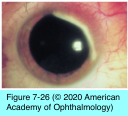
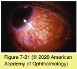
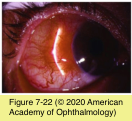
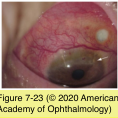
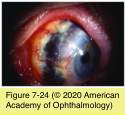

# 8.7.9. Immune-Mediated Diseases (IX): Scleritis

## Images

## Hierarchy

- Pathogenesis
  - immune-mediated (immune-complex) vasculitis
  - underlying systemic immunologic disease
    - indidence
      - diffuse or nodular scleritis
        - 1/3
      - necrotizing scleritis
        - 2/3
    - associated diseases
      - 1/2
        - gout
      - infectious
        - syphilis
        - tuberculosis
        - herpes zoster
        - lyme disease
        - “cat-scratch” disease
        - leprosy
      - autoimmune connective tissue diseases
        - rheumatoid arthritis
        - systemic lupus erythematosus
        - seronegative spondyloarthropathies (eg, ankylosing spondylitis)
        - wegener granulomatosis
        - polyarteritis nodosa
        - giant cell arteritis
  - 4-6 decades of life
    - exceedingly rare in children
  - F>M
  - 1/2 bilateral
- worsen at night
- Complications Of Scleritis
  - peripheral keratitis
    - 37%
      - localized to the area of inflammation
  - central stromal keratitis
    - rare
    - heavy vascularization and opacification if untreated
  - sclerokeratitis
    - fibrosis and lipid deposition of peripheral cornea and neighboring scleritis
    - area of involvement may gradually move centrally
    - accompanies herpes zoster scleritis
  - scleral thinning
    - scleral translucency and/or thinning
      - may also occur in rheumatic diseases
      - 33%
    - frank scleral defects
      - only in the most severe forms of necrotizing disease/scleromalacia perforans
  - uveitis
    - 30%
    - anterior uveitis
      - eyes with anterior scleritis
    - posterior uveitis
      - eyes with posterior scleritis
  - glaucoma
    - 18%
  - cataract
    - 7%
- Laboratory Evaluation
  - initial screening
    - complete blood count (CBC) with differential
    - erythrocyte sedimentation rate (ESR) or C- reactive protein (CRP)
    - serum autoantibody screening (antinuclear antibodies, anti-DNA antibodies, rheumatoid factor, antineutrophil cytoplasmic antibodies)
    - urinalysis
    - serum uric acid test
    - syphilis serology
    - chest x-ray
    - sarcoidosis screening (serum angiotensin- converting enzyme and lysozyme)
  - if systemic evaluation is initially negative, repeat the workup annually
  - in conjunction with a rheumatologist or other internist
- Clinical Presentation
  - gradual onset
    - over several days
  - severe boring or piercing ocular pain
    - referred to other regions of the head or face
    - violaceous hue
      - tender globe
      - best seen in natural sunlight
  - inflamed sclera
  - inflamed vessels
    - crisscross pattern
    - adhere to the sclera
  - scleral edema
    - overlying episcleral edema
      - cannot be moved with a cotton-tipped applicator
  - types
    - Diffuse versus nodular anterior scleritis
      - Diffuse anterior scleritis
        - part of the anterior sclera (<1/2)
          - 60%
        - entire anterior segment
          - 40%
      - Nodular anterior scleritis
        - scleral nodule
          - deep red-purple color
          - immobile
          - separated from the overlying episcleral tissue
    - Necrotizing scleritis
      - Necrotizing scleritis with inflammation
        - severe pain
        - localized patch of inflammation
          - edges more inflamed than center
        - avascular edematous patch of sclera
          - 25%
          - sclera may develop a blue-gray appearance
        - altered deep episcleral vessels
          - large anastomotic vessels circumscribe the involved area
        - may spread posteriorly to the equator and circumferentially
      - Necrotizing scleritis without inflammation (scleromalacia perforans
        - long-standing rheumatoid arthritis
        - painless
          - signs of inflammation are minimal
        - sclera thins and the underlying dark uvea becomes visible
        - large abnormal blood vessels surround and cross the areas of scleral loss
        - spontaneous perforation is rare
        - bulging staphyloma
          - may rupture with minimal trauma
          - if intraocular pressure is elevated
    - Posterior scleritis
      - no related systemic disease can be found in patients with posterior scleritis
      - can occur
        - in isolation
          - diagnosis can be missed in the absence of associated anterior scleritis
        - concomitantly with anterior scleritis
      - pain
        - pain may be referred to other parts of the head
      - tenderness
        - vision loss
      - retraction of the lower eyelid
      - proptosis
      - restricted motility
      - angle-closure glaucoma
      - choroidal folds
      - papilledema
        - exudative retinal detachment
      - thickened posterior sclera by echography, computed tomography, or magnetic resonance imaging
- Management
  - in general the treatment of scleritis is systemic
  - topical corticosteroids
    - nonnecrotizing disease, especially diffuse disease
      - mild diffuse anterior or nodular scleritis
  - oral NSAIDS
    - 600 mg of ibuprofen 3 times a day
  - oral and/or high-dose (pulsed) intravenous corticosteroids
    - indications
      - severe nodular scleritis
      - necrotizing scleritis
      - sclerokeratitis
  - systemic immunosuppressive therapy
    - methotrexate
    - cyclosporine
    - cyclophosphamide
    - rheumatoid arthritis–associated scleritis
      - if no therapeutic response is observed with corticosteroids
  - TNF inhibitors such as infliximab
  - subconjunctival corticosteroids
    - in nonnecrotizing scleritis
      - when systemic administration is contraindicated or not feasible
  - antituberculosis and anti-pneumocystis coverage may be necessary for at-risk patients
  - treatment failure
    - progression of disease to a more severe form (eg, nodular to necrotizing)
    - an alternate therapeutic strategy will need to be instituted
      - failure to achieve response to treatment after 2–3 weeks of therapy
