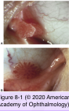
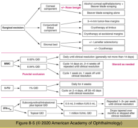
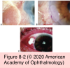

# 8.8.1. Neoplastic Disorders of the Conjunctiva and Cornea I: Epithelial Tumors

## Images

## Hierarchy

- inferior fornix
  - more often
- Benign Epithelial Tumors
  - Conjunctival papilloma
    - pathogenesis
      - human papillomavirus (hpv)
        - HPV-6 (& 11) (in children)
          - pedunculated
        - HPV-16 (& 18) (in adults)
          - sessile
          - same subtypes associated with OSSN
            - premalignant?
    - clinical findings
      - pedunculated
        - stalk
        - multilobulated appearance
          - smooth, clear epithelium
          - numerous underlying, small corkscrew blood vessels
        - location
          - tarsal or bulbar conjunctiva
          - along the semilunar fold
      - sessile
        - flat base
          - more typically found at the limbus
        - glistening surface
        - numerous red dots
          - resembles a strawberry
        - may spread onto the cornea
      - inverted papilloma
        - very rare variant
      - signs of dysplasia
        - keratinization (leukoplakia)
        - symblepharon formation
        - inflammation
        - invasion
      - +- multiple lesions
      - may be extensive in immunocompromised patients
    - management
      - observation
        - spontaneous resolution
          - papillomas that are small, cosmetically acceptable, and nonirritating
          - may take months to years
      - cryotherapy alone
      - excision with cryotherapy to the base
      - excision with adjunctive application of interferon-α2b
      - oral cimetidine
      - recurrences are frequent
      - incomplete excision can stimulate growth and lead to a worse cosmetic outcome
- Malignant Epithelial Lesions
  - Squamous cell carcinoma
    - pathogenesis
    - clinical findings
      - older individuals
      - interpalpebral fissure zone
        - limbal and bulbar conjunctiva
      - broad base
      - plaquelike, gelatinous, or papilliform growth
      - sharp borders
      - +- leukoplakia
      - engorged conjunctival vessels suggest malignancy
      - pigmentation can occur in dark-skinned patients
      - superficial growth
        - infrequently penetrating the sclera or Bowman layer
          - invasion of the iris or trabecular meshwork provides the tumor with access to the systemic circulation
            - metastasis
        - orbital invasion
      - CIN and invasive squamous cell carcinoma may have similar clinical appearances
    - management of atypical epithelial tumors
      - high recurrence rate
        - negative surgical margins
          - 33%
        - positive surgical margins
          - 50%
      - delineating tumor margins with rose bengal or lissamine green
        - increases the likelihood of complete excision
      - topical chemotherapy
        - interferon-α2b
        - MMC
        - 5-FU
      - radiation therapy
        - adjunctive therapy in select cases
      - orbital exenteration for orbital invasion
  - Mucoepidermoid carcinoma
    - very rare
    - limbal conjunctiva, fornix, or caruncle
    - resembles an aggressive variant of squamous cell carcinoma
    - more likely than squamous cell carcinoma to invade the globe or orbit
    - pathology
      - neoplastic epithelial cells
    - treatment
      - wide surgical excision
        - malignant goblet cells
          - mucin stains
      - adjuvant therapy
        - cryotherapy
        - radiotherapy
  - Spindle cell carcinoma
    - rare
    - highly malignant
    - bulbar or limbal conjunctiva
    - anaplastic cells appear spindle shaped
- Preinvasive Epithelial Lesions
  - Conjunctival intraepithelial neoplasia (dysplasia)
    - definition
      - dysplastic process does not invade the underlying basement membrane
        - mild (CIN I)
          - 1/3 epithelial thickness
            - squamous dysplasia
        - moderate (CIN II)
          - 2/3 epithelial thickness
            - squamous dysplasia
        - severe (CIN III)
          - 2/3-full epithelial thickness
          - carcinoma in situ
            - atypical cells involve the entire thickness of the epithelium
    - pathogenesis
      - sunlight (UV) exposure
        - higher incidence close to equator
        - mutation in p53 suppressor gene
      - older age
      - light complexion
      - xeroderma pigmentosa
      - HPV infection
        - subtypes 16 & 18
      - systemic immunosuppression
        - in a young adult (<50 years) r/o HIV infection
          - rapid growth may occur in a person with AIDS
      - smoking
      - petroleum products
    - clinical findings
      - 3 clinical variants
        - papilliform: a sessile papilloma harbors dysplastic cells
          - hyperkeratosis=increased thickness of stratum corneum
            - dyskeratosis=individual cell keratinization
            - parakeratosis=retention of nuclei in stratum corneum
        - gelatinous: acanthosis and dysplasia
        - leukoplakic: hyperkeratosis, parakeratosis, and dyskeratosis
      - interpalpebral bulbar conjunctiva
        - at or near the limbus
        - potential to spread to other areas of the ocular surface, including the cornea
      - mild inflammation
      - abnormal vascularization
        - large feeder blood vessels indicate a higher probability of invasion beneath the epithelial basement membrane
      - slow-growing
  - Corneal intraepithelial neoplasia
    - the conjunctival/limbal component is not clinically apparent
    - granular, translucent, gray epithelial sheet
      - broadly based at the limbus
      - fimbriated margins
      - pseudopodia-like extensions
      - +- free islands of punctate granular epithelium
      - stains with
        - rose bengal
        - lissamine green
    - corneal neovascularization does not typically occur
      - helps differentiate CIN lesions from limbal stem cell failure
