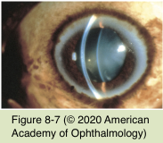
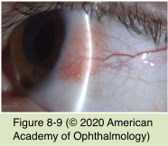
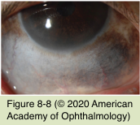

# 8.8.3. Neoplastic Disorders of the Conjunctiva and Cornea (III): Benign Pigmented Lesions

## Images

## Hierarchy

- Benign (racial) melanosis
  - bilateral
  - middle-aged individuals with dark skin
  - increasing pigmentation of the conjunctiva
    - most apparent at the limbus
      - less prominent as one approaches the fornix
  - striate melanokeratosis
    - streaks and whorls of peripheral corneal epithelial pigment
- Introduction
  - Pigment spot of the sclera
    - collection of melanocytes associated with
      - intrascleral nerve loop
      - perforating anterior ciliary vessel
  - Melanosis
    - excessive pigmentation without an elevated mass
      - congenital (whether epithelial or subepithelial)
      - acquired (whether primary or secondary)
  - Conjunctival pigmentation
    - chronic exposure to
      - epinephrine
      - silver
      - mascara
  - See Tables 8-2 and 8-3
- Congenital epithelial melanosis (freckle/ ephelis)
  - present at an early age
  - flat brown patch
  - bulbar conjunctiva near the limbus
  - more common in darkly pigmented individuals
- Nevus
  - arise during childhood and adolescence
  - types
    - junctional (pure intraepithelial)
      - rare except in children
      - difficult to distinguish histopathologically from primary acquired melanosis
    - compound
      - most common type
    - subepithelial
      - equivalent of the intradermal nevus
  - clinical findings
    - flat or elevated
    - variable pigmentation
    - subepithelial nevus often has a cobblestone appearance
      - half of all conjunctival nevi
    - small epithelial inclusion cysts
      - compound or subepithelial nevi
      - secretion of mucin by goblet cells in the inclusion cysts can cause a nevus to enlarge
        - false impression of malignant change
    - secondary lymphocytic inflammation
      - when inflamed, an amelanotic, vascularized nevus may resemble
        - angioma
        - chronic conjunctivitis
  - management
    - rarely become malignant
      - rapid enlargement at puberty
        - clinical impression of conjunctival melanoma
      - follow every 6–12 months
        - serial photography
    - excisional biopsy should be performed on
      - lesions that change
      - lesions on the tarsal conjunctiva, the caruncle, or the plica semilunaris or fornix
        - nevi are rare in these locations!
- Ocular melanocytosis
  - 1:2500 individuals
  - usually unilateral
    - 5% bilateral
      - more common in the black, hispanic, and asian populations
  - pathogenesis
    - focal proliferation of subepithelial melanocytes (blue nevi)
  - clinical findings
    - patches of episcleral pigmentation (congenital melanosis of the episclera)
      - slate gray
      - immobile
    - dermal melanocytosis (nevus of ota)
      - proliferation of dermal melanocytes in the periocular skin
      - first and second dermatomes of cranial nerve V
      - 1/2
    - oculodermal melanocytosis
    - increased pigmentation of the iris and choroid
    - secondary glaucoma
      - 10%
    - malignant transformation
      - rare
        - lifetime risk of uveal melanoma in a patient with ocular melanocytosis is about 1/400
      - seems to occur only in patients with fair complexions
      - malignant melanoma
        - skin
        - conjunctiva
        - uvea
        - orbit
- Neurogenic and Smooth-Muscle Tumors
  - peripheral nerve sheath tumors
    - types
      - neurofibroma
        - neurofibroma of the conjunctiva or eyelid is almost always a manifestation of neurofibromatosis
      - neurilemoma (schwannoma)
        - from Schwann cells of a peripheral nerve sheath
      - neuroma
  - leiomyosarcoma
    - very rare limbal lesion
      - more common in multiple endocrine neoplasia (MEN)
    - potential for orbital invasion
