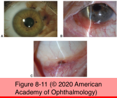
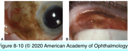

# 8.8.4. Neoplastic Disorders of the Conjunctiva and Cornea IV: Preinvasive/Malignant Pigmented Lesions

## Images

## Hierarchy

- Melanoma
  - Epidemiology
    - prevalence
      - 1 per 2 million
    - <1% of ocular malignancies
      - PAM (70%)
  - Pathogenesis
    - arise from
      - nevi (20%)
      - de novo (10%)
  - Clinical presentation
    - most commonly in bulbar conjunctiva or at limbus
      - can arise in palpebral conjunctiva
    - variable pigmentation
      - 25% are amelanotic
    - heavy vascularization
      - may bleed easily
        - recurrent melanomas are often amelanotic
    - grow in a nodular fashion
    - can invade the globe or orbit
  - Differential diagnosis
    - underlying ciliary body melanoma extending through sclera
  - Prognosis
    - overall mortality rate
      - better prognosis than cutaneous melanoma
      - 25%
    - at 10 years
      - metastasis
        - 26%
      - death
        - 13%
    - poor prognostic indicators
      - not involving the limbus
        - location in the palpebral conjunctiva, caruncle, or fornix
      - involvement of the eyelid margin
      - melanomas arising de novo
      - thickness >1.8 mm
      - invasion into deeper tissues
      - residual involvement at the surgical margins
      - pagetoid or full-thickness intraepithelial spread
      - lymphatic invasion
      - mixed cell type
    - metastasize to
      - regional lymph nodes
      - brain
      - lungs
      - liver
    - gene expression profiling
      - bone
  - Management
    - surgical resection
    - sentinel lymph node biopsy
    - orbital exenteration
      - when local excision or enucleation cannot completely excise the tumor
      - palliative treatment for aggressive tumors that cannot be controlled locally
        - • adjunctive radiotherapy
    - lifelong, close ophthalmic follow-up
    - gene expression profiling
      - may be helpful in determining the response to targeted chemotherapies
- Primary acquired melanosis
  - pathogenesis
    - proliferation of abnormal melanocytes in the basal conjunctival epithelium
    - unilateral
    - light skin color
      - analogous to lentigo maligna of the skin
    - middle-aged
    - secondary acquired melanosis
      - addison disease
      - radiation
      - pregnancy
  - clinical findings
    - multiple flat, brown patches of noncystic pigmentation
      - superficial conjunctiva
    - malignant transformation
      - most cases are benign
      - main risk factor for progression to melanoma is cellular atypia
        - PAM with atypia progresses to conjunctival melanoma in 36%–75%
  - management
    - suspicious pigmented lesions of the ocular surface should be removed
      - nodularity
      - enlargement
        - changes in size may be the result of inflammation or hormonal influences
      - increased vascularity
      - location
        - palpebral/tarsal conjunctiva
        - fornix
        - plica
        - caruncle
    - complete excision should be done when possible
    - if the pigment is diffuse, perform multiple biopsies
      - PAM without atypia
        - lesion(s) may be followed every 6–12 months
      - PAM with atypia
        - if not amenable to complete excision
          - eliminate all conjunctival pigment
          - adjuvant topical chemotherapy
    - care should be exercised in performing intraocular surgery on patients with untreated ocular surface neoplasia
      - tumor seeding within corneal stroma and internal eye structures
