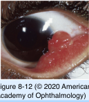
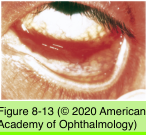
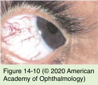

# 8.8.5. Neoplastic Disorders of the Conjunctiva and Cornea (V): Vascular and Mesenchymal Tumors

## Images

## Hierarchy

- classification
  - hamartoma
    - nevus flammeus
    - capillary hemangioma
    - cavernous hemangioma
  - reactive
    - pyogenic granuloma
    - glomus tumor
    - intravascular papillary endothelial hyperplasia
  - malignant
    - Kaposi sarcoma
    - angiosarcoma
  - See Table 8-4
- Inflammatory vascular tumors
  - pyogenic granuloma
    - predisposing condition
      - chalazion
    - clinical presentation
      - rapidly growing
        - minor trauma or surgery
      - red
      - pedunculated
      - smooth
      - bleeds easily
      - stains with fluorescein dye
    - treatment
      - topical or intralesional corticosteroids
      - excision
        - cauterization to the base
        - primary closure of the wound
        - postoperative topical corticosteroids
  - subconjunctival granulomas
    - parasitic and mycotic infections
    - rheumatoid arthritis
  - juvenile xanthogranuloma
    - histiocytic disorder
      - sarcoidosis
      - subconjunctival or subdermal nodular fibrovascular tissue
  - fibrous histiocytoma
    - fibroblasts and histiocytes with lipid vacuoles
  - nodular fasciitis
    - very rare
    - at the insertion site of a rectus muscle
  - necrobiotic xanthogranuloma
    - very rare
    - involves anterior orbit and eyelids
      - presents as subconjunctival/subdermal nodular fibrovascular tissue
    - associated with
      - paraproteinemia
      - multiple myeloma
      - lymphoma
- Hemangioma
  - present at birth
  - may enlarge slowly
  - isolated
    - rare
    - bulbar conjunctiva
  - extension from adjacent structures
    - palpebral conjunctiva can be involved with an eyelid capillary hemangioma
    - diffuse hemangiomatosis of the palpebral conjunctiva or conjunctival fornix indicates an orbital capillary hemangioma
    - cavernous hemangioma of the orbit may present initially under the conjunctiva
- Nevus flammeus
  - port-wine stain
  - congenital
  - types
    - isolated
    - Sturge-Weber syndrome
      - vascular hamartomas
        - secondary glaucoma
      - leptomeningeal angiomatosis
  - genetic mutation
    - vascular endothelial protein receptor for angiopoietin 1
      - controls the assembly of perivascular smooth muscle
- Ataxia-telangiectasia
  - Louis-Bar syndrome
  - autosomal recessive
    - chromosome 11
    - progressive cerebellar ataxia
      - inactivation of a critical protein kinase that regulates response to DNA double-strand breaks
      - most common cause of progressive ataxia in early childhood
  - oculocutaneous telangiectasia
    - conjunctival telangiectasia
      - almost always observed, especially as the child ages
  - ocular motility deficits
    - horizontal and vertical supranuclear gaze palsies
      - inability to initiate saccades
        - head thrusting
        - abnormalities of the fast phase of OKN
      - impaired pursuit
      - total ophthalmoplegia
    - oculocephalic responses remain intact
  - thymic hypoplasia
    - defective T-cell function
    - immunoglobulin deficiency
      - immunodeficiency
        - high incidence of malignancy
        - recurrent sinopulmonary infections
- Malignant tumors
  - Kaposi sarcoma
    - malignant neoplasm of vascular endothelium
    - pathogenesis
      - Kaposi sarcoma–associated herpesvirus/ human herpesvirus 8
      - young patients
        - AIDS!
    - clinical findings
      - involves the skin and mucous membranes
      - eyelid skin
        - purplish nodule
      - orbital involvement
        - eyelid and conjunctival edema
      - conjunctiva
        - reddish
          - highly vascular
        - inferior fornix
          - simulates a subconjunctival hemorrhage
        - types
          - nodular
            - less responsive to therapy
          - diffuse
    - management
      - may not be curative
      - cryotherapy
      - radiotherapy
      - surgical debulking
      - local or systemic chemotherapy
      - intralesional interferon-α2a
  - other malignant tumors
    - malignant fibrous histiocytoma
    - liposarcoma
    - leiomyosarcoma
    - rhabdomyosarcoma
