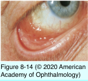
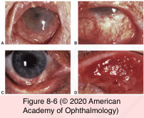
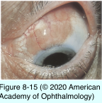

# 8.8.6. Neoplastic Disorders of the Conjunctiva and Cornea (VI): Other Tumors

## Images

## Hierarchy

- lymphangiectasia and lymphangioma
  - lymphangiectasia
    - etiology
      - developmental anomaly
      - trauma
      - inflammation
    - irregularly dilated lymphatic channels
    - bulbar conjunctiva
    - spontaneous filling with blood
    - differential diagnosis
      - ataxia-telangiectasia (louis-bar syndrome)
        - interpalpebral telangiectasia of the arteries
        - lacks an associated lymphatic component
        - grow with the patient and the eyeball
        - poor immune system
          - no episodes of hemorrhage or swelling
          - recurrent pneumonia
  - lymphangioma
    - proliferation of lymphatic channel elements
    - present at birth
      - may enlarge slowly
    - patch of vesicles with edema
      - intralesional hemorrhage
        - “chocolate cyst”
- Conjunctival Lymphocytic Tumors
  - lymphoid hyperplasia (reactive hyperplasia)
    - may represent a low-grade b-cell lymphoma
    - clinical presentation
      - 40 years
      - subepithelial
      - minimally elevated
      - salmon-colored
      - pebbly appearance
      - moderately or highly vascularized
    - differential diagnosis
      - primary localized amyloidosis
        - clinically indistinguishable from conjunctival lymphoma
    - fresh tissue
      - immunohistochemistry
      - flow cytometry
      - gene rearrangement studies
    - management
      - local excision
        - may resolve spontaneously
      - topical corticosteroids
      - radiation
      - general medical consultation
  - lymphoma
    - pathogenesis
      - limited to the conjunctiva
      - in conjunction with systemic lymphoma
      - monoclonal b-cell lymphoma
        - most common
      - less common
        - plasmacytoma
        - hodgkin lymphoma
        - t-cell lymphoma
    - clinical findings
      - 50 years
      - immunosuppressed
        - <50 years
      - usually unilateral
        - 20% are bilateral
      - same clinical appearance as benign lymphoid hyperplasia
        - salmon pink
        - mobile
      - differential diagnosis
        - may masquerade as chronic conjunctivitis
        - extrascleral extension of uveal lymphoid neoplasia
          - fixed to the underlying sclera
    - management
      - ≤31% of patients may have or may eventually develop systemic lymphoma
        - refer to an oncologist
      - incisional biopsy
        - unless tumor is small enough to be removed completely
      - local external-beam radiation therapy
      - systemic chemotherapy
        - if systemic lymphoma
      - cryotherapy
      - intralesional chemotherapy with interferon-α2b
- Glandular Tumors of the Conjunctiva
  - Oncocytoma
    - cystadenoma
    - slow-growing
    - reddish brown nodule
    - surface of the caruncle
    - from ductal and acinar cells of main and accessory lacrimal glands
  - Sebaceous Gland Carcinoma
    - 1% of all eyelid tumors
    - 5% of eyelid malignancies
    - older individuals
    - younger individuals after radiation
    - masquerade as
      - chalazia
      - chronic unilateral blepharoconjunctivitis
- metastatic tumors
  - much less common than those to the uveal tract and orbit
  - cancer of the breast, lung, kidney, and cutaneous melanoma
  - metastases or leukemic infiltrates to the limbus or cornea
