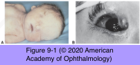
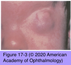
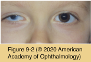

# 8.9.1: Congenital Anomalies (I): Globe

## Images

## Hierarchy

- See Table 9-1
- conjunctiva is typically absent
- Cryptophthalmos
  - forms
    - isolated
    - recessive syndromic
      - Fraser syndrome
        - acrofacial and urogenital malformations
        - +- cryptophthalmos
      - mutations in the FRAS1 gene
        - 4q21
        - encodes a putative extracellular matrix protein
  - clinical presentation
    - usually bilateral
    - eyelids and associated structures of the brows and lashes fail to form (ablepharon)
    - cornea is merged with the epidermis
    - anterior chamber, iris, and lens are variably formed or are absent
    - associated ocular findings
      - absence of the lacrimal glands and canaliculi
      - corneal and conjunctival dermoid
  - pseudocryptophthalmos
    - eyelids and associated structures form but fail to separate (ankyloblepharon)
  - treatment
    - surgical intervention
      - cosmesis
      - relief of pain from absolute glaucoma
    - pseudocryptophthalmos
      - eyelid reconstruction
      - fornix reconstruction
  - Cryptophthalmos
    - rare
    - skin passes uninterrupted from the forehead, over the eye, to the cheek
      - blends in with the cornea, which is usually malformed
    - Fraser syndrome
      - autosomal recessive
      - partial syndactyly
      - genitourinary anomalies
- Nanophthalmos
  - genetics
    - sporadic
    - hereditary
      - autosomal dominant
        - chromosome arm 11p
      - autosomal recessive
        - membrane-type frizzled protein (MFRP) gene
  - clinical presentation
    - small, functional eye
      - relatively normal internal organization and proportions
    - short axial length (15–20 mm)
      - high degree of hyperopia (7–15 D)
    - high lens-to-eye volume ratio
      - crowded anterior segments
        - angle-closure glaucoma
    - thickened sclera
      - choroidal effusions or hemorrhage
    - steep corneal curvature
    - narrow palpebral fissures
    - strabismus
  - management
    - angle-closure glaucoma
      - Laser iridotomy
      - peripheral laser iridoplasty
    - Cataract surgery
      - cataract surgery may be complicated by
        - exudative retinal detachment
        - uveal effusion/hemorrhage
      - high intraocular lens powers are required
- bone fragility
- Blue Sclera
  - generalized scleral thinning
    - increased visibility of the underlying uvea
  - 2 syndromes
    - osteogenesis imperfecta type I
      - autosomal dominant
    - Ehlers-Danlos syndrome type VI
      - autosomal recessive
      - keratoglobus/keratoconus
      - joint hyperextensibility
      - cardiac anomalies
        - severe kyphoscoliosis
      - skin abnormalities
        - abnormal scarring
        - soft distensibility
        - easy bruisability
  - Ehlers-Danlos can be associated with angioid streaks
  - differential diagnosis
    - ocular melanosis bulbi
    - rheumatoid arthritis
    - minocycline staining
  - management
    - regular hearing evaluations after adolescence
    - postmenopausal women
      - long-term physical therapy to strengthen the paraspinal muscles
      - estrogen and progesterone replacement
      - adequate calcium and vitamin D intake
        - FAME
- Microphthalmos
  - small, disorganized globe
    - often
      - cystic outpouching of the posteroinferior sclera
      - colobomatous defects of the iris, ciliary body, uvea, and optic nerve
  - etiology
    - maternal infections
    - exposure to toxins and radiation
    - genetic abnormalities
      - most cases of nonsyndromic microphthalmos are sporadic
      - +- autosomal dominant, autosomal recessive, and X-linked forms
      - trisomies of almost every chromosome (typically, trisomy 13)
  - systemic associations
    - intellectual disability
    - dwarfism
  - associated ocular abnormalities
    - leukomas
    - anterior segment disorders
    - retinal dysplasia
    - colobomas
    - cysts
    - marked internal dysgenesis
    - persistent fetal vasculature (PFV)
    - small orbit
    - ptosis
    - blepharophimosis
    - cystic outpouching of the posteroinferior sclera
  - management
    - cosmetic shell or contact lens
    - genetic counseling
