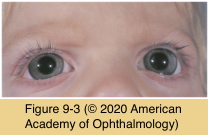

# 8.9.2: Congenital Anomalies (II): Cornea (I)

## Images

## Hierarchy

- in contrast to nanophthalmos
- hyperopia
  - any refractive error because of variations in globe size
- Cornea plana
  - genetics
    - autosomal recessive and dominant
      - KERA gene (12q22)
        - alteration of tertiary structure of keratan sulfate proteoglycans
  - clinical presentation
    - Finnish ancestry
    - flat cornea
      - radius of curvature < 43 D
        - 30–35 D
        - corneal curvature = adjacent sclera is pathognomonic
    - shallow anterior chamber
      - angle-closure glaucoma
    - angle abnormalities
      - open-angle glaucoma
    - associations
      - sclerocornea
        - distinguished by loss of corneal transparency
      - microcornea
      - cataracts
      - anterior and posterior colobomas
  - management
    - correct refractive errors
      - Ehlers-Danlos syndrome
        - causes blue sclera
    - correct glaucoma
    - penetrating keratoplasty
      - high risk of
        - graft rejection
        - postkeratoplasty glaucoma
- Megalocornea
  - epidemiology
    - x-linked recessive
      - males more affected
      - heterozygous women may demonstrate a slight increase in corneal diameter
    - autosomal recessive
      - rare
  - clinical presentation
    - corneal enlargement
      - 13.0–16.5 mm
      - bilateral
      - nonprogressive
      - histologically normal
  - etiology
    - failure of the optic cup to grow and of its anterior tips to close
    - arrested buphthalmos
    - abnormality in collagen production
    - exaggerated growth of the cornea
  - associated findings
    - miosis
    - goniodysgenesis
      - glaucoma (not congenital glaucoma)
    - cataract
      - congenital glaucoma must be ruled out
    - ectopia lentis
    - arcus juvenilis
    - myopia and with-the-rule astigmatism
  - systemic associations
    - craniosynostosis
      - most other conditions cause hyperopia
    - frontal bossing
    - hypertelorism
    - facial anomalies
      - facial hemiatrophy
    - dwarfism
    - intellectual disability
      - also associated with microphthalmos
        - also associated with microphthalmos
    - hypotonia
    - Down syndrome
    - Marfan syndrome
    - Alport syndrome
      - causes blue sclera
    - osteogenesis imperfecta
    - mucolipidosis type II
  - management
    - congenital glaucoma must be ruled out
      - intraocular pressure measurement
      - careful biomicroscopy
        - normal axial length
      - ultrasonography
    - implant the IOL into the capsular bag
      - standard-sized posterior chamber lenses are too short to be fixated in the ciliary sulcus
      - anterior chamber lenses are problematic in the enlarged anterior chamber
- Microcornea
  - epidemiology
    - genetics
      - autosomal dominant (most common)
      - autosomal recessive
    - equal sex predilection
  - clinical presentation
    - diameter <10 mm (or <9 mm in a newborn)
      - clear cornea
      - normal thickness
      - corneas are relatively flat
        - hyperopia
    - glaucoma
      - angle-closure glaucoma
      - open-angle glaucoma
        - 20%
          - nanophthalmic corneas are steep
        - later in life
    - associated ocular anomalies
      - PFV
      - congenital cataracts
      - anterior segment dysgenesis
  - systemic associations
    - myotonic dystrophy
      - optic nerve hypoplasia
    - fetal alcohol syndrome
    - achondroplasia
      - FAME
    - anterior microphthalmos
      - Ehlers-Danlos syndrome
      - the whole anterior segment is small
  - differential diagnosis
    - nanophthalmos
      - eye is small but otherwise relatively normal
    - microphthalmos
      - entire eye is small and malformed
  - management
    - excellent visual prognosis with spectacles if isolated finding
