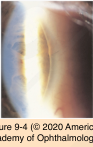
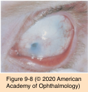
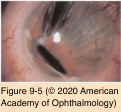
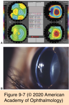
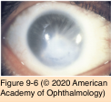

# 8.9.3. Congenital Anomalies (III): Cornea (II): Anterior Segment Dysgenesis

## Images

## Hierarchy

- Posterior embryotoxon
  - Schwalbe line is visible in 8%–30% of normal eyes
    - opaque ridge 0.5–2.0 mm central to the limbus
  - thickened and anteriorly displaced schwalbe line
    - visible by external examination!
    - bilateral
  - eye is usually normal
    - autosomal dominant
  - ocular or systemic syndromes
    - arteriohepatic dysplasia (Alagille syndrome)
    - X-linked ichthyosis
    - familial aniridia
- Sclerocornea
  - transmission
    - sporadic
    - autosomal dominant and recessive
  - no sex predilection
  - bilateral
    - 90%
  - scleralization of the cornea
    - corneal periphery or the entire cornea
    - superficial vessels cross the cornea
  - cornea plana
    - 80%
  - systemic anomalies
    - angle structures are also commonly malformed
- limbus is usually ill-defined
- Axenfeld-Rieger syndrome
  - transmission
    - sporadic
      - autosomal dominant (75%)
        - chromosome region 6p25 (forkhead genes)
      - anteriorly displaced schwalbe line (posterior embryotoxon)
  - clinical presentation
    - attached iris strands
    - glaucoma
      - 50%
      - late childhood or in adulthood
    - associated skeletal, cranial, facial, and dental abnormalities
- Circumscribed posterior keratoconus
  - localized central or paracentral indentation of the posterior cornea
    - without any protrusion of the anterior surface!
    - in contrast to Peter anomaly
  - corneal thinning
  - overlying stromal haze
  - focal deposits of pigmentation and guttae
    - Descemet membrane and endothelium are usually present
    - at the margins of the opacity
  - amblyopia
    - irregular astigmatism
  - sporadic
    - unilateral
    - nonprogressive
  - autosomal recessive form
    - short stature
    - intellectual disability
      - similar to Peters plus
    - cleft lip and palate
    - vertebral anomalies
    - bilateral
- Peters anomaly
  - genetics
    - most cases are sporadic
    - autosomal recessive and dominant
      - mutations in
        - PAX6 gene (11p13)
        - PITX2 gene (4q25-26)
        - CYP1B1 gene (2p22-21)
        - FOXC1 gene (6p25)
          - See under Axendeld-Rieger
  - clinical presentation
    - central corneal opacity
    - localized absence of the corneal endothelium and Descemet membrane
    - types
      - type I
        - iridocorneal adhesions
        - better prognosis for vision rehabilitation with corneal transplantation
      - type II
        - cataractous lens or corneolenticular adhesions
    - associated ocular abnormalities
      - congenital glaucoma
      - microcornea
      - aniridia
      - bilateral cases associated with systemic malformations
    - bilateral>unilateral
    - systemic involvement
      - PFV
      - Peters plus syndrome
        - cleft lip/palate
        - short stature
        - external ear abnormalities
        - intellectual disability
        - other systemic malformations
          - heart defects
          - hearing loss
          - central nervous system deficits
          - spinal defects
          - gastrointestinal and genitourinary defects
          - skeletal anomalies
        - systemic malformations may be associated with genetically transmitted syndromes
          - trisomy 13–15
            - not trisomy 21 !
          - Peters plus syndrome
          - Kivlin syndrome
          - Pfeiffer syndrome
          - exception rather than the rule
- Keratectasia & congenital anterior staphyloma
  - rare
  - unilateral
  - sporadic
  - cornea
    - opaque
    - thin
    - protruded
      - lined by uvea
        - congenital anterior staphyloma
      - not lined by uvea
        - keratectasia
    - absent Descemet membrane and endothelium
  - disorganized anterior segment
  - lens occasionally adheres to cornea
    - resembles unilateral Peters anomaly
  - treatment
    - PK
    - sclerokeratoplasty
    - poor visual prognosis
