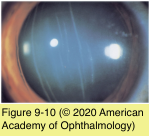

# 8.9.4. Secondary Abnormalities Affecting the Fetal Cornea

## Images

## Hierarchy

- compare with circumscribed posterior keratoconus (non-inflammatory)
- Intrauterine Keratitis: Bacterial and Syphilitic
  - mechanism of corneal damage
    - direct action of the infecting agent
    - teratogenic effect resulting in malformation
    - delayed reactivation of the agent after birth
  - von Hippel internal corneal ulcer
    - posterior corneal defect
    - signs of inflammation may be present after birth
      - corneal infiltrates and vascularization
      - keratic precipitates
      - uveitis
    - iris adhesions
    - lens is usually involved
  - congenital syphilis
    - fetal death or premature delivery
      - first decade of life
        - children with untreated congenital syphilis
    - interstitial keratitis
      - rapidly progressive corneal edema
      - abnormal vascularization
        - deep stroma adjacent to descemet membrane
          - cornea assumes a salmon pink color
            - salmon patch
        - over several weeks to months blood flow ceases
          - “ghost” vessels
- Arcus Juvenilis
  - deposition of lipid in peripheral corneal stroma
    - sector
  - not associated with abnormalities of serum lipid
- Birth Trauma
  - first few postnatal days
  - ruptures in Descemet membrane and the endothelium
    - vertical or oblique
  - progressive corneal edema
    - edema may or may not clear
      - can again become edematous later in life
  - healing
  - high astigmatism
    - hypertrophic ridge of descemet membrane
  - amblyopia
  - differential diagnosis
    - congenital glaucoma
- Congenital Corneal Keloid
  - bilateral
  - failure of normal differentiation of corneal tissue
  - associated systemic conditions
    - Lowe disease (oculocerebrorenal syndrome)
  - associated ocular findings
    - cataracts
      - ACL syndrome (acromegaly, cutis gyrata, cornea leukoma syndrome)
        - autosomal dominant inheritance
    - aniridia
    - glaucoma
  - histology
    - thick collagen bundles haphazardly arranged
    - focal areas of myofibroblastic proliferation
- Primary Congenital Glaucoma
  - dysplasia of the anterior chamber angle
  - at birth or within the first few years of life
  - epiphora
  - photophobia
  - blepharospasm
  - buphthalmos
    - megalocornea=13.0-16.5 mm
  - corneal enlargement >12 mm
  - corneal edema
    - at birth
      - 25%
    - at 6 month
      - 60%
  - tears in Descemet membrane
    - Haab striae
    - oriented horizontally or concentric to the limbus
- Congenital Corneal Anesthesia
  - epidemiology
    - genetics
      - autosomal recessive
      - chromosome 9q31-q33
    - rare
  - clinical presentation
    - infancy and childhood
    - bilateral
    - sterile epithelial ulcerations
    - painless corneal opacities
    - classification
      - group I
        - isolated trigeminal anesthesia
      - group II
        - mesenchymal anomalies
          - Goldenhar syndrome
          - Möbius syndrome
          - familial dysautonomia
      - group III
        - focal brainstem signs
  - differential diagnosis
    - herpes simplex virus keratitis, recurrent corneal erosion, and dry eye
  - management
    - thorough systemic examination
    - neuroradiologic studies
    - frequent topical lubrication
    - punctal occlusion
    - nighttime eyelid splinting
    - lateral tarsorrhaphy
    - amniotic membrane transplantation
    - scleral contact lenses
    - conjunctival flap
