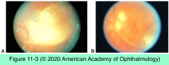
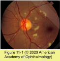
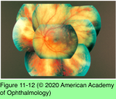

# 9.10.4. Ocular Involvement in AIDS (I)

## Images

## Hierarchy

- Ophthalmic manifestations
  - human immunodeficiency virus (HIV)
  - reported in 70% of infected people
    - infects and results in the depletion of CD4+ helper T lymphocytes
  - visual morbidity occurs primarily with posterior segment involvement
    - may be the first sign of disseminated systemic HIV infection
  - accelerated aging may be a part of HIV- associated eye disease
    - earlier onset of macular degeneration and cataracts
  - HIV-related microangiopathy of the retina (retinopathy)
    - HIV has been isolated from the human retina
      - the most common ocular finding in patients infected with HIV
    - HIV antigen has been detected in retinal endothelial cells
    - retinal hemorrhages
    - microaneurysms
    - cotton-wool spots
  - opportunistic viral, bacterial, and fungal infections
    - cytomegalovirus (CMV)
    - herpes zoster virus
    - Toxoplasma gondii
    - Mycobacterium tuberculosis
    - Mycobacterium avium-intracellulare
    - Cryptococcus neoformans
    - Pneumocystis jirovecii
    - Histoplasma capsulatum
    - Candida
    - molluscum contagiosum virus
  - Kaposi sarcoma of the eyelid and conjunctiva
    - microsporidia
  - lymphomas involving the retina (primary intraocular lymphoma), adnexal structures, and orbit
  - squamous cell carcinoma of the conjunctiva
  - HIV infection itself may cause anterior or intermediate uveitis
    - not responsive to corticosteroids
    - improves with antiretroviral therapy
- Toxoplasma Retinochoroiditis
  - differs from toxoplasmosis in immunocompetent patients
    - ≤40% have bilateral disease
    - lesions are larger
    - vitreous reaction may be less
    - preexisting scars are rare
      - 6%
    - solitary, multifocal, and miliary patterns of retinitis
    - inevitably progresses if left untreated
    - may be associated with cerebral or disseminated toxoplasmosis
  - pathogenesis
    - newly acquired T gondii infections
      - more common
    - dissemination from nonocular sites
      - more common
    - reactivation of quiescent toxoplasmosis also occurs
  - may be difficult to distinguish from
    - ARN
    - necrotizing herpetic retinitis
    - syphilitic retinitis
  - diagnostic workup
    - aqueous and vitreous samples for culture and polymerase chain reaction techniques
  - pathology
    - inflammatory reaction in the choroid, retina, and vitreous is less prominent
    - trophozoites and cysts can be observed in greater numbers
    - T gondii organisms can occasionally be noted invading the choroid
  - management
    - consultation with specialists in infectious diseases
      - magnetic resonance imaging (MRI) of the brain
    - antitoxoplasmic therapy
      - various combinations of pyrimethamine, sulfadiazine, azithromycin, atovaquone, or clindamycin
      - consider the possibility of coexisting cerebral or disseminated toxoplasmosis
      - continued maintenance therapy may be necessary for patients with poor immune status that is not improving
    - corticosteroids should be used with caution and only in the presence of appropriate antimicrobial coverage
- Necrotizing Herpetic Retinitis
  - severity directly proportional to the level of immunologic compromise
  - progressive outer retinal necrosis (PORN)
    - rare variant of necrotizing herpetic retinitis
      - varicella-zoster virus or herpes simplex virus
    - in the absence of, at the same time as, or subsequent to cutaneous varicella-zoster infection
    - in early stages PORN may be difficult to differentiate from peripheral CMV retinitis
    - rapid progression
    - high incidence of retinal detachment
      - relative absence of vitreous inflammation
      - bilateral involvement is common
    - treatment
      - intravitreous ganciclovir, foscarnet, or acyclovir
      - combination antiretroviral therapy
- Cytomegalovirus Retinitis
  - CD4+ counts ≤50 cells/μL
  - occasionally is the first AIDS-defining infection
    - remains the most common opportunistic ocular infection in patients with AIDS
  - references
  - Immune recovery uveitis (IRU)
    - occurs only in eyes with previous CMV retinitis whose immune status improves with combination antiretroviral therapy
      - 10%
        - increase in the CD4+ T-lymphocyte count of at least 50 cells/μL to at least 100 cells/μL
    - risk factors
      - risk proportional to the surface area of retina involved
        - CMV retinitis surface area ≥25%
      - greater risk (odds ratio, 10.6) in patients ever treated with cidofovir
      - has not been linked to
        - active replication of CMV
        - continuation or discontinuation of anti-CMV medication
    - clinical presentation
      - anterior or intermediate uveitis
      - more likely to have
        - macular edema
          - resistant to sub-Tenon corticosteroids
            - such injections do not cause reactivation of CMV infection
            - intravitreal injections of corticosteroids must be avoided!
        - epiretinal membrane
      - associated with moderate vision loss
  - Retinal detachment
    - 50% of patients with CMV retinitis
      - during active disease or after successful treatment
    - with potent antiretroviral regimens, the rate of retinal detachment has been reduced to 0.06 per patient-year
    - risk factors
      - involvement of all 3 retinal zones
      - lower CD4+ T-lymphocyte count
      - more extensive retinitis
    - treatment
      - difficult to repair because of
        - extensive retinal necrosis
        - multiple, often posterior, hole formation
      - pars plana vitrectomy with long-term silicone oil tamponade
        - anatomical reattachment in 90%
