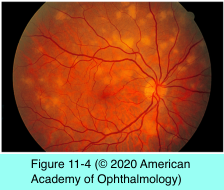
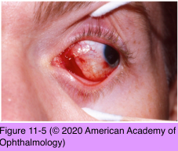

# 9.10.5. Ocular Involvement in AIDS (II)

## Images

## Hierarchy

- Syphilitic Chorioretinitis
  - clinical presentation
    - uveitis
    - optic neuritis
    - nonnecrotizing retinitis
      - unilateral or bilateral
      - pale-yellow, placoid retinal lesions
        - preferentially involve the macula
          - syphilitic posterior placoid chorioretinitis
    - exudative retinal detachment
      - dense vitritis without clinical evidence of chorioretinitis
    - dermatologic and CNS symptoms
  - treatment
    - 18–24 million units of intravenous penicillin G/ day x 10–14 days
      - followed by
        - 2.4 million units of intramuscular benzathine penicillin G weekly x3 weeks
  - monitor for recurrence with rapid plasma reagin (RPR) test
- Multifocal Choroiditis and Systemic Dissemination
  - multifocal choroidal lesions from a variety of infectious agents are found in up to 10% of patients with AIDS
  - most common organisms
    - C neoformans
    - P jirovecii
    - M tuberculosis
    - multiple infectious agents may cause simultaneous infectious multifocal choroiditis
  - choroid is a site of opportunistic disseminated infections and thus needs to be carefully examined
  - multifocal choroiditis is frequently a sign of disseminated infection
- atypical mycobacteria
- human herpesvirus 8
- Pneumocystis jirovecii Choroiditis
  - patients with AIDS are at much greater risk for Pneumocystis jirovecii pneumonia
    - rarely can result in choroiditis
  - contain the microorganisms
  - clinical presentation
    - choroidal infiltrates
      - slightly elevated, plaquelike, yellow-white lesions
    - minimal vitritis
  - fluorescein angiography
    - hypofluorescent in the early phase
    - hyperfluorescent in the later phase
  - management
    - infectious diseases specialist
    - intravenous trimethoprim (20 mg/kg/day) and sulfamethoxazole (100 mg/kg/day) x 3-week
    - or
    - pentamidine (4 mg/kg/day) x 3-week
    - within 3–12 weeks, most of the yellow-white lesions disappear leaving mild overlying pigmentary changes
    - vision is usually not affected
- Ocular Adnexal Kaposi Sarcoma
  - ocular adnexal involvement occurs in ≈20% of AIDS-associated systemic Kaposi sarcoma
    - before availability of potent antiretroviral therapy
  - 2 aggressive variants
    - endemic
      - prevalent in Kenya and Nigeria
    - epidemic
      - in renal transplant recipients
  - clinical presentation
    - skin lesions
      - in patients with AIDS
    - visceral organs (the gastrointestinal tract, lung, and liver)
      - ≤50% of patients
  - histology
    - spindle cells mixed with vascular structures
  - treatment
    - excision
    - cryotherapy
    - radiation
- Cryptococcus neoformans Choroiditis
  - Cryptococcus neoformans
  - multifocal choroiditis
    - solitary or multiple discrete yellow-white chorioretinal lesions
      - varying markedly in size
      - postequatorial
  - some patients show choroidal lesions before clinical evidence of dissemination
  - CSF infection
    - secondary optic nerve edema as a result of increased intracranial pressure
      - optic atrophy
    - direct invasion of the optic nerve is also possible
      - more rapid vision loss
  - treatment
    - amphotericin and flucytosine
