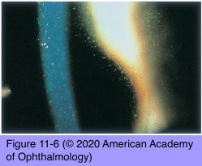

# 9.10.6. Ocular Involvement in AIDS (III)

## Images

## Hierarchy

- Molluscum Contagiosum
  - small elevation with central umbilication
    - a DNA virus of the poxvirus family
  - immunocompetent individuals
    - few, unilateral
    - involve the eyelids
  - patients with AIDS
    - numerous, bilateral
  - indications for surgical excision
    - symptomatic lesions
    - lesions causing conjunctivitis
- Herpes Zoster
  - corneal involvement can cause persistent, chronic epithelial keratitis
    - patients <50 years with herpes zoster lesions of the face or eyelids should be considered for HIV testing
  - treatment
    - intravenous and topical acyclovir
  - periodic monitoring for posterior segment involvement
- Precautions in the Health Care Setting
  - there are no published reports of HIV transmission in ophthalmic health care settings
  - hands should be washed or a hand sterilizer solution used between tests on an individual and between patients
  - tonometers, diagnostic contact lenses, and contact lens trial sets should be appropriately disinfected
- HIV Infection in Resource-Limited Regions of the World
  - effective antiretroviral therapy and education have greatly improved outcomes and decreased the rate of ocular complications in resource-rich nations
  - 2013
    - 35 million people are living with HIV/AIDS
      - 2.1 million adolescents (ages 10–19 years)
      - 3.34 million children
  - ≤95% of new HIV infections occur in low- and middle-income countries
- Other Infections
  - AIDS does not predispose to bacterial keratitis
    - but bacterial keratitis is
      - more severe
      - more likely to cause perforation
  - herpes simplex keratitis does not have a higher incidence in patients with AIDS
    - but
      - has prolonged course/multiple recurrences
      - involves the limbus
  - microsporidia
    - coarse, punctate epithelial keratitis with minimal conjunctival reaction
    - electron microscopy of epithelial scrapings
      - obligate, intracellular, protozoal parasite
  - solitary granulomatous conjunctivitis
    - cryptococcal or mycotic infections
    - tuberculosis
    - possibility of dissemination must be aggressively investigated
  - orbital and intraocular lymphomas
  - conjunctival squamous cell carcinomas
