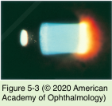
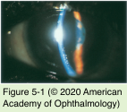
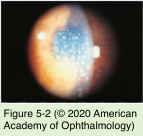
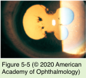
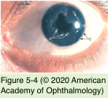

# 9.5.2. Clinical Approach to Uveitis (II): Signs

## Images

## Hierarchy

- Intermediate Segment
  - vitreous inflammatory cells
    - grading
      - examine retrolental space in a dilated eye using the slit-lamp biomicroscope and a 1×0.5 mm beam
    - cells in the vitreous strands are old
    - cells in the syneretic areas may be new
  - vitreous haze
    - standardized photographs
  - snowball opacities
    - sarcoidosis
    - intermediate uveitis
  - exudates over the pars plana (snowbank)
    - active
      - fluffy or shaggy appearance
    - inactive
      - gliotic or fibrotic and smooth
  - vitreal strands
  - cyclitic membrane formation
    - secondary ciliary body detachment
      - hypotony
- Anterior segment
  - injection
    - perilimbal vascular engorgement (ciliary flush)
    - diffuse injection of the conjunctiva/episclera
  - anterior chamber reaction
    - types
      - serous (aqueous flare caused by protein influx)
      - purulent (polymorphonuclear leukocytes and necrotic debris causing hypopyon)
      - fibrinous (plasmoid, or intense fibrinous exudate)
      - sanguinoid (inflammatory cells with erythrocytes, as manifested by hypopyon mixed with hyphema)
    - grading
      - 1- × 1-mm high-power beam at full intensity at a 45°–60° angle in a dark room
      - The SUN working group grading for anterior chamber cells
        - see Table 5-8
      - The SUN working group grading for anterior chamber flare
        - see Table 5-9
  - keratic precipitates
    - collections of inflammatory cells on the corneal endothelium
      - new
        - white
        - smoothly rounded
      - old
        - crenated (shrunken)
        - pigmented
        - glassy
      - mutton-fat KPs
        - large, yellowish
        - associated with granulomatous inflammation
  - pigment dispersion
  - pupillary miosis
  - synechiae, both anterior and posterior
  - iris nodules
    - Koeppe nodules
      - at the pupillary border
    - Busacca nodules
      - within the iris stroma
    - Berlin nodules
      - in the angle
  - band keratopathy (observed in long-standing uveitis)
  - iris granulomas
  - heterochromia (eg, Fuchs heterochromic uveitis)
  - stromal atrophy (eg, herpetic uveitis)
  - intraocular pressure (IOP)
    - IOP is often low
      - decreased aqueous production
      - increased uveoscleral outflow
    - IOP may increase
      - trabecular meshwork becomes clogged by inflammatory cells/debris
      - trabecular meshwork is inflamed (trabeculitis)
      - pupillary block
- Posterior segment
  - retinal or choroidal inflammatory infiltrates
  - inflammatory sheathing of arteries or veins
  - exudative, tractional*, or rhegmatogenous* retinal detachment
  - retinal pigment epithelial hypertrophy or atrophy*
  - atrophy or swelling of the retina, choroid, or optic nerve head*
  - preretinal or subretinal fibrosis*
  - retinal or choroidal neovascularization*
