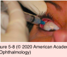
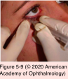

# 9.5.7. Clinical approach to uveitis (IV): Medical Management (II): Corticosteroids

## Images

## Hierarchy

- introduction
  - indications
    - treatment of active inflammation
      - reduction of inflammatory infiltration of the retina, choroid, or optic nerve
    - prevention/treatment of complications such as CME
  - not indicated in patients with
    - chronic flare
    - fuchs heterochromic uveitis
    - pars planitis not accompanied by macular edema
  - begin therapy with a high dose of corticosteroids
  - taper the dose as the inflammation subsides
    - taper gradually (over days to weeks) if utilized for >2–3 weeks
  - maintain on the minimum dosage needed to control the inflammation
    - increase the dose if surgical intervention is required
- topical administration
  - indications
    - anterior uveitis
    - vitritis +-
  - ointment form
    - for nighttime use
      - macular edema +-
    - when preservatives in the eyedrops are not well tolerated
  - difluprednate 0.05%
  - rimexolone
  - loteprednol
    - less ocular hypertensive effect
      - not as effective as prednisolone in controlling uveitis that is more intense than mild to moderate
  - fluorometholone
  - generic forms of prednisolone may have less of an anti-inflammatory effect
    - may be a result of differences in particle size
      - vigorously agitate drug before instillation!
- intravitreal administration
  - triamcinolone acetonide
    - trans–pars plana intravitreal injection (4 mg; 0.1 mL)
    - indications
      - recalcitrant uveitic CME
        - visual acuity improvement for 3–6 months in nonvitrectomized eyes
    - complications
      - cataract formation
        - not curative of chronic uveitis
      - IOP elevation
        - 50%
        - ≤25% of patients may require topical medications to control IOP
        - 1%–2% may require filtering surgery
      - “sterile endophthalmitis”
        - 1%–6%
        - lower incidence with preservative-free intravitreal triamcinolone
      - infectious endophthalmitis
      - rhegmatogenous retinal detachment
  - sustained-release fluocinolone implant
    - indication
      - chronic noninfectious uveitis affecting the posterior segment
    - technique
      - inserted through a small pars plana incision and sutured to the sclera
    - 0.59 mg implant is effective for a median of 30 months
      - at 34 weeks, inflammation was well controlled in nearly all eyes
    - complications
      - cataract
        - in nearly all phakic eyes within 2 years
      - elevated IOP necessitating topical therapy
        - nearly 75% after 3 years
          - 37% required filtering surgery
      - endophthalmitis
      - wound leaks
      - hypotony
      - vitreous hemorrhage
      - retinal detachments
    - Reimplantation may be performed
    - Multicenter Uveitis Steroid Treatment (MUST) trial
      - fluocinolone implant was compared with standard systemic therapy
      - corrected distance visual acuity was not significantly different between the 2 treatment groups at 2 years
  - biodegradable intraocular implant
    - indications
      - posterior uveitis
      - retinal vein occlusion
    - injected through the pars plana into the vitreous cavity
      - 700 μg of dexamethasone
    - relative contraindications
      - aphakia
        - risk of implant migration into the anterior chamber
      - decentered intraocular lens
      - vitrectomy
- periocular administration
  - depot injections
    - triamcinolone acetonide (40 mg)
    - methylprednisolone acetate (40–80 mg)
      - intermediate or posterior uveitis
  - indications
    - more posterior effect is needed
      - CME
    - patient is nonadherent or unresponsive to topical or systemic administration
  - contraindications
    - infectious uveitis (eg, toxoplasmosis)
    - necrotizing scleritis
  - can cause systemic adverse effects similar to those of oral corticosteroids
  - can raise IOP precipitously for a long time
    - the periocular steroid should be removed surgically!
  - sub-Tenon route
    - superotemporal approach (Nozik technique)
      - the preferred location
      - technique
        - 5⁄8 25-gauge -inch needle
        - upper eyelid is retracted
        - patient is instructed to look down and nasally
        - anesthesia is applied with a cotton swab soaked in proparacaine or tetracaine
        - needle is placed bevel-down against the sclera
        - advanced through the conjunctiva and Tenon capsule using a side-to-side movement
        - advance needle to the hub
      - complications
        - upper eyelid ptosis
        - periorbital hemorrhage
        - globe perforation
    - inferotemporal approach
      - inferior approach using the Nozik technique can be awkward to perform
  - transseptal route
    - preferred for the inferior approach
    - technique
      - short 27-gauge needle
        - can be more painful than the sub-Tenon injection if a 25-gauge needle is used
      - 3-mL syringe
      - use index finger to push the temporal lower eyelid posteriorly and locate the equator of the globe
      - insert needle inferior to the globe through the skin of the eyelid
      - directed straight back through the orbital septum into the orbital fat to the hub of the needle
      - aspirate needle
        - if there is no blood reflux, inject the corticosteroid
    - complications
      - periorbital and retrobulbar hemorrhage
      - lower eyelid retractor ptosis
      - orbital fat prolapse with periorbital festoon formation
      - orbital fat atrophy
      - skin discoloration
- Systemic Corticosteroid Administration
  - oral corticosteroid
    - indications
      - vision-threatening chronic uveitis
        - topical/local corticosteroids are insufficient
        - systemic disease also requires therapy
    - prednisone
      - 1–2 mg/kg/day
        - not >60–80 mg/day
      - gradually taper every 1–2 weeks
        - lowest possible dose that will control inflammation and minimize adverse effects
        - for 3 months or, in some cases, longer
          - if ≥10 mg oral prednisone/day is required for >3 months
            - immunomodulatory therapy is indicated
  - intravenous corticosteroid
    - indications
      - explosive onset of severe noninfectious posterior uveitis/panuveitis
    - intravenous, high-dose, pulse methylprednisolone
      - 1 g/day over 1 hour x ≤3 days
        - gradual taper of oral prednisone starting at 1– 1.5 mg/kg/day
      - adverse effects
        - psychological disturbances
        - hypertension
        - elevated glucose levels
        - only in a hospital setting
          - general health must be closely monitored, often with the assistance of an internist
  - corticosteroid complications
    - patients at high risk for corticosteroid-induced exacerbations of their conditions
      - diabetes mellitus
      - hypertension
      - peptic ulcer
        - systemic corticosteroids + NSAIDs
          - higher risk of gastric ulcers
            - should receive a H2 receptor blocker or proton-pump inhibitor
            - best avoided
      - gastroesophageal reflux disease
      - immunocompromised
      - psychiatric conditions
    - osteoporosis
      - tests to evaluate patients at risk for corticosteroid-induced osteoporosis
        - serial height measurements
        - serum calcium and phosphorus levels
        - serum 25-hydroxycholecalciferol levels
        - follicle-stimulating hormone and testosterone levels (if gonadal status is uncertain)
          - bone-mineral-density screening (for anyone receiving corticosteroid therapy for >3 months)
      - long-term corticosteroid maintenance therapy
        - calcium and vitamin D supplements
        - drugs for prevention/treatment of osteoporosis
          - for patients receiving the equivalent of ≥7.5 mg/day prednisone
