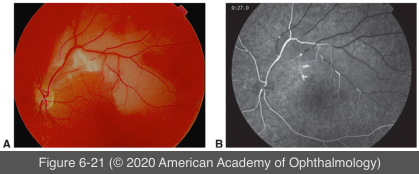

# 9.6.11. Posterior Uveitis (IV): Susac Syndrome

## Images

## Hierarchy

- SICRET syndrome
  - Small Infarctions Of Cochlear, Retinal, and Encephalic Tissue
- epidemiology
  - rare
    - young women
      - ages 16–58 years
- clinical triad
  - encephalopathy
  - hearing loss
  - branch retinal artery occlusions
- Lab work-up
  - audiometry
    - sensorineural hearing loss
  - FA
    - focal nonperfused retinal arterioles with hyperfluorescent walls
  - magnetic resonance imaging (MRI)
    - multifocal supratentorial white matter lesions
      - corpus callosum may be involved
- ocular presentation
  - ocular findings are highly specific
  - diffuse or localized narrowing of retinal arteries
    - peripheral retinal arteries
    - isolated retinal arteriolar involvement may occur as a very late manifestation
  - “boxcar” segmentation of the blood column
  - no evidence of embolic material or inflammatory reactions around the vessels
- treatment
  - high-dose intravenous corticosteroids
  - anticoagulants
  - IMT
  - +- self-limiting
- Differential diagnosis
  - Behçet disease
    - no vitreous haze or cells
  - MS
  - herpetic encephalitis
  - acute disseminated encephalomyelitis
