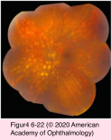
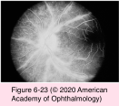
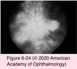
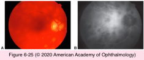
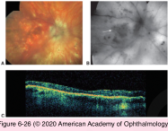

# 9.6.12. Posterior Uveitis (V): White Dot Syndromes (I)

## Images

## Hierarchy

- CME
- Birdshot uveitis
  - birdshot chorioretinopathy
  - epidemiology
    - F>M
      - white women of northern European descent
      - past the fourth decade of life
    - highly correlated with the HLA-A29 gene
      - sensitivity of 96%
      - specificity of 93%
      - increased (224x) relative risk
      - 7% of the general population are HLA-A29 (+)
        - HLA-A29 is confirmatory rather than diagnostic!
  - symptoms
    - blurred vision
    - floaters
      - nyctalopia
    - disturbance of color vision
    - unusual peripheral visual phenomena
      - pinwheels
      - sparkles
      - flickering lights
    - visual complaints out of proportion to visual acuity
  - clinical presentation
    - multifocal, hypopigmented, ovoid, cream- colored lesions (50–1500 μm)
      - nasal and radial distribution emanating from the optic nerve
      - postequatorial
      - at the level of the choroid and RPE
      - frequently follow the underlying choroidal vessels
      - may not be readily apparent at first
    - minimal or absent anterior uveitis
    - varying degrees of vitritis
    - retinal vasculitis
    - optic nerve head inflammation
    - late complications
      - optic atrophy
      - epiretinal membrane
      - CNV
        - rare
  - lab evaluation
    - fluorescein angiography
      - early disease
        - initial hypofluorescence with subtle late staining
        - does not typically highlight the lesions
          - useful in identifying signs of active inflammation
            - retinal vasculitis
            - CME
            - optic nerve head leakage
      - late disease
        - hypopigmented lesions do not show transmission defects
          - loss of pigment concurrent with loss of choriocapillaris
    - indocyanine green angiography
      - multiple hypofluorescent spots
    - fundus autofluorescence imaging
      - hypoautofluorescence
        - more numerous than on clinical examination or FA
      - more numerous and not uniformly correspondent with the birdshot lesions
      - placoid macular hypoautofluorescence
        - important predictor of central vision loss
    - OCT imaging
      - macular edema
      - patchy or diffuse loss of photoreceptors
        - macular thinning
  - differential diagnostic
    - pars planitis
    - VKH syndrome
    - sympathetic ophthalmia
    - OHS
    - intraocular lymphoma
    - sarcoidosis
  - management
    - natural course
      - insidiously progressive (chronic)
        - progressive worsening of the visual field
        - abnormal electroretinogram (ERG) with extended follow-up
        - majority of patients require treatment
      - self-limited
        - a subset of patients
        - do well without treatment
          - any patient who is not treated should be monitored closely
    - monitoring of disease course
      - full-field ERG
        - 30-Hz flicker implicit time
        - scotopic b-wave amplitudes
        - more useful for monitoring disease course than changes in visual acuity or funduscopic appearance
      - Goldmann/automated visual field (30-2)
        - more useful for monitoring disease course than changes in visual acuity or funduscopic appearance
    - systemic corticosteroids
      - typically incompletely responsive to corticosteroids alone
      - extended treatment is anticipated in most patients
    - early introduction of corticosteroid-sparing IMT
      - low-dose cyclosporine (2–5 mg/kg/day)
      - mycophenolate mofetil
      - azathioprine
      - methotrexate
      - TNF-α inhibitors
      - intravenous polyclonal immunoglobulin
    - periocular/intravitreal corticosteroid injections
      - adjunctive therapy for CME and inflammatory recurrences
    - intravitreal fluocinolone acetonide implant
      - systemic therapy not tolerated or has failed
    - ≤88% of patients maintain vision with aggressive, long-term control of inflammation
- Inflammatory Chorioretinopathies of Unknown Etiology
  - See Table 6-2
  - white dot syndromes
    - group of inflammatory disorders with discrete, multiple, well-circumscribed, yellow-white lesions at the level of the retina/outer retina/ RPE/choriocapillaris or choroid during some phase of their course
  - epidemiology
    - < 50 years
      - except
        - birdshot uveitis
    - female predominance
      - MEWDS
        - serpiginous choroiditis
      - birdshot uveitis
      - multifocal choroiditis and panuveitis
      - punctate inner choroiditis (PIC)
      - subretinal fibrosis and uveitis syndrome
      - acute zonal occult outer retinopathy
      - except
        - APMPPE
          - M=F
        - serpiginous choroidopathy
          - M=F
  - etiology
    - autoimmune/inflammatory
      - increased prevalence of systemic autoimmunity both in patients with WWS and their first/second-degree relatives
      - inherited immune dysregulation that predisposes to autoimmunity
    - infectious cause
    - unknown
  - prodromal viral syndrome
    - APMPPE
    - MEWDS
  - bilateral +- asymmetrical
    - with the exception of
      - ARPE
        - multiple evanescent white dot syndrome [MEWDS]
  - presenting symptoms
    - photopsias
    - blurred vision
    - nyctalopia
      - birdshot
    - floaters
    - visual field loss contiguous with the blind spot
  - differential diagnosis
    - infectious entities
      - syphilis
      - diffuse unilateral subacute neuroretinitis (DUSN)
      - ocular histoplasmosis syndrome (OHS)
    - noninfectious entities
      - sarcoidosis
      - sympathetic ophthalmia
      - Vogt-Koyanagi-Harada (VKH) syndrome
      - intraocular lymphoma
