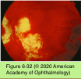
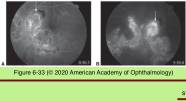
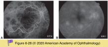
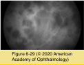
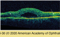

# 9.6.13. Posterior Uveitis (VI): White Dot Syndromes (II)

## Images

## Hierarchy

- Serpiginous choroiditis
  - epidemiology
    - M=F
  - pathogenesis
    - unknown
      - 2nd-7th decades
      - immune-mediated occlusive vasculitis
        - microorganisms may be a potential trigger
    - reported to occur in patients with
      - Crohn disease
      - sarcoidosis
      - PAN
  - clinical presentation
    - symptoms
      - painless
      - paracentral scotomata
      - decreased vision
    - bilateral asymmetric
    - no AC reaction
    - minimal vitreous reaction
    - active areas
      - pseudopodial/geographic gray-white lesions at the level of the RPE projecting from the optic nerve
        - progressive centrifugal extension
          - disease activity is confined to the leading edge of the advancing lesion
      - macular or peripheral lesions may present without peripapillary involvement
        - less common
      - +- shallow subretinal fluid
      - +- vascular sheathing
      - +- RPE detachment
      - +- neovascularization of the disc
    - late findings
      - atrophy of the choriocapillaris, RPE, and retina
      - extensive RPE hyperpigmentation and subretinal fibrosis
  - natural course
    - chronic progressive
      - CNV
        - at the border of an old scar
        - ≤25%
      - new lesions & recurrent attacks are typical
    - final visual acuity of 20/200 - counting fingers
      - ≤38%
  - paraclinical evaluation
    - FA
      - early phase
        - blockage of the choroidal flush
      - late phase
        - staining of the active edge of the lesion
        - hypofluorescence throughout all phases of the study for both acute and old lesions
          - early hyperfluorescence with late leakage is indicative of CNV
    - ICG angiography
      - may reveal more extensive involvement than FA or clinical examination
      - CNV
        - localized hyperfluorescence during the middle to late phases
        - useful in distinguishing active lesions from CNV
    - FAF imaging
      - sensitive for detecting RPE damage and monitoring disease course
      - hyperfluorescence highlights active disease
      - hypoautofluorescence corresponds closely to regressed disease
    - OCT imaging
      - active disease
        - outer retinal reflectivity and disruption
      - regressed disease
        - atrophic changes in the retina and RPE
  - serpiginous-like choroiditis
    - Mycobacterium tuberculosis
      - patients exposed to active pulmonary TB
        - can cause inflammation that simulates typical serpiginous choroiditis
        - countries where TB is endemic
      - tuberculin skin testing
      - interferon-gamma release assay
      - chest X-ray often appears normal
      - lesions appear and progress in multiple areas
        - unilateral
        - involve posterior pole, mid-periphery, and periphery
          - more prominent vitreous cellular reaction
            - usually sparing the juxtapapillary area until late in the disease
      - responds to anti-TB treatment
        - complete control may take months
        - +- corticosteroids
    - herpetic choroiditis
    - syphilitic choroiditis
  - treatment
    - systemic, periocular, and intravitreal corticosteroids
      - for active lesions
        - particularly lesions threatening the fovea
      - corticosteroids alone are ineffective
      - patients require prolonged anti-inflammatory therapy
    - systemic IMT
      - cyclosporine monotherapy
      - triple therapy with prednisone, cyclosporine, and azathioprine
        - may induce rapid remission of acute disease
        - prolonged therapy is required
        - disease recurrence is frequently observed as drugs are tapered
      - cytotoxic therapy
        - cyclophosphamide
        - chlorambucil
        - induce long, drug-free remissions
    - intravitreal fluocinolone acetonide implant
      - patients intolerant of systemic therapy
    - CNV treatment
      - intravitreal anti-VEGF drugs
      - focal laser photocoagulation
      - photodynamic therapy
  - references
- Acute posterior multifocal placoid pigment epitheliopathy (APMPPE)
  - epidemiology
    - healthy young adults
      - 2nd-3rd decade
    - M = F
  - pathogenesis
    - genetic predisposition
      - influenza-like prodrome (50%)
        - similar to serpiginous & ARPE
          - unlike other WDSs
      - HLA-B7
      - HLA-DR2
    - immune-mediated vascular alteration
      - choroidal/choriocapillaris perfusion abnormalities with secondary involvement of the RPE/photoreceptors
    - noninfectious systemic associations
      - erythema nodosum
      - cerebral vasculitis
        - potentially life-threatening
      - scleritis and episcleritis
        - should undergo urgent neurologic evaluation
      - GPA
      - PAN
      - sarcoidosis
      - ulcerative colitis
    - infectious systemic associations
      - group A streptococcal infection
      - adenovirus type 5 infection
      - tuberculosis
      - Lyme disease
      - mumps
      - sudden onset
        - hepatitis B vaccination
        - resolve over a period of 2–6 weeks
  - clinical presentation
    - natural course
      - new peripheral lesions may appear in a linear/ radial array over the next 3 weeks
    - symptoms
      - vision loss
        - fellow eye becomes involved within days to weeks
          - bilateral
      - central and paracentral scotomata
      - photopsias may precede loss of vision
    - multiple large, flat, yellow-white placoid lesions at the level of the RPE
      - 1-2 disc areas
      - throughout the posterior pole to the equator
      - resolve over a period of 2–6 weeks
        - permanent, well-defined RPE alterations (depigmentation and pigment clumping)
        - rapid evolution of the pigmentary changes, often over days, is a typical feature
    - +- papillitis
    - +- mild vitritis
    - atypical findings
      - retinal vasculitis
      - retinal vascular occlusive disease
      - retinal neovascularization
      - exudative retinal detachment
      - minimal or no anterior uveitis
      - CME
        - uncommon
  - lab evaluation
    - FA
      - acute phase
        - early hypofluorescence
          - typically more numerous than on funduscopy
      - subacute phase
        - late hyperfluorescent staining
        - increased central hyperfluorescence with late staining
      - resolution phase
        - transmission defects
    - ICG angiography
      - choroidal hypofluorescence
        - typically more numerous than on funduscopy
        - become smaller in the inactive stages
      - hypervisualization of the underlying choroidal vessels in both the acute and inactive stages
    - FAF imaging
      - RPE alterations
        - appear during recovery well after the choroid is affected
        - are fewer in number
    - OCT
      - acute lesions
        - hyperreflectivity of the outer retinal layers
        - subretinal or intraretinal fluid
      - resolving lesions
        - outer retinal and photoreceptor loss
  - differential diagnosis
    - choroidal metastasis
    - viral retinitis
    - sarcoidosis
    - VKH syndrome
    - pneumocystis choroiditis
    - serpiginous choroiditis
      - insidious and progressive
        - APMPPE is acute, usually nonrecurring disease!
  - treatment
    - systemic corticosteroids
      - may not alter visual outcome
      - some authorities advocate treatment in patients with
        - extensive macular involvement
        - associated CNS vasculitis
    - visual acuity returns to ≥20/40 within 6 months
      - 20% are left with residual visual dysfunction
    - risk factors for loss of vision
      - foveal involvement at presentation
      - older age
      - unilateral disease
        - APMPPE is bilateral
          - APMPPE is a disease of the young
      - longer interval between initial and fellow eye involvement
        - Usually days-weeks
      - recurrence
        - APMPPE is usually non-recurrent
