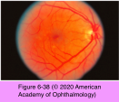
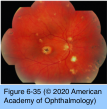
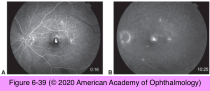
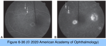
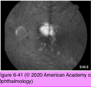
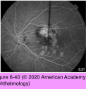
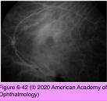
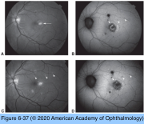

# 9.6.14. Posterior Uveitis (VII): White Dot Syndromes (III)

## Images

## Hierarchy

- CNV
  - leading cause of vision loss
- Multifocal choroiditis and panuveitis (MCP)
  - multifocal choroiditis (MFC)
    - MCP
    - PIC
    - subretinal fibrosis and uveitis syndrome (SFU)
  - young women with myopia
    - 9-69 years
      - F:M=3:1
      - PIC patient's are younger
  - pathogenesis
    - unknown
    - viral etiology
      - herpes simplex and Epstein-Barr virus
      - initial viral infection may trigger an autoimmune process
  - clinical presentation
    - symptoms
      - floaters
      - photopsias
      - enlargement of the physiologic blind spot
      - decreased vision
    - bilateral
      - asymmetrical
    - active lesions
      - multiple creamy opaque dots (50–200 μm)
        - peripapillary, midperipheral, and anterior equatorial distribution
        - smaller than birdshot uveitis or APMPPE
        - larger and more pigmented than PIC
        - new lesions may appear
      - varying degrees of anterior segment inflammation
      - vitritis
        - excludes OHS or PIC
        - PIC lesions are deeper and more punched out than those of MCP
    - regressed lesions
      - atrophic yellow-white punched-out scars
      - varying degrees of hyperpigmentation
    - peripheral chorioretinal streaks
    - peripapillary pigment changes
      - similar to OHS
        - subretinal fibrosis with RPE clumping is much more common in MCP!
    - complications
      - cataract
      - ERM
        - CME
          - unlike PIC
    - natural course
      - insidious onset
        - similar to PIC
      - chronic recurrent
  - paraclinical evaulation
    - FA
      - active lesions
        - early hypofluorescence
        - late staining
      - regressed lesions
        - transmission defects (early hyperfluorescence that fades in late phase)
      - macular edema and CNV
        - early hyperfluorescence and late leakage
    - ICG angiography
      - active lesions
        - midphase hypofluorescent lesions
        - more numerous than on clinical examination or FA
      - regressed lesions
        - clustered around the optic nerve
          - may correlate with an enlarged blind spot
        - hypofluorescent spots may fade with treatment
    - FAF imaging
      - active lesions
        - hyperautofluorescence
      - regressed lesions
        - punctate hypoautofluorescent spots (≥125 μm)
          - correspond to areas of chorioretinal atrophy
        - smaller hypoautofluorescent spots (<125 μm) numbering in the hundreds may be seen in the macular and peripapillary regions not visible on fundus photography
    - OCT imaging
      - drusenlike material beneath the RPE at the site of visible spots
        - associated with more widespread disruption of the overlying outer retina
      - choroidal hyperreflectivity beneath the deposits
    - pathology
      - from large numbers of B lymphocytes in the choroid to a predominance of T lymphocytes
      - different immune mechanisms may produce a similar clinical picture
    - differential diagnosis
      - diagnosis of exclusion
        - sarcoidosis
        - syphilis
        - TB
  - treatment
    - systemic/periocular corticosteroids
      - for macular edema
      - +- induce regression of CNV
    - IMT
      - successful in achieving inflammatory quiescence
      - 83% reduction in the risk of posterior pole complications (CME, ERM, and CNV)
      - 92% reduction in vision loss to ≤20/200
    - intravitreal fluocinolone acetonide implant
    - CNV
      - intravitreal anti-VEGF drugs
      - laser
      - inflammatory component should be well controlled
  - guarded visual prognosis
    - permanent vision loss in at least 1 eye
      - 75%
    - vision loss to ≤20/200
      - 12% per eye-year
- Punctate inner choroiditis (PIC)
  - epidemiology
    - young women with myopia
      - 18-40 years
        - younger median age compared to MCP (29 vs 45 years)
      - 90% F
  - symptoms
    - metamorphopsia
    - paracentral scotomata
    - photopsias
    - asymmetric loss of central acuity
  - clinical presentation
    - PIC lesions
      - white-yellow chorioretinal lesions
      - 100–200 μm
      - rarely extend to the midperiphery
      - progress to atrophic scars
        - pigmented halo
          - deeper and more punched out than those of MCP
    - serous retinal detachment
      - over confluent PIC lesions
    - CNV
      - common vision-threatening complication in PIC & MCP
        - more frequent at presentation in patients with PIC (79% vs 28%)
    - cataract
      - no vitritis
        - in contrast to MCP
      - rare
        - unlike MCP
    - CME
    - ERM
    - natural course
      - acute onset
      - self-limited
        - unlike MCP
  - paraclinical evaluation
    - FA
      - early hypofluorescence with late staining
      - +- early hyperfluorescence (especially with CNV)
    - ICG angiography
      - midphase hypofluorescence
        - corresponds to lesions apparent on FA and clinical examination
        - useful in delineating disease extent and activity
    - OCT
      - findings similar to those of MCP
  - treatment
    - observation
    - periocular and/or systemic corticosteroids
      - poor initial visual acuity
      - multiple acute PIC lesions proximate to the fovea
    - CNV
      - intravitreal anti-VEGF
      - laser photocoagulation
      - photodynamic therapy
      - submacular surgery
  - visual prognosis
    - favorable in absence of CNV involving the foveal center
- In contrast to MCP
  - patients with MCP are more likely to have bilateral visual impairment (≤20/50)
- worse visual prognosis than PIC
