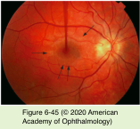
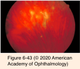
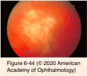
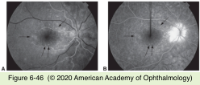
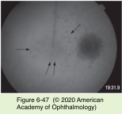

# 9.6.15. Posterior Uveitis (VIII): White Dot Syndromes (IV)

## Images

## Hierarchy

- perifoveal location
- CME
- Multiple evanescent white dot syndrome (MEWDS)
  - epidemiology
    - 2nd-4th decades
      - healthy, young, moderately myopic females
        - similar to MCP, PIC, SFU, AZOOR
  - pathogenesis
    - antecedent viral prodrome
      - 1/3
        - similar to APMPPE
    - RPE–photoreceptor complex rather than the choroid
  - natural course
    - acute
      - self-limited
    - recurrences are uncommon (10%–15%)
      - In contrast to most other WDSs
  - clinical presentation
    - unilateral (80%)
    - symptoms
      - decreased vision
        - photopsias
      - central or paracentral scotomata
        - enlarged physiologic blind spot
    - multiple, discrete, white-to-orange spots (100– 200 μm)
      - level of the RPE or deep retina
      - transitory and frequently missed
      - leave a granular macular pigmentary change
        - very useful in making the diagnosis after the white dots have faded
    - variable vitreous inflammation
    - mild blurring of the optic disc
    - small minority with chronic MEWDS develop choroidal scarring
    - isolated vascular sheathing
      - rare
  - paraclinical evaluation
    - FA
      - late-staining, characteristic punctate hyperfluorescent lesions
      - wreathlike configuration surrounding the fovea
        - each white dot comprises multiple punctate hyperfluorescent spots in a wreathlike cluster
    - ICG angiography
      - multiple hypofluorescent lesions that are more numerous than on clinical examination or FA
        - fade with resolution of the disease
      - hypofluorescence around optic disc
    - FAF imaging
      - hyperfluorescent spots corresponding to those found on clinical examination
      - small, punctate hypoautofluorescent areas localized around the optic disc and posterior pole
    - visual field abnormalities
      - generalized depression
      - paracentral or peripheral scotomata
      - enlargement of the blind spot
    - ERG
      - diminished a-wave
      - reversible
        - diminished early receptor potential (ERP) amplitudes
    - SD-OCT
      - abnormal photoreceptor inner/outer segment line (ellipsoid zone) reflectivity
        - reversible
  - prognosis
    - excellent
      - recovery of vision within 2–10 weeks without treatment
    - residual symptoms
      - photopsias
      - enlargement of the blind spot
      - may persist for months
  - associated ocular conditions
    - MCP
    - acute zonal occult outer retinopathy
    - acute macular neuroretinopathy
      - rare
        - healthy young women
      - acute onset of visual impairment and multifocal scotomata
      - minimal decrease in visual acuity
        - reddish, flat, wedge-shaped lesions in the macula
        - symptoms frequently persist despite resolution of the fundus lesions
      - no treatment required
- Subretinal fibrosis and uveitis syndrome
  - epidemiology
    - extremely uncommon panuveitis
    - young women with myopia
      - 14-34 years
        - 95% F
  - pathogenesis
    - unknown
      - similar to MCP & PIC
    - immune mechanisms
      - local antibodies directed against the RPE
      - enhanced expression of the Fas-Fas ligand in the retina
  - clinical presentation
    - bilateral
    - panuveitis
      - mild to moderate vitritis
        - unlike most other WDSs
      - significant anterior segment inflammation
    - white-yellow lesions (50–500 μm)
      - posterior pole to midperiphery
      - level of the RPE
      - lesions may
        - fade without RPE alterations
        - become atrophic
          - choroidal scars
        - enlarge and coalesce into large, white, stellate zones of subretinal fibrosis
    - serous neurosensory retinal detachment
      - similar to MCP
    - natural course
      - CNV
      - insidious onset
      - chronic recurrent
        - similar to MCP
    - guarded visual prognosis
  - paraclinical evaluation
    - FA
      - early phase
        - multiple areas of blocked choroidal fluorescence and hyperfluorescence
      - late phase
        - staining of the lesions without leakage
    - OCT
      - retinal edema
      - subretinal fluid
      - subretinal fibrosis
    - pathology
      - B lymphocytes, plasma cells, and subretinal fibrotic tissue with islands of RPE and Müller cells
  - differential diagnosis
    - sarcoidosis
      - granulomatous infiltration of the choroid
        - choroidal granulomas
    - OHS
    - APMPPE
    - syphilis
    - TB
    - birdshot uveitis
    - pathologic myopia
    - sympathetic ophthalmia
    - toxoplasmosis
  - treatment
    - systemic corticosteroids
      - equivocal efficacy
    - IMT
      - equivocal efficacy
    - rituximab
      - may have some utility
