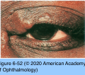
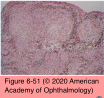
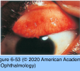
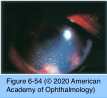
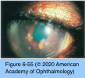
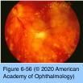
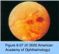

# 9.6.17. Panuveitis (I): Sarcoidosis

## Images

## Hierarchy

- etiology
  - exposure to microbe-rich environments
    - mycobacteria
    - propionibacteria
  - genetic predisposition
- epidemiology
  - familial clustering
    - 5x increased risk in siblings
  - onset usually from 20-50 years
    - also a common cause of newly diagnosed uveitis among patients ≥60 years
  - both sexes
    - slight female predominance
  - ocular involvement
    - ≤50% of patients with systemic disease
    - uveitis is the most common manifestation
      - ≤10% of all cases of uveitis
  - worldwide distribution
    - highest prevalence in the northern European countries (40 cases per 100,000 people)
  - all ethnic groups
    - ≤20x more prevalent among African Americans
- erythema nodosum
- systemic sarcoidosis
  - multisystem granulomatous disorder
    - thorax
      - most common (90%)
      - pulmonary disease is the major cause of morbidity
    - lymph nodes, skin, eyes, CNS, bones and joints, liver, and heart
  - acute sarcoidosis
    - frequently with associated anterior uveitis in young patients
    - <2 years duration
    - Löfgren syndrome
      - acute iritis
      - bilateral hilar adenopathy
      - febrile arthropathy
      - responsive to systemic corticosteroids
      - good long-term prognosis
    - Heerfordt syndrome (uveoparotid fever)
      - uveitis
      - parotitis
        - facial nerve palsy
      - fever
  - chronic sarcoidosis
    - .> 2 years’ duration
    - interpulmonary involvement
    - extended corticosteroid therapy may be required
  - pediatric sarcoidosis
    - uncommon
    - early-onset sarcoidosis (<5 years)
      - atypical clinical course
        - less likely than adults to manifest pulmonary disease
        - far more likely to have cutaneous and articular involvement
    - disease course in older children (8–15 years) approximates that in adults
  - late-onset sarcoidosis
    - more likely to have uveitis
    - less likely to have asymptomatic chest radiograph abnormalities
- chronic uveitis
- CXR
- diagnostic testing
  - CXR
    - ≤90%
    - do not persist throughout the disease course
  - high-resolution CT
    - more sensitive
    - valuable in patients with normal CXR but high clinical index of suspicion
  - serum ACE and lysozyme
    - +- elevated
    - reflective of total-body granuloma content
      - neither diagnostic nor specific
      - useful in tracking active disease
  - serum and urinary calcium levels
    - ACE levels may be artificially low in patients taking ACE-inhibitors
    - not specific for sarcoidosis
      - abnormal results suggest more widespread involvement
  - liver function test
  - Gallium scanning
    - limited sensitivity
  - fluorine-18-fluorodeoxyglucose positron emission tomography
    - more accurate in pulmonary and extrapulmonary sarcoidosis
  - bronchoalveolar lavage
    - mononuclear alveolitis with increased CD4+ lymphocytes
  - traditional approach for suspected ophthalmic involvement
    - ACE and lysozyme levels
    - additional tests (see above) can supplement the workup
      - repeat the tests annually in patients with negative results but high clinical index of suspicion
  - diagnosis of sarcoidosis is made histologically from tissue obtained from
    - lungs
    - mediastinal lymph nodes
    - skin
    - peripheral lymph nodes
    - liver
    - conjunctiva
    - minor salivary glands
    - lacrimal glands
    - pathology
      - noncaseating granuloma
        - without histologic evidence of infection or foreign body
- differential diagnosis
  - sarcoidosis should be considered in the differential diagnosis of any intraocular inflammation
  - early-onset sarcoidosis (≤5 years) must be differentiated from
    - JIA-associated anterior uveitis
    - familial juvenile systemic granulomatosis (Blau syndrome)
      - autosomal dominant
      - NOD2 gene (also known as CARD15)
      - ocular disease is virtually identical to sarcoidosis
- treatment
  - vision-threatening posterior segment lesions
    - topical, periocular, and systemic corticosteroids are the mainstays of therapy
    - systemic corticosteroids (prednisone, 40–80 mg/day)
  - cycloplegia
  - intravitreal corticosteroids
    - for patients intolerant of systemic therapy
  - fluocinolone acetonide implant
  - systemic IMT
    - can provide good control of the disease
      - chronic vision-threatening sarcoidosis responds better to IMT
        - likelihood of significant visual improvement is substantially increased with systemic therapy
    - TNF-α inhibitors
      - infliximab and adalimumab
        - effective in the treatment of sarcoidosis- associated uveitis
          - infliximab can cause drug-induced lupus
            - can cause a sarcoidlike syndrome
      - etanercept
  - prognostic factors
    - presence of intermediate or posterior uveitis
    - chronic posterior uveitis
    - glaucoma
    - delay in presentation to a uveitis specialist of more than 1 year
    - poor patient adherence
  - overall mortality from sarcoidosis
    - 5%
    - ≤10% with neurosarcoidosis
- ocular sarcoidosis
  - can affect any ocular tissue
    - cutaneous involvement
    - orbital/eyelid granulomas
    - palpebral/bulbar conjunctival nodules
    - lacrimal gland infiltration
      - keratoconjunctivitis sicca
  - anterior uveitis
    - acute
    - chronic granulomatous uveitis
    - most common ocular manifestation
      - ≈2/3
    - biomicroscopic findings
      - mutton-fat KPs including anterior chamber angle
      - Koeppe and Busacca iris nodules
      - white clumps of cells (“snowballs”) in the inferior anterior vitreous
    - cornea
      - infrequently involved
        - nummular corneal infiltrates
        - inferior corneal endothelial opacification
        - band keratopathy
          - chronic uveitis or hypercalcemia
    - large iris granulomas
    - extensive posterior synechiae
      - iris bombé and angle-closure glaucoma
    - peripheral anterior synechiae
      - secondary glaucoma
        - portends a poor prognosis
  - posterior segment manifestations
    - ≤20%
    - vitreous involvement
      - common
      - clumps of snowballs +- diffuse cellular infiltration
    - nodular granulomas
      - 1⁄4–1 disc diameter
        - linear strands (string of pearls)
      - optic nerve
      - retina
      - choroid
    - perivascular sheathing
      - linear or segmental periphlebitis
      - irregular nodular granulomas along venules
        - candle-wax drippings (taches de bougie)
    - occlusive retinal vascular disease
      - branch retinal vein occlusion>central retinal vein occlusion
      - peripheral retinal capillary nonperfusion
      - retinal neovascularization
      - vitreous hemorrhage
    - CME
    - optic disc edema without granulomatous invasion of the optic nerve
      - in patients with papilledema and neurosarcoidosis
