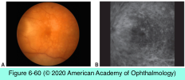
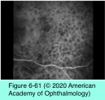
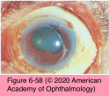
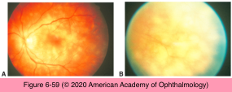

# 9.6.18. Panuveitis (II): Sympathetic Ophthalmia

## Images

## Hierarchy

- epidemiology
  - earlier estimates of the incidence of SO
    - ≤0.5% in eyes with nonsurgical trauma and 10/100,000 after intraocular surgery
  - M=F
    - most recent minimum incidence estimate is low (0.03/100,000)
    - lower risk in children
  - increased risk in older patients
- pathogenesis
  - until recently, penetrating ocular injury was the most common precipitating event
  - ocular surgery—particularly vitreoretinal surgery—is now the main precipitating event
    - in the early 1980s
      - 0.01% after pars plana vitrectomy
    - recent studies
      - risk of developing SO following pars plana vitrectomy is >2x this figure
        - 0.06% after vitrectomy in the context of penetrating ocular injuriy
  - surgery or penetrating ocular injury complicated by incarceration of uveal tissue
    - exposure of uveoretinal antigens to conjunctival lymphatic channels
      - altered T-lymphocyte response to previously sequestered ocular self-antigens (derived from the RPE or choroid)
  - genetic predisposition
    - HLA-DR4, -DRw53, and -DQw3
    - immunogenetics of SO and VKH syndrome are virtually identical
  - latent period after surgery/injury
    - 80% within 3 months of injury
    - 90% within 1 year
    - in a recent series
      - only 1/3 within 3 months
      - <1/2 within 1 year
  - enucleation within 2 weeks of injury to prevent SO should be considered in patients with grossly disorganized globes with no discernible visual function
  - enucleation preferred to evisceration for the removal of ocular contents in severely injured eyes
- diagnostic tests
  - FA
    - acute stage
      - multiple hyperfluorescent sites of leakage at the level of the RPE during the venous phase
    - pooling of dye beneath areas of exudative retinal detachment
    - Dalen-Fuchs lesions may appear hypofluorescent early in the study or hyperfluorescent with late staining
  - ICG angiography
    - numerous hypofluorescent foci
      - intermediate phase of the angiogram
      - may become isofluorescent in the late stage
  - OCT imaging
    - shallow, serous retinal detachment
    - intraretinal edema
  - B-scan ultrasonography
    - choroidal thickening
- pathology
  - similar for both the exciting and sympathizing eyes
  - diffuse, granulomatous, nonnecrotizing inflammation
    - spares the choriocapillaris in the early stage
  - Dalen-Fuchs nodules
    - 1//3
      - clusters of epithelioid cells located between RPE and Bruch membrane
      - not specific to SO
        - also in VKH syndrome and sarcoidosis
- differential diagnosis
  - TB, sarcoidosis, syphilis, fungal infections, traumatic or postoperative endophthalmitis
  - lens-associated uveitis
    - reported with SO in ≤25% of cases
  - VKH syndrome
    - clinical presentations of SO and VKH syndrome may be strikingly similar
    - history of prior ocular injury is by definition absent in patients with VKH syndrome
      - clinical course
- management
  - once SO has become established, enucleation of the exciting eye will not alter the disease course
    - exciting eye may eventually become the better-seeing eye!
  - systemic corticosteroids
  - IMT
    - corticosteroid-sparing drugs
  - topical corticosteroids
  - cycloplegic and mydriatic agents
  - periocular corticosteroids
    - to manage inflammatory recurrences and CME
      - treatment of the acute anterior uveitis
  - intravitreal corticosteroids
    - patients intolerant of systemic corticosteroid therapy
  - intravitreal fluocinolone acetonide implant
- clinical presentation
  - asymmetric bilateral
    - exciting eye
    - latent period
    - sympathizing eye
  - symptoms
    - minimal problems in near vision, mild photophobia, and slight redness to severe granulomatous anterior uveitis
  - diffuse, granulomatous, nonnecrotizing panuveitis
  - anterior segment findings
    - mutton-fat KPs
      - exciting eye exhibits more severe inflammation than the sympathizing eye, at least initially
    - thickening of the iris
    - posterior synechiae
    - elevated IOP due to trabeculitis
    - hypotony as a result of ciliary body shutdown
  - posterior segment findings
    - moderate to severe vitritis
    - yellowish white, midequatorial choroidal lesions (Dalen-Fuchs nodules)
      - may become confluent
    - peripapillary choroidal lesions
    - exudative retinal detachment
  - complications
    - cataract
    - chronic CME
    - peripapillary and macular CNV
    - optic atrophy
    - new complications in the sympathizing eye develop at a rate of 40% per person-year
      - traumatic etiology
  - risk factors for poor vision in the sympathizing eye
    - active intraocular inflammation
  - extraocular findings similar to VKH syndrome
    - cerebral spinal fluid pleocytosis
      - exudative retinal detachment
    - sensory neural hearing disturbance
    - alopecia
    - poliosis
    - vitiligo
      - uncommon
- clinical course & prognosis
  - chronic with frequent exacerbations
  - untreated leads to loss of vision and phthisis bulbi
  - with prompt and aggressive systemic therapy, the visual prognosis is good in the sympathizing eye
    - 60% of patients achieve a final visual acuity of 20/40
    - up to 25% may decline to ≤20/200
