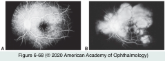
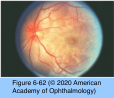
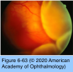
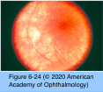
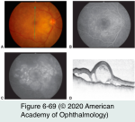
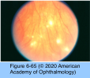
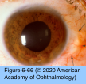
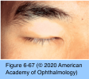

# 9.6.19. Panuveitis (III): Vogt- Koyanagi-Harada Syndrome

## Images

## Hierarchy

- epidemiology
  - affects certain ethnic groups
    - Asian
    - Asian Indian
    - Hispanic
    - Native American
    - Middle Eastern
    - uncommon among whites
    - rare among sub-Saharan Africans
  - incidence varies geographically
    - up to 4% of all uveitis referrals in United States
    - up to 8% of all uveitis referrals in Japan
    - the most common cause of noninfectious uveitis in Brazil and Saudi Arabia
- pathogenesis
  - cell-mediated autoimmune process
    - T lymphocytes directed against self-antigens associated with melanocytes of all organ systems
  - genetic predisposition
    - HLA-DR4 among Japanese patients
      - HLA-DRB*0405
        - in Japanese patients
    - HLA-DR1 or HLA-DR4 among Hispanic patients from southern California
- pathology
  - acute uveitic stage
    - diffuse, nonnecrotizing, granulomatous inflammation
      - lymphocytes and macrophages admixed with epithelioid and multinucleate giant cells
      - peripapillary choroid is the predominant site of the granulomatous inflammatory infiltration
        - ciliary body
        - iris
          - identical to that seen in SO
    - proteinaceous fluid exudates in the subretinal space
  - unlike acute uveitic and chronic recurrent stages
  - convalescent stage
    - nongranulomatous inflammation
      - uveal infiltration of lymphocytes, few plasma cells, and the absence of epithelioid histiocytes
    - number of choroidal melanocytes decreases with loss of melanin pigment
      - sunset-glow fundus
    - focal loss of RPE cells with chorioretinal adhesions
      - nummular chorioretinal scars in the peripheral retina
  - chronic recurrent stage
    - granulomatous choroiditis with damage to the choriocapillaris
      - preservation of the choriocapillaris
- 30%
- essential diagnostic features of VKH syndrome
  - bilateral involvement
  - no history of penetrating ocular trauma
  - no evidence of other ocular or systemic disease
  - exudative retinal detachment during the acute phase
    - highly specific
  - See Table 6-3
    - sunset-glow fundus during the chronic phase
      - highly specific
- differential diagnosis
  - SO, uveal effusion syndrome, posterior scleritis, primary intraocular lymphoma, uveal lymphoid infiltration, APMPPE, and sarcoidosis
- several weeks later
- clinical presentation
  - bilateral
    - Similar to APMPPE & MEWDS
  - 4 stages
    - prodromal
      - flulike symptoms
        - headache, nausea, meningismus, dysacusia, tinnitus, fever, orbital pain, photophobia, and hypersensitivity of the skin and hair to touch
        - several days preceding the ocular symptoms
      - focal neurologic signs
        - rare
        - cranial neuropathies
        - hemiparesis
        - aphasia
        - transverse myelitis
        - ganglionitis
        - cerebrospinal fluid analysis
          - lymphocytic pleocytosis
            - 80%
            - may persist for up to 8 weeks
          - normal levels of glucose
      - auditory problems
        - coincident with the onset of ocular disease
          - central dysacusia involving higher frequencies or tinnitus
            - early in the disease course
            - improve within 2–3 months
            - persistent deficits may remain
        - 75%
    - acute uveitic
      - sequential blurring of vision in both eyes
        - 1–2 days after the onset of CNS signs
      - granulomatous anterior uveitis
        - bilateral
        - IOP may be elevated
          - forward displacement of the lens–iris diaphragm
            - ciliary body edema
            - annular choroidal detachment
        - IOP may be low
          - secondary to ciliary body shutdown
      - posterior segment findings
        - variable degree of vitritis
        - hyperemia & edema of the optic nerve
          - thickening of the posterior choroid with elevation of the peripapillary retinal choroidal layer
        - multiple focal serous retinal detachments
          - shallow
          - cloverleaf pattern around the posterior pole
          - may coalesce into large, bullous, exudative detachments
        - profound vision loss may occur
    - convalescent
      - resolution of the exudative retinal detachment
      - gradual depigmentation of the choroid
        - orange-red discoloration
          - sunset-glow fundus
          - sunset-glow fundus may show focal areas of retinal hyperpigmentation or hypopigmentation
        - juxtapapillary depigmentation
      - small, round, discrete depigmented lesions
        - inferior peripheral fundus
      - perilimbal vitiligo (Sugiura sign)
        - 85% of Japanese patients
      - integumentary changes
        - 30%
          - occur weeks to months after the onset of ocular inflammation (during the convalescent stage)
        - correspond with the development of fundus depigmentation
        - vitiligo
        - alopecia
        - poliosis
    - chronic recurrent
      - repeated bouts of granulomatous anterior uveitis
        - KPs, posterior synechiae, iris nodules, iris depigmentation, and stromal atrophy
        - may occur concomitantly with subclinical choroidal inflammation, requiring systemic therapy
      - posterior segment recurrences
        - vitritis, papillitis, multifocal choroiditis, and exudative retinal detachment
        - uncommon
      - complications
        - cataract formation (50%)
          - posterior subcapsular cataract
        - glaucoma (33%)
        - CNV (≤15%)
        - subretinal fibrosis
        - associated with
          - increased disease duration
          - more frequent recurrences
          - an older age at disease onset
  - clinical course
    - chronic
    - many patients experience recurrent episodes of inflammation
- diagnostic tests
  - FA
    - acute uveitic stage
      - pooling of dye in the subretinal space in areas of neurosensory detachment
        - numerous punctate hyperfluorescent foci at the level of the RPE
      - disc leakage
      - CME and retinal vascular leakage are uncommon
    - convalescent and chronic recurrent stages
      - focal RPE loss and atrophy produce multiple hyperfluorescent window defects
  - ICG angiography
    - delay in choriocapillaris and choroidal vessel perfusion
    - early choroidal stromal vessel hyperfluorescence and leakage
    - disc hyperfluorescence
    - multiple hypofluorescent spots throughout the fundus
      - may be present even when the funduscopic and FA findings are unremarkable
      - sensitive markers for the detection and monitoring of subclinical choroidal inflammation
    - hyperfluorescent pinpoint changes within areas of exudative retinal detachment
  - ultrasonography
    - exudative retinal detachment
      - diffuse, low to medium reflective thickening of the posterior choroid
        - most prominent in the peripapillary area, with extension to the equatorial region
    - vitreous opacification
    - posterior thickening of the sclera
  - OCT
    - serous macular detachments
      - fibrin bands extending from the retina to the RPE (acute phase)
    - SD-OCT
      - choroidal thickening in the acute phase
        - decreases with treatment
    - CME
    - choroidal neovascular membrane
  - FAF imaging
    - granular hyperautofluorescence in areas of inflammation
  - lumbar puncture
    - in highly atypical cases
      - lymphocytic pleocytosis
        - prominent neurologic signs and a paucity of ocular findings
- treatment
  - acute stage
    - early and aggressive treatment with corticosteroids
      - 1–1.5 mg/kg/day of oral prednisone
      - intravitreal corticosteroids
        - ≤1 g of intravenous methylprednisolone daily x3 days followed by high-dose oral corticosteroids
        - patients intolerant of systemic therapy
      - systemic corticosteroids are tapered slowly according to the clinical response, on average over a 6–12 month period
        - tapering corticosteroids too soon can result in early recurrence
      - oral corticosteroids reduce
        - risk of CNV and subretinal fibrosis by 82%
        - risk of visual acuity decline to 20/200 or worse in better-seeing eyes by 67%
      - oral versus intravenous routes of administration show no differences in outcome
    - IMT
      - to achieve more prompt inflammatory control and to facilitate more rapid tapering of corticosteroids
      - IMT was associated with
        - risk reductions of 67% for vision loss to 20/50 or worse
        - risk reductions of 92% for vision loss to 20/200 or worse in better-seeing eyes
  - overall visual prognosis with treatment is fair
    - up to 70% of patients retaining visual acuity of ≥20/40
