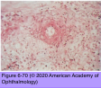
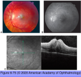
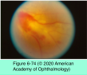

# 9.6.20. Panuveitis (IV): Behcet Disease

## Images

## Hierarchy

- General considerations
  - epidemiology
    - most are sporadic
      - onset 25-35 years
        - as early as age 10–15 years!
    - most common in the Northern Hemisphere
      - eastern Mediterranean
      - eastern rim of Asia
        - along the Old Silk Route
    - prevalence
      - 80–300 cases per 100,000 in Turkey
      - 8–10 per 100,000 in Japan
      - 0.4 per 100,000 in the United States
  - diagnostic criteria
    - See Table 6-4
      - See Table 6-5
  - classification
    - “complete” type
      - 4 major criteria
    - “incomplete” type
      - 3 major criteria or ocular involvement with 1 other major criterion
      - M=F
  - chronic
    - relapsing
  - occlusive systemic/multisystem vasculitis
    - can have its predominant effect on a single system
      - neuro-BD
      - ocular BD
      - intestinal BD
      - vascular BD
  - can affect both the anterior and the posterior segments
    - often simultaneously
- M>F
- complications
  - macular edema
  - complex cataract
  - glaucoma
  - secondary and neovascular glaucoma
  - retinal and optic disc neovascularization
  - retinal detachment
  - vitreous hemorrhage
- most frequent finding
- Pathogenesis
  - no known environmental factors
  - specific HLA associations
    - HLA-B12 with mucocutaneous lesions
    - of little diagnostic value
      - HLA-B51 with ocular lesions
  - early
    - delayed-type hypersensitivity reactions
  - late
    - immune-complex–type reactions
- Pathology
  - nongranulomatous, necrotizing, obliterative vasculitis
- 40%
- Diagnostic tests
  - HLA typing, cutaneous pathergy testing, ESR & CRP
    - of little value
  - FA
    - marked dilatation and occlusion of retinal capillaries with perivascular staining
    - retinal ischemia
    - leakage of fluorescein into the macula (CME)
    - retinal neovascularization
  - OCT
    - macular edema
      - subtle vascular leakage before clinical evidence of disease activity
        - adjusting therapy may prevent the development of inflammatory damage
    - disruption of the retinal architecture
  - chest x-ray, chest CT, and brain MRI with contrast enhancement
- Nonocular systemic manifestations
  - oral aphthous ulcers
    - significant discomfort and pain
    - lips, gums, palate, tongue, uvula, and posterior pharynx
    - discrete, round or oval
      - 2-15 mm
    - white with red rims
    - heal with little scarring
      - recur every 5–10 days or every month
        - last 7–10 days
  - skin lesions
    - erythema nodosum
      - over extensor surfaces
      - painful
      - recurrent
      - face, neck, and buttocks
      - disappear with minimal, if any, scarring
    - acne vulgaris & folliculitis-like skin lesions
      - upper thorax and face
    - cutaneous pathergy
      - sterile pustule at the site of a venipuncture
      - not pathognomonic of BD
  - genital ulcers
    - male patients
      - on the scrotum or penis
    - female patients
      - vulva and the vaginal mucosa
    - variable amounts of pain
    - can be deep and leave scars
  - systemic vasculitis
    - 25%
    - any size artery or vein may be affected
      - vascular complications
        - arterial occlusion
        - aneurysm
        - venous occlusion
        - varices
    - cardiac involvement
      - 17%
      - myocarditis
        - granulomatous endocarditis
        - endomyocardial fibrosis
      - pericarditis
      - coronary arteritis
    - gastrointestinal lesions
      - multiple ulcers involving the esophagus, stomach, and intestines
    - pulmonary involvement
      - pulmonary arteritis with aneurysmal dilatation
    - arthritis
      - 50%
      - knee is most affected
        - 50%
  - neurologic involvement
    - 10%
    - M>F
    - 10% of patients with neuro-BD can have ocular disease
    - 30% of patients with ocular BD may have neurologic involvement
    - affects mainly areas of motor control
    - headaches
    - strokes
    - palsies
    - confusional state
      - 25%
    - mortality
      - lower with the use of IMT
        - up to 10% in patients with neuro-BD
  - neuro-ophthalmic involvement
    - cranial nerve palsies
    - central scotomata caused by papillitis
    - visual field defects
    - papilledema resulting from thrombosis of venous sinuses
- Differential diagnosis
  - HLA-B27–associated anterior uveitis
  - reactive arthritis syndrome
  - sarcoidosis
  - systemic vasculitides including systemic lupus erythematosus, PAN, and GPA
  - necrotizing herpetic retinitis
- Treatment
  - corticosteroids
    - most patients eventually become resistant to corticosteroid therapy
      - for explosive-onset (acute) anterior segment and posterior segment inflammation
    - 1.5 mg/kg/day of oral prednisone with a gradual taper
    - periocular and intravitreal steroids
  - immunomodulatory medications
    - sight-threatening posterior segment inflammation
      - start systemic steroid + IMT
    - colchicine
      - for mucocutaneous disease
    - azathioprine
      - ineffective for ocular BD
      - effective in controlling oral/genital ulcers and arthritis
        - azathioprine (with corticosteroids) as first-line treatment
      - +- treatment of choice for Behçet retinal vasculitis
    - infliximab
      - rapid remission of disease activity, long-term disease control
      - at ≥10 mg/kg carries a greater risk of
        - disseminated TB
        - malignancy
    - American expert panel recommended
      - anti-TNF therapy with infliximab or adalimumab as first- or second-line corticosteroid-sparing therapy
      - infliximab as first- or second-line treatment for acute exacerbations of preexisting Behçet disease
    - European League Against Rheumatism recommends
      - cyclosporine or infliximab as second-line treatment
    - cyclosporine
      - risk of nephrotoxicity
      - increased risk of neuro-BD in patients treated with cyclosporine
    - tacrolimus
      - less toxic
        - not as effective as other cytotoxic drugs
      - substitute for cyclosporine
      - used successfully in Japan
    - mycophenolate mofetil
      - successful in treating ocular BD in small case series
    - interferon alfa-2a
      - efficacious and well tolerated
      - highly effective in Behçet uveitis
    - chlorambucil
      - effective even at relatively low doses
        - somewhat less effective in non–Behçet uveitis
      - may be the most effective immunomodulatory drug in achieving durable remission
        - more effective than cyclosporine for posterior segment ocular BD
      - reserve the use of alkylating agents for patients with refractory disease
    - cyclophosphamide
      - alternative to chlorambucil
      - oral or pulsed intravenous therapy
      - greater risk of systemic complications
- more severe in men
- Ocular manifestations
  - 70%
    - M>F
  - 80% bilateral
  - explosive onset over the course of just a few hours
    - recurrent and relapsing
  - ocular involvement as an initial presenting problem is relatively uncommon
    - 10%
  - can affect any or all portions of the uveal tract
  - anterior uveitis
    - may be the only ocular manifestation of BD
    - redness, pain, photophobia, and blurred vision
    - nongranulomatous
    - transient hypopyon
      - 25%
      - can shift with the patient’s head position or disperse with head shaking
      - may not be visible unless viewed by gonioscopy
    - can spontaneously resolve even without treatment
    - other anterior segment manifestations
      - posterior synechiae, iris bombé, angle-closure glaucoma, cataract, episcleritis, scleritis, conjunctival ulcers, and corneal immune ring opacities
  - posterior segment manifestations
    - most common type of uveitis found in children and adults
    - obliterative, necrotizing retinal vasculitis
      - arteries & veins
        - branch retinal vein occlusion
        - isolated branch artery occlusions
        - combined branch retinal vein and branch retinal artery occlusions
        - vascular sheathing
          - retinal vessels may become white and sclerotic
    - +- multifocal areas of chalky white retinitis
      - may be confused with acute retinal necrosis
    - retinal ischemia
      - retinal neovascularization
      - neovascularization of the iris and neovascular glaucoma
    - variable amounts of vitritis
    - CME
    - optic nerve
      - 25%
      - optic papillitis
      - progressive optic atrophy
  - severe vision loss
    - 25%
- Prognosis
  - visual acuity <20/200
    - 25%
    - caused by
      - occlusive retinal vasculitis
      - macular edema
      - optic atrophy
      - glaucoma
    - current patients appear to have a better visual prognosis
  - adult men tend to have poorer vision outcomes
  - predictive factors for vision loss
    - posterior synechiae
    - persistent inflammation
    - elevated IOP
    - hypotony
