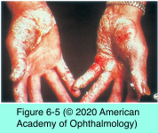
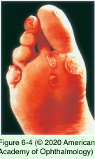
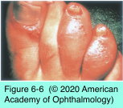

# 9.6.2. Anterior Uveitis (II): HLA- B27-related Diseases

## Images

## Hierarchy

- Ankylosing spondylitis
  - symptoms
    - low back pain
    - morning stiffness
      - often, persons with anterior uveitis lack symptoms of back disease
      - improves with exertion
  - • family history of AS or anterior uveitis
  - anterior uveitis + history/family history of low- back problems
    - HLA-B27
    - sacroiliac imaging
  - HLA-B27
    - 90%
    - 25% of HLA-B27–positive patients develop spondyloarthritis or eye disease
  - extraarticular manifestations
    - pulmonary apical fibrosis
    - cardiovascular disease (aortic valvular insufficiency)
  - treatment
    - sulfasalazine
      - NSAIDs
        - the mainstay of medical treatment
      - joint disease not controlled with NSAIDs
      - may reduce recurrences of uveitis
    - refer to rheumatologist
  - nonpharmacologic interventions
    - exercise
    - physical therapy
    - smoking cessation
- Reactive arthritis syndrome (Reiter syndrome)
  - epidemiology
    - <2% of all spondyloarthropathies
    - young adult M
      - 10% F
    - HLA-B27
      - 95%
  - pathogenesis
    - triggering infections
      - urethritis
        - Ureaplasma urealyticum
        - Chlamydia
      - diarrhea or dysentery without urethritis
        - Shigella
        - Salmonella
        - Yersinia
    - pathogens cannot be isolated from affected joints
  - classic diagnostic triad
    - nonspecific urethritis
    - arthritis
      - within 30 days of infection
      - knees, ankles, feet, and wrists
      - asymmetrical
      - oligoarticular (≤4 joints)
    - conjunctivitis
      - sacroiliitis
        - 70%
  - Extraarticular findings
    - eye involvement
      - 20%
      - conjunctivitis
        - mucopurulent and papillary
        - most common eye finding
      - acute nongranulomatous anterior uveitis
        - may become bilateral and chronic
      - punctate subepithelial keratitis
        - +- permanent corneal scars
    - nail bed pitting
    - constitutional symptoms
      - fever and malaise
        - similar to Behcet
    - 2 other major diagnostic criteria
      - keratoderma blennorrhagicum
        - scaly, erythematous, irritating disorder of the palms and soles
      - circinate balanitis
        - persistent, scaly, erythematous, circumferential rash of the distal penis
- anti-TNF drugs
  - second-line treatment in recalcitrant cases
- 10%
- oral ulcers
- Psoriatic arthritis
  - clinical presentation
    - cutaneous changes
    - terminal phalangeal joint inflammation
    - ungual involvement
    - sacroiliitis
      - 20%
    - IBD
      - occurs more frequently than general population
  - anterior uveitis
    - 25%
    - insidious
      - more likely to be chronic (than other spondyloarthropathies)
    - bilateral
    - more severe in HLA-B27–positive patients
  - anterior uveitis in psoriasis without arthritis
    - older than idiopathic or HLA-B27–associated uveitis
    - +- bilateral and of longer duration
    - +- posterior segment involvement
- Inflammatory bowel disease (IBD)
  - sacroiliitis
    - 20%
    - 60% are HLA-B27 positive
  - acute anterior uveitis
    - 12% of patients with ulcerative colitis
    - 2.4% of patients with Crohn disease
    - occasionally, bowel disease is asymptomatic and follows the onset of uveitis
    - are more commonly HLA-B27 negative
      - patients with IBD + acute anterior uveitis are more likely to be HLA-B27 positive and have sacroiliitis
  - sclerouveitis
  - intermediate uveitis
    - have symptoms resembling rheumatoid arthritis
      - usually do not develop sacroiliitis
    - HLA-B27–negative IBD
