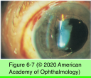
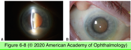
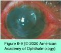
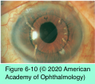

# 9.6.3. Anterior Uveitis (III)

## Images

## Hierarchy

- Tubulointerstitial nephritis and uveitis syndrome (TINU)
  - epidemiology
    - women < early 30s
      - mean age of onset 21 years
  - clinical presentation
    - anterior uveitis
      - bilateral
      - nongranulomatous
      - ocular findings more severe in patients with recurrent disease
        - fibrin, posterior synechiae, larger KPs, and, rarely, hypopyon
      - posterior segment involvement is atypical
        - mild vitritis
        - optic nerve and macular edema
      - more commonly uveitis develops before systemic symptoms of TIN
    - diagnostic criteria for TIN
      - abnormal serum creatinine level or decreased creatinine clearance
      - abnormal urinalysis findings: increased β2- microglobulin level, proteinuria, presence of eosinophils, pyuria or hematuria, urinary white cell casts, and normoglycemic glycosuria
      - associated systemic illness: fever, weight loss, anorexia, fatigue, arthralgias, and myalgias; there may also be abnormal liver function, eosinophilia, and an elevated erythrocyte sedimentation rate
  - pathogenesis
    - seroreactivity against retinal and renal antigens
  - pathology
    - severe interstitial fibrosis
      - strongly associated with HLA-DRB1*0102
  - treatment
    - very responsive to high-dose oral corticosteroids
    - immunomodulatory therapy
      - small proportion of patients
- Drug-induced uveitis
  - rifabutin
    - antibiotic used in the prevention/ treatment of Mycobacterium avium-intracellulare infection
    - anterior & posterior uveitis
      - +- hypopyon
        - reversible
    - stellate, refractile endothelial deposits
      - initially in the periphery; may extend to the central cornea
  - systemic fluoroquinolones
    - especially moxifloxacin
    - iris depigmentation and uveitis
  - sulfonamides
  - bisphosphonates
  - diethylcarbamazine
    - antifilarial drug
      - loiasis
  - oral contraceptives
  - certain anti-TNF drugs (eg, etanercept)
    - new-onset uveitis and a systemic sarcoid-like syndrome
  - vaccines
    - BCG
    - influenza
  - tuberculin skin test
  - Intravesical BCG vaccine
    - treatment of bladder cancer
    - can result in an infectious uveitis
  - topical antiglaucoma medications
    - metipranolol
      - nonselective beta-blocking drug
    - anticholinesterase inhibitors
    - prostaglandin F2α analogues
  - drugs that are injected directly into the eye
    - antibiotics
    - urokinase (a plasminogen activator)
    - cidofovir
      - cytosine analogue effective against CMV
    - VEGF inhibitors
  - treatment
    - topical corticosteroids and cycloplegic drugs
    - cessation/tapering of the offending medication
- Glaucomatocyclitic crisis (Posner- Schlossman syndrome)
  - pathogenesis
    - infection with herpetic viruses (CMV)
  - clinical presentation
    - vague symptoms
      - discomfort
      - blurred vision
      - halos
    - signs
      - markedly elevated iop
      - corneal edema
      - low-grade cell and flare
      - slightly dilated pupil
    - episodes last from hours to days
    - recurrences are common over many years
  - treatment
    - topical corticosteroids
    - antiglaucoma medication
    - possible role for antiviral therapy
- KPs
  - vary in size/distribution
- Postoperative inflammation: IOL-associated uveitis
  - pathogenesis
    - surgical manipulation
      - breakdown of the blood–aqueous barrier
    - IOL implantation
      - can activate complement cascades and promote neutrophil chemotaxis
        - cellular deposits on the IOL
        - synechiae formation
        - capsular opacification
        - anterior capsule phimosis
      - the more biocompatible the IOL material, the less likely it is to incite an inflammatory response
        - acrylic IOLs appear to have excellent biocompatibility
        - foldable implant materials are well tolerated in many patients with uveitis
        - polypropylene haptics
          - cause enhanced bacterial and leukocyte binding
            - probably should be avoided in patients with uveitis!
        - silicone optics are associated with increased cellular deposition (compared with acrylic or hydrogel optics)
      - Irregular/damaged IOL surfaces
    - retained lens material
      - exacerbates the usual transient postoperative inflammation
    - iris chafing caused by the edges/loops of IOLs
      - <1%
        - sulcus placement of a single-piece acrylic IOL
          - may also occur with appropriately placed 3- piece IOL in the sulcus
      - older rigid ACIOLs (>flexible anterior chamber IOLs)
      - motion of an iris-supported or anterior chamber IOL may cause
        - corneal endothelial damage or decompensation
        - low-grade anterior uveitis
        - peripheral anterior synechiae
        - recalcitrant glaucoma
        - CME
  - UGH syndrome
    - irritation of the iris root by any intraocular implant
      - UBM or anterior segment OCT
    - treatment
      - topical corticosteroids
      - some may require IOL explantation/ repositioning
  - cataract surgery in patients with uveitis
    - aggressive control of intraocular inflammation in the preoperative and postoperative periods
- Lens-associated uveitis
  - pathogenesis
    - immune reaction to lens protein
      - disruption of the lens capsule (traumatic or surgical)
        - phacoantigenic uveitis
      - leakage of lens protein through intact lens capsule in mature/hypermature cataracts
        - phacolytic uveitis
    - patients previously sensitized to lens protein can experience inflammation within 24 hours
  - Phacoantigenic uveitis
    - "phacoanaphylactic endophthalmitis"
    - anterior uveitis
      - granulomatous or nongranulomatous
      - KPs
        - small or large
      - variable AC reaction
        - +- hypopyon
      - posterior synechiae
      - elevated IOP
      - anterior vitreous inflammation
    - pathology
      - zonal granulomatous inflammation
        - neutrophils around the lens material with surrounding lymphocytes, plasma cells, epithelioid cells, and occasional giant cells
    - treatment
      - topical corticosteroids
        - when small amounts of lens material remain, corticosteroid therapy alone may be sufficient
      - systemic corticosteroids
        - for severe cases
      - cycloplegic and mydriatic agents
      - surgical removal of all lens material
  - Phacolytic uveitis
    - acute increase in IOP
      - phacolytic glaucoma
      - clogging of the trabecular meshwork by macrophages engorged with lens proteins
    - refractile bodies in the aqueous
      - lipid-laden macrophages
      - aqueous tap reveals swollen macrophages
    - lack of KPs and synechiae
    - treatment
      - pressure reduction
        - osmotic agents and topical medications
      - cataract extraction
        - quickly !
- Postoperative inflammation: infectious endophthalmitis
  - delayed/late-onset endophthalmitis after cataract surgery
    - Infection with low-virulence organisms
      - Propionibacterium acnes
      - Staphylococcus epidermidis
      - fungal species
